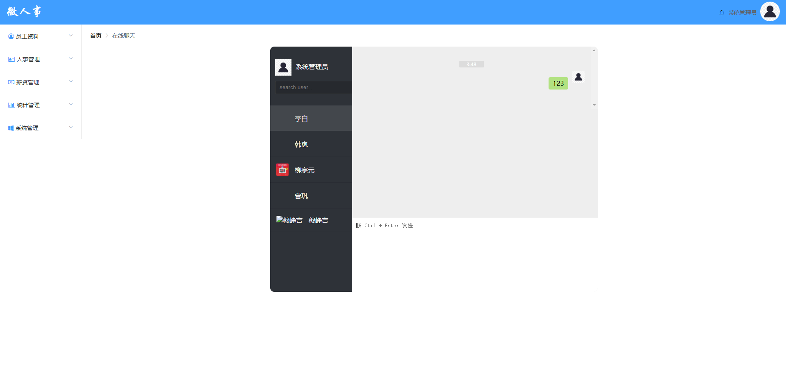

# 即时通讯功能测试

## 主要针对部门管理功能进行测试用例设计

## 1.测试内容概述

该部分测试用例一共编写17条

即时通讯设置页面

如果图片无法打开，请修改host文件

<ul style="font-size:16px">
<li>主要测试点：
    
1.页面设计是否合理，是否符合设计图

    
2.聊天框测试

    
3.消息接收及时性

    
4.历史消息的存储

    
5.搜索

    
......

</li>
</ul>

## 后续详细内容请参考以下表格：

由于许多单元格内容过长，显示效果不太好，下面贴出excel表格

<a href="./即时通讯测试用例设计.xlsx">链接：即时通讯测试用例</a>

| 平台     | 所属模块  | 用例标题                                   | 前置条件                                                    | 步骤                                                         | 预期                                                         | 关键词 | 优先级 | 用例类型 | 适用阶段     | 备注 | 类型可选值列表 | 阶段可选值列表 | 平台           |
| -------- | --------- | ------------------------------------------ | ----------------------------------------------------------- | ------------------------------------------------------------ | ------------------------------------------------------------ | ------ | ------ | -------- | ------------ | ---- | -------------- | -------------- | -------------- |
| 所有平台 | /即时通讯 | 系统管理员点击铃铛按钮打开在线聊天页面     | 1.系统管理员登录                                            | 1.点击页面右上角铃铛按钮                                     | 1.在线聊天页面打开 2.在线聊天页面符合设计图 3.读取数据库hr表中系统管理员名，作为聊天列表名显示在在线聊天页面 |        | 中     | 功能测试 | 功能测试阶段 |      |                |                | 所有平台(#608) |
| 所有平台 | /即时通讯 | 使用非系统管理员帐号登录点击铃铛按钮       |                                                             | 1.使用员工“杜甫”帐号登录 2.点击铃铛按钮                      | 1.页面无响应                                                 |        | 中     | 功能测试 | 功能测试阶段 |      |                |                | 所有平台(#609) |
| 所有平台 | /即时通讯 | 在消息发送框内输入边界值内字符并发送       | 1.网络连接正常                                              | 1.点击“李白”打开在线聊天窗口 2.在消息发送框内输入“你好” 3.使用“ctrl+enter”发送信息 | 1.消息发送成功，输入框内容清空，聊天框右侧显示发送的消息 2. 在另一个浏览器使用“李白”账号登录系统，右上角铃铛按钮出现红点 3.点击铃铛按钮进入在线聊天页面，点击“系统管理员”，接收到消息“你好” |        | 中     | 功能测试 | 功能测试阶段 |      |                |                | 所有平台(#610) |
| 所有平台 | /即时通讯 | 在消息发送框内输入大于右边界值的字符并发送 | 1.网络连接正常                                              | 1.点击“李白”打开在线聊天窗口 2.在消息发送框内输入“134646798796432132132132165467976465464646313213” 3.使用“ctrl+enter”发送信息 | 1.消息输入框提示“消息过长，发送失败” 2.另一个客户端“李白”接受不到消息 3.聊天框中不出现消息，输入框中消息保留不清空 |        | 中     | 功能测试 | 功能测试阶段 |      |                |                | 所有平台(#611) |
| 所有平台 | /即时通讯 | 在消息发送框内输入内容为空                 | 1.网络连接正常                                              | 1.点击“李白”打开在线聊天窗口 2.在消息发送框内输入“” 3.使用“ctrl+enter”发送信息 | 1.消息输入框提示“输入的消息不能为空，请重新输入” 2.另一个客户端“李白”接受不到消息 3.聊天框中不出现消息 |        | 中     | 功能测试 | 功能测试阶段 |      |                |                | 所有平台(#612) |
| 所有平台 | /即时通讯 | 在消息发送框内输入空格并发送               | 1.网络连接正常                                              | 1.点击“李白”打开在线聊天窗口 2.在消息发送框内输入“ ” 3.使用“ctrl+enter”发送信息 | 1.消息发送成功，输入框内容清空，聊天框右侧显示发送的消息 2. 在另一个浏览器使用“李白”账号登录系统，右上角铃铛按钮出现红点 3.点击铃铛按钮进入在线聊天页面，点击“系统管理员”，接收到消息“  ” |        | 中     | 功能测试 | 功能测试阶段 |      |                |                | 所有平台(#613) |
| 所有平台 | /即时通讯 | 在消息发送框内输入回车并发送               | 1.网络连接正常                                              | 1.点击“李白”打开在线聊天窗口 2.在消息发送框内输入“ ” 3.使用“ctrl+enter”发送信息 | 1.消息发送成功，输入框内容清空，聊天框右侧显示发送的消息 2. 在另一个浏览器使用“李白”账号登录系统，右上角铃铛按钮出现红点 3.点击铃铛按钮进入在线聊天页面，点击“系统管理员”，接收到消息“  ” |        | 中     | 功能测试 | 功能测试阶段 |      |                |                | 所有平台(#614) |
| 所有平台 | /即时通讯 | 在消息发送框内拖入图片                     | 1.网络连接正常                                              | 1.点击“李白”打开在线聊天窗口 2.将桌面上的“风景.jpg”拖入到消息发送框内 | 1.页面提示无法发送该类型消息 2.另一个客户端“李白”接受不到消息 3.聊天框中不出现消息，输入框显示为空 |        | 中     | 功能测试 | 功能测试阶段 |      |                |                | 所有平台(#615) |
| 所有平台 | /即时通讯 | 在消息发送框内拖入文件                     | 1.网络连接正常                                              | 1.点击“李白”打开在线聊天窗口 2.将桌面上的“test.txt”拖入到消息发送框内 | 1.页面提示无法发送该类型消息 2.另一个客户端“李白”接受不到消息 3.聊天框中不出现消息,输入框显示为空 |        | 中     | 功能测试 | 功能测试阶段 |      |                |                | 所有平台(#616) |
| 所有平台 | /即时通讯 | 在网络连接断开情况下发送消息               | 1.进入在线聊天页面，点击“李白”打开聊天窗口 2.网络连接断开   | 1.发送消息“123” 2.使用“ctrl+enter”发送信息                   | 1.页面无响应 2.输入框内容保留，聊天框内不出现消息  3.网络连接后没有消息发出 |        | 中     | 功能测试 | 功能测试阶段 |      |                |                | 所有平台(#617) |
| 所有平台 | /即时通讯 | 在网络不稳定的情况下发送消息               | 1.进入在线聊天页面，点击“李白”打开聊天窗口 2.网络连接不稳定 | 1.发送消息“123” 2.使用“ctrl+enter”发送信息                   | 1.页面提示当前网络不稳定 2.输入框内容保留，聊天框内不出现消息  3.一段时间后页面提示消息发送失败 4.显示重发按钮提供重新发送消息功能 |        | 中     | 功能测试 | 功能测试阶段 |      |                |                | 所有平台(#618) |
| 所有平台 | /即时通讯 | 消息输入框内“Backspace”键的使用            |                                                             | 1.进入在线聊天页面，点击“李白”打开聊天窗口 2.输入“123” 3.按下“BackSpace”键 | 1.按下一次“BackSpace”键聊天框内容消除一个字符                |        | 中     | 功能测试 | 功能测试阶段 |      |                |                | 所有平台(#619) |
| 所有平台 | /即时通讯 | session失效后点击铃铛按钮                  | 1.session失效                                               | 1.点击铃铛按钮                                               | 1.跳转到登录页面                                             |        | 中     | 功能测试 | 功能测试阶段 |      |                |                | 所有平台(#620) |
| 所有平台 | /即时通讯 | session失效后不能接受其他用户的信息        | 1.“系统管理员”session失效                                   | 1.另一个客户端中“李白”向“系统管理员”发送消息                 | 1.“李白”消息能发送成功 2.“系统管理员”没有消息提示，点开“李白”聊天框没有消息 |        | 中     | 功能测试 | 功能测试阶段 |      |                |                | 所有平台(#621) |
| 所有平台 | /即时通讯 | 向没有在线的用户发送消息                   | 1.消息接收方没在线                                          | 1.点击“李白”打开在线聊天窗口 2.在消息发送框内输入“你好” 3.使用“ctrl+enter”发送信息 | 1.消息能成功发送 2.“李白”登录后有新消息提示 3.点击“系统管理员”聊天框，能查看到一条“你好”消息 |        | 中     | 功能测试 | 功能测试阶段 |      |                |                | 所有平台(#622) |
| 所有平台 | /即时通讯 | session失效后重新登录查看消息              | 1.session失效                                               | 1.重新登录 2.进入在线聊天页面                                | 1.能查看到以前的聊天记录 2.能接收到自己不在线这段时间新增的消息 |        | 中     | 功能测试 | 功能测试阶段 |      |                |                | 所有平台(#623) |
| 所有平台 | /即时通讯 | 清除cookie后重新登录查看消息               |                                                             | 1.清除cookie 2.重新登录“系统管理员”账号 3.进入在线聊天页面   | 1.能查看到以前的聊天记录 2.能接收到自己不在线这段时间新增的消息 |        | 中     | 功能测试 | 功能测试阶段 |      |                |                | 所有平台(#624) |