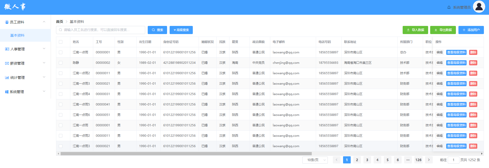

# 基本资料功能测试

## 主要针对基本资料进行测试用例设计

## 1.基本资料功能点概述

<ol style="font-size:16px">
<li>员工信息查询</li>
<li>员工信息修改</li>
<li>员工信息添加</li> 
<li>员工信息删除</li>
<li>搜索功能</li>
    (1).普通搜索（模糊搜索） 
    (2).高级搜索
<li>数据导入导出</li>
<li>分页</li>
</ol>

如果图片无法打开，请修改host文件

## 2.测试内容概述

该部分测试用例一共编写275条

### （1）员工信息查询

员工信息页面:

<ul style="font-size:16px">
<li>主要测试点：
    
1.页面设计是否合理，是否符合设计图

    
2.查询并显示在页面上的员工数据是否与数据库内数据一致

    
3.在数据库内对员工信息进行修改，能否及时、正确反馈到页面上

    
4.员工排序规则设计是否符合需求

    
......

</li>
</ul>

### （2）分页

分页展示:

<ul style="font-size:16px">
<li>主要测试点：
    
1.分页默认值是否符合需求

    
2.页面是否正确展示分页信息，对应的文本框的值是否正确填充

    
3.每页信息条数限制功能、翻页功能、两种页面跳转功能是否能正常使用

    
4.页面跳转输入框的数据校验

    
......

</li>
</ul>

### （3）普通搜索（模糊查询）

普通搜索框:

<ul style="font-size:16px">
<li>主要测试点：
    
1.普通搜索框的数据校验

    
2.从数据库内查询到的数据的准确性

    3.<kbd>Enter</kbd>、<kbd>Backspace</kbd>等快捷键的使用
    
4.搜索框清除按钮的使用

    
......

</li>
</ul>

## 后续详细内容请参考以下表格：

由于许多单元格内容过长，显示效果不太好，下面贴出excel表格

<a href="./基础资料测试用例.xlsx">链接：基础资料测试用例</a>

| 平台     | 所属模块           | 用例标题                                                     | 前置条件                                                     | 步骤                                                         | 预期                                                         | 关键词   | 优先级 | 用例类型 | 适用阶段     | 备注                                                         | 类型可选值列表 | 阶段可选值列表 |      平台      |
| -------- | ------------------ | ------------------------------------------------------------ | ------------------------------------------------------------ | ------------------------------------------------------------ | ------------------------------------------------------------ | -------- | ------ | -------- | ------------ | ------------------------------------------------------------ | -------------- | -------------- | :------------: |
| 所有平台 | /员工资料/基本资料 | 员工资料显示                                                 | 1.管理员admin登录                                            | 1.点击员工资料url 2.点击基本资料url                          | 1.成功跳转到基本资料页面 2.将数据库内员工信息读取到来并在页面正确显示 3.员工按照vhr数据库内employee表的id字段升序排列 3.内容模块标题为基本资料 4.基本资料页面设计符合设计图 | 页面显示 | 中     | 功能测试 | 功能测试阶段 | 有效等价类                                                   |                |                |  所有平台(#0)  |
| 所有平台 | /员工资料/基本资料 | 分页信息                                                     | 1.管理员admin登录                                            | 1.点击员工资料url 2.点击基本资料url                          | 1.显示默认每页员工数据条数10条 2.根据每页员工数据条数与数据库员工总条数正确计算页数，并显示到页面上来 3.页数无法完全显示，中间页面由...代替 4.在直接输入页面跳转处，输入框内默认值为1，员工总条数正确显示 5.当前页默认处于第一页，页面按钮1处于选中状态 | 分页显示 | 中     | 功能测试 | 功能测试阶段 |                                                              |                |                | 所有平台(#21)  |
| 所有平台 | /员工资料/基本资料 | 员工信息条数选择                                             | 1.管理员admin登录  2.点击员工资料url 3.点击基本资料url       | 1.点击员工信息条数选择下拉框 2.选择每页显示20条员工信息条数  | 1.下拉列表显示预设的条数 2.下拉列表焦点在默认值10条处 3.选择每页显示20条员工信息后，员工信息展示条数变为20条，分页总页数正确减少 | 条数限制 | 中     | 功能测试 | 功能测试阶段 |                                                              |                |                | 所有平台(#22)  |
| 所有平台 | /员工资料/基本资料 | 在非第一页点击向前翻页按钮                                   | 1.管理员admin登录  2.点击员工资料url 3.点击基本资料url       | 1.跳转到第2页 2.点击向前翻页按钮                             | 1.页面跳转到前一页 2.员工数据显示为前一页数据 3.页面数-1     | 边界值   | 中     | 功能测试 | 功能测试阶段 | 有效等价类                                                   |                |                | 所有平台(#23)  |
| 所有平台 | /员工资料/基本资料 | 在非最后一页点击向后翻页按钮                                 | 1.管理员admin登录  2.点击员工资料url 3.点击基本资料url       | 1.跳转到第1页 2.点击向前翻页按钮                             | 1.页面跳转到后一页 2.员工数据显示为后一页数据 3.页面数+1     | 边界值   | 中     | 功能测试 | 功能测试阶段 | 有效等价类                                                   |                |                | 所有平台(#24)  |
| 所有平台 | /员工资料/基本资料 | 在第一页点击向前翻页按钮                                     | 1.管理员admin登录  2.点击员工资料url 3.点击基本资料url       | 1.跳转到第1页 2.点击向前翻页按钮                             | 1.向前翻页按钮显示为不可选取 2.页面不发送跳转请求，仍然处于第一页 | 边界值   | 中     | 功能测试 | 功能测试阶段 | 无效等价类                                                   |                |                | 所有平台(#25)  |
| 所有平台 | /员工资料/基本资料 | 在最后一页点击向后翻页按钮                                   | 1.管理员admin登录  2.点击员工资料url 3.点击基本资料url       | 1.跳转到最后一页 2.点击向后翻页按钮                          | 1.向后按钮显示为不可选取 2.页面不发送跳转请求，仍然处于最后一页 | 边界值   | 中     | 功能测试 | 功能测试阶段 | 无效等价类                                                   |                |                | 所有平台(#26)  |
| 所有平台 | /员工资料/基本资料 | 点击当前页的页面按钮进行页面跳转                             | 1.管理员admin登录  2.点击员工资料url 3.点击基本资料url       | 1.跳转到第1页 2.点击第1页的页面按钮                          | 1.当前页第1页的页面按钮不可选取 2.页面不发送跳转请求，仍然处于当前页 |          | 低     | 功能测试 | 功能测试阶段 |                                                              |                |                | 所有平台(#27)  |
| 所有平台 | /员工资料/基本资料 | 点击非当前页的页面按钮进行页面跳转                           | 1.管理员admin登录  2.点击员工资料url 3.点击基本资料url       | 1.点击第10页的页面按钮                                       | 1.页面跳转到第10页，员工数据刷新 2.页面按钮10处于被选中状态，页面按钮刷新并显示正确 |          | 中     | 功能测试 | 功能测试阶段 |                                                              |                |                | 所有平台(#28)  |
| 所有平台 | /员工资料/基本资料 | 点击靠左...按钮进行页面跳转                                  | 1.管理员admin登录  2.点击员工资料url 3.点击基本资料url 4.跳转到第10页 | 1.靠左的...正常显示在第1页按钮的右边 2.点击靠左的...按钮     | 1.页面跳转到第5页，员工数据刷新 2.页面按钮5处于被选中状态，页面按钮刷新并显示正确 |          | 低     | 功能测试 | 功能测试阶段 |                                                              |                |                | 所有平台(#29)  |
| 所有平台 | /员工资料/基本资料 | 点击靠右...按钮进行页面跳转                                  | 1.管理员admin登录  2.点击员工资料url 3.点击基本资料url 4.跳转到第10页 | 1.靠右的...正常显示在最后一页按钮的左边 2.点击靠右的...按钮  | 1.页面跳转到第15页，员工数据刷新 2.页面按钮15处于选中状态，页面按钮刷新并显示正确 |          | 低     | 功能测试 | 功能测试阶段 |                                                              |                |                | 所有平台(#30)  |
| 所有平台 | /员工资料/基本资料 | 页面跳转输入框输入最小边界上的整数                           | 1.管理员admin登录  2.点击员工资料url 3.点击基本资料url 4.跳转到第10页 | 1.选中页面跳转输入框，并输入1 2.按下回车键                   | 1.页面跳转到第1页，员工数据刷新 2.页面按钮1处于选中状态，页面按钮刷新并显示正确 | 边界值   | 中     | 功能测试 | 功能测试阶段 | 有效等价类                                                   |                |                | 所有平台(#31)  |
| 所有平台 | /员工资料/基本资料 | 页面跳转输入框输入最大边界上的整数                           | 1.管理员admin登录  2.点击员工资料url 3.点击基本资料url 4.每页显示员工信息条数为10条/页 | 1.选中页面跳转输入框，并输入62 2.按下回车键                  | 1.页面跳转到第62页，员工数据刷新 2.页面按钮62处于选中状态，页面按钮刷新并显示正确 | 边界值   | 中     | 功能测试 | 功能测试阶段 | 有效等价类                                                   |                |                | 所有平台(#32)  |
| 所有平台 | /员工资料/基本资料 | 页面跳转输入框输入最小边界外的整数                           | 1.管理员admin登录  2.点击员工资料url 3.点击基本资料url       | 1.选中页面跳转输入框，并输入0 2.按下回车键                   | 1.跳转到第1页，员工数据刷新 2.输入框内数值清除并填入1 3.页面按钮1处于被选中状态，页面按钮刷新并显示正确 | 边界值   | 中     | 功能测试 | 功能测试阶段 | 无效等价类                                                   |                |                | 所有平台(#33)  |
| 所有平台 | /员工资料/基本资料 | 页面跳转输入框输入最大边界外的整数                           | 1.管理员admin登录  2.点击员工资料url 3.点击基本资料url 4.每页显示员工信息条数为10条/页 | 1.选中页面跳转输入框，并输入100 2.按下回车键                 | 1.跳转到第62页，员工数据刷新 2.输入框内数值清除并填入62 3.页面按钮62处于被选中状态，页面按钮刷新并显示正确 | 边界值   | 中     | 功能测试 | 功能测试阶段 | 无效等价类                                                   |                |                | 所有平台(#34)  |
| 所有平台 | /员工资料/基本资料 | 页面跳转输入框输入符号                                       | 1.管理员admin登录  2.点击员工资料url 3.点击基本资料url       | 1.选中页面跳转输入框，并输入-1 2.按下回车键                  | 1.跳转到第1页，员工数据刷新 2.输入框内数值清除并填入1 3.页面按钮1处于被选中状态，页面按钮刷新并显示正确 |          | 中     | 功能测试 | 功能测试阶段 | 无效等价类                                                   |                |                | 所有平台(#35)  |
| 所有平台 | /员工资料/基本资料 | 页面跳转输入框输入中文字符                                   | 1.管理员admin登录  2.点击员工资料url 3.点击基本资料url       | 1.选中页面跳转输入框，并输入“五” 2.按下回车键                | 1.输入框内数值清除并填入当前页码 2.按下回车后跳不执行跳转，仍处于当前页 3.页面不重新发送请求 |          | 中     | 功能测试 | 功能测试阶段 | 无效等价类                                                   |                |                | 所有平台(#36)  |
| 所有平台 | /员工资料/基本资料 | 页面跳转输入框输入英文字符                                   | 1.管理员admin登录  2.点击员工资料url 3.点击基本资料url       | 1.选中页面跳转输入框，并输入“five” 2.按下回车键              | 1.输入框内数值清除并填入当前页码 2.按下回车后跳不执行跳转，仍处于当前页 3.页面不重新发送请求 |          | 中     | 功能测试 | 功能测试阶段 | 无效等价类                                                   |                |                | 所有平台(#37)  |
| 所有平台 | /员工资料/基本资料 | 页面跳转输入框输入符输入特殊字符串                           | 1.管理员admin登录  2.点击员工资料url 3.点击基本资料url       | 1.选中页面跳转输入框，并输入“  ” 2.按下回车键                | 1.输入框内数值清除并填入当前页码 2.按下回车后跳不执行跳转，仍处于当前页 3.页面不重新发送请求 |          | 中     | 功能测试 | 功能测试阶段 | 无效等价类                                                   |                |                | 所有平台(#38)  |
| 所有平台 | /员工资料/基本资料 | 页面跳转输入框输入符输入攻击性字符串                         | 1.管理员admin登录  2.点击员工资料url 3.点击基本资料url       | 1.选中页面跳转输入框，并输入“' or1=1#'” 2.按下回车键         | 1.输入框内数值清除并填入当前页码 2.按下回车后跳不执行跳转，仍处于当前页 3.页面不重新发送请求 |          | 中     | 功能测试 | 功能测试阶段 | 无效等价类                                                   |                |                | 所有平台(#39)  |
| 所有平台 | /员工资料/基本资料 | 页面跳转输入框输入小数                                       | 1.管理员admin登录  2.点击员工资料url 3.点击基本资料url       | 1.选中页面跳转输入框，并输入1.5 2.按下回车键                 | 1.输入框内数值清除并填入当前页码 2.按下回车后跳不执行跳转，仍处于当前页 3.页面不重新发送请求 |          | 中     | 功能测试 | 功能测试阶段 | 无效等价类                                                   |                |                | 所有平台(#40)  |
| 所有平台 | /员工资料/基本资料 | 页面跳转输入框输入字符e                                      | 1.管理员admin登录  2.点击员工资料url 3.点击基本资料url       | 1.选中页面跳转输入框，并输入“eee” 2.按下回车键               | 1.输入框内数值清除并填入当前页码 2.按下回车后跳不执行跳转，仍处于当前页 3.页面不重新发送请求 |          | 中     | 功能测试 | 功能测试阶段 | 无效等价类                                                   |                |                | 所有平台(#41)  |
| 所有平台 | /员工资料/基本资料 | 页面跳转框输入数字，点击页面按钮                             | 1.管理员admin登录  2.点击员工资料url 3.点击基本资料url       | 1.选中页面跳转输入框，并输入“15” 2.点击页面按钮16            | 1.页面跳转到第16页，显示第16页的员工信息 2.页面跳转输入框内容替换为16 |          | 低     | 功能测试 | 功能测试阶段 |                                                              |                |                | 所有平台(#42)  |
| 所有平台 | /员工资料/基本资料 | 页面跳转输入框输入当前页面                                   | 1.管理员admin登录  2.点击员工资料url 3.点击基本资料url 4.当前页面为第10页 | 1.选中页面跳转输入框，并输入10 2.按下回车键                  | 1.按下回车后跳不执行跳转，仍处于当前页 2.页面不重新发送请求  |          | 低     | 功能测试 | 功能测试阶段 |                                                              |                |                | 所有平台(#43)  |
| 所有平台 | /员工资料/基本资料 | 在其他地方输入数字后在页面跳转输入框粘贴                     | 1.打开记事本 2.输入数字“123” 3.复制字符串                    | 1.选中页面跳转输入框，使用粘贴快捷键 2.选中页面跳转输入框，鼠标右键，选择粘贴 | 1.输入框内显示被粘贴的数字                                   |          | 低     | 功能测试 | 功能测试阶段 |                                                              |                |                | 所有平台(#43)  |
| 所有平台 | /员工资料/基本资料 | 在其他地方输入字符串后在页面跳转输入框粘贴                   | 1.打开记事本 2.输入字符串“adssdf” 3.复制字符串               | 1.选中页面跳转输入框，使用粘贴快捷键 2.选中页面跳转输入框，鼠标右键，选择粘贴 | 1.输入框内粘贴的字符串被清除                                 |          | 低     | 功能测试 | 功能测试阶段 |                                                              |                |                | 所有平台(#43)  |
| 所有平台 | /员工资料/基本资料 | 普通搜索框输入正确、长度大于1个字符小于10个字符的员工名      | 1.选中普通搜索框                                             | 1.输入长度为5个字符的“江南一点雨” 2.点击搜索按钮             | 1.员工信息展示页面刷新，员工名中有“江南一点雨”的员工信息显示在页面中 2.分页信息刷新，显示正确 |          | 中     | 功能测试 | 功能测试阶段 | 有效等价类                                                   |                |                | 所有平台(#44)  |
| 所有平台 | /员工资料/基本资料 | 普通搜索框输入错误的员工名                                   | 1.选中普通搜索框                                             | 1.输入长度为5个字符的“一二三四五” 2.点击搜索按钮             | 1.员工信息展示页面刷新，员工页面无信息显示 2.分页信息刷新，显示正确 |          | 中     | 功能测试 | 功能测试阶段 | 无效等价类                                                   |                |                | 所有平台(#45)  |
| 所有平台 | /员工资料/基本资料 | 普通搜索框输入工号                                           | 1.选中普通搜索框                                             | 1.输入00000057 2.点击搜索按钮                                | 1.员工信息展示页面刷新，员工页面无信息显示 2.分页信息刷新，显示正确 |          | 中     | 功能测试 | 功能测试阶段 | 无效等价类                                                   |                |                | 所有平台(#46)  |
| 所有平台 | /员工资料/基本资料 | 普通搜索框输入符号                                           | 1.选中普通搜索框                                             | 1.输入“@#￥%……&” 2.点击搜索按钮                              | 1.提示输入信息错误的提示信息 2.搜索框内容清除 3.搜索框获得焦点 |          | 中     | 功能测试 | 功能测试阶段 | 无效等价类                                                   |                |                | 所有平台(#47)  |
| 所有平台 | /员工资料/基本资料 | 普通搜索框输入特殊字符串                                     | 1.选中普通搜索框                                             | 1.输入“null” 2.点击搜索按钮                                  | 1.提示输入信息错误的提示信息 2.搜索框内容清除 3.搜索框获得焦点 |          | 中     | 功能测试 | 功能测试阶段 | 无效等价类                                                   |                |                | 所有平台(#48)  |
| 所有平台 | /员工资料/基本资料 | 普通搜索框输入攻击性字符串                                   | 1.选中普通搜索框                                             | 1.输入“‘or 1=1#” 2.点击搜索按钮                              | 1.提示输入信息错误的提示信息 2.搜索框内容清除 3.搜索框获得焦点 |          | 中     | 功能测试 | 功能测试阶段 | 无效等价类                                                   |                |                | 所有平台(#49)  |
| 所有平台 | /员工资料/基本资料 | 普通输入框输入大于范围长度的员工名                           | 1.选中普通搜索框                                             | 1.输入长度为11个字符的“一二三四五六七八九十零” 2.点击搜索按钮 | 1.提示输入员工名超限的提示信息 2.搜索框内容清除 3.搜索框获得焦点 |          | 中     | 功能测试 | 功能测试阶段 | 无效等价类                                                   |                |                | 所有平台(#50)  |
| 所有平台 | /员工资料/基本资料 | 普通输入框输入小于范围长度的员工名（不输入）                 | 1.选中普通搜索框                                             | 1.输入框内不输入任何信息 2.点击搜索按钮                      | 1.提示请输入员工名的提示信息 2.搜索框内容清除 3.搜索框获得焦点 |          | 中     | 功能测试 | 功能测试阶段 | 无效等价类                                                   |                |                | 所有平台(#51)  |
| 所有平台 | /员工资料/基本资料 | 使用Enter键完成搜索                                          | 1.选中普通搜索框 2.输入正确的员工名“江南一点雨”              | 按下Enter键                                                  | 1.员工信息展示页面刷新，员工名中有“江南一点雨”的员工信息显示在页面中 2.分页信息刷新，显示正确 |          | 中     | 功能测试 | 功能测试阶段 |                                                              |                |                | 所有平台(#52)  |
| 所有平台 | /员工资料/基本资料 | 普通输入框输入前后带空格的正确员工名                         | 1.选中普通搜索框                                             | 1.输入“ 江南一点雨 ” 2.点击搜索按钮                          | 1.员工信息展示页面刷新，员工名中有“江南一点雨”的员工信息显示在页面中 2.分页信息刷新，显示正确 |          | 中     | 功能测试 | 功能测试阶段 |                                                              |                |                | 所有平台(#53)  |
| 所有平台 | /员工资料/基本资料 | 普通输入框输入中间夹着空格的正确员工名                       | 1.选中普通搜索框                                             | 1.输入“江南 一 点雨” 2.点击搜索按钮                          | 1.员工信息展示页面刷新，员工页面无信息显示 2.分页信息刷新，显示正确 |          | 中     | 功能测试 | 功能测试阶段 |                                                              |                |                | 所有平台(#54)  |
| 所有平台 | /员工资料/基本资料 | 使用输入框内“清除”按钮清除输入内容                           | 1.选中普通搜索框 2.在搜索框内输入任意内容                    | 点击“清除”按钮                                               | 1.输入框内容被清除                                           |          | 中     | 功能测试 | 功能测试阶段 |                                                              |                |                | 所有平台(#55)  |
| 所有平台 | /员工资料/基本资料 | 完成搜索后，使用输入框内“清除”按钮清除输入内容               | 1.选中普通搜索框 2.输入正确的员工名“江南一点雨” 3.点击搜索按钮 | 点击“清除”按钮                                               | 1.输入框内容被清除 2.不执行页面跳转                          |          | 中     | 功能测试 | 功能测试阶段 |                                                              |                |                | 所有平台(#56)  |
| 所有平台 | /员工资料/基本资料 | 高级搜索界面显示                                             |                                                              | 点击“高级搜索”按钮                                           | 1.高级搜索页面成功显示 2.页面设计符合设计图 3.每个输入框或下拉列表默认值符合需求设计 |          | 中     | 功能测试 | 功能测试阶段 |                                                              |                |                | 所有平台(#57)  |
| 所有平台 | /员工资料/基本资料 | 高级搜索界面中政治面貌下拉列表内容显示                       | 1.点击高级搜索按钮进入对应页面                               | 1.点击政治面貌下拉列表                                       | 1.下拉列表展开 2.从politicsstatus表中查询出所有政治面貌字段，并正确显示在下拉列表中 3.下拉列表中的政治面貌字段按照id升序排序 |          | 中     | 功能测试 | 功能测试阶段 |                                                              |                |                | 所有平台(#58)  |
| 所有平台 | /员工资料/基本资料 | 高级搜索界面中政治面貌下拉列表长度可变                       | 1.点击高级搜索按钮进入对应页面                               | 1.在数据库内添加一个长度超过政治面貌文本框的值 2.点击政治面貌下拉列表 3.选择新添加的字段 | 1.下拉列表中能完全显示新添加的字段 2.选择后，文本框能完全显示新添加的字段 3.下拉列表和文本框长度变化不会对页面的美观产生较大影响 |          | 低     | 功能测试 | 功能测试阶段 |                                                              |                |                |                |
| 所有平台 | /员工资料/基本资料 | 政治面貌下拉列表选取后文本框内容填充                         | 1.点击高级搜索按钮进入对应页面                               | 1.点击政治面貌下拉列表 2.选择“中共党员”                      | 1.下拉列表关闭 2.文本框内填充内容“中共党员”                  |          | 低     | 功能测试 | 功能测试阶段 |                                                              |                |                | 所有平台(#59)  |
| 所有平台 | /员工资料/基本资料 | 高级搜索界面中民族下拉列表内容显示                           | 1.点击高级搜索按钮进入对应页面                               | 1.点击民族下拉列表                                           | 1.下拉列表展开 2.从nation表中查询出所有政治面貌字段，并正确显示在下拉列表中 3.下拉列表中的民族字段按照id升序排序 |          | 中     | 功能测试 | 功能测试阶段 |                                                              |                |                | 所有平台(#60)  |
| 所有平台 | /员工资料/基本资料 | 高级搜索界面中民族下拉列表长度可变                           | 1.点击高级搜索按钮进入对应页面                               | 1.在数据库内添加一个长度超过民族文本框的值 2.点击民族下拉列表 3.选择新添加的字段 | 1.下拉列表中能完全显示新添加的字段 2.选择后，文本框能完全显示新添加的字段 3.下拉列表和文本框长度变化不会对页面的美观产生较大影响 |          | 低     | 功能测试 | 功能测试阶段 |                                                              |                |                | 所有平台(#61)  |
| 所有平台 | /员工资料/基本资料 | 民族下拉列表选取后文本框内容填充                             | 1.点击高级搜索按钮进入对应页面                               | 1.点击民族下拉列表 2.选择“汉族”                              | 1.下拉列表关闭 2.文本框内填充内容“汉族”                      |          | 低     | 功能测试 | 功能测试阶段 |                                                              |                |                | 所有平台(#62)  |
| 所有平台 | /员工资料/基本资料 | 高级搜索界面中职位下拉列表内容显示                           | 1.点击高级搜索按钮进入对应页面                               | 1.点击职位下拉列表                                           | 1.下拉列表展开 2.从position表中查询出所有职位字段，并正确显示在下拉列表中 3.下拉列表中的职位字段按照id升序排序 |          | 中     | 功能测试 | 功能测试阶段 |                                                              |                |                | 所有平台(#63)  |
| 所有平台 | /员工资料/基本资料 | 高级搜索界面中职位下拉列表长度可变                           | 1.点击高级搜索按钮进入对应页面                               | 1.在数据库内添加一个长度超过职位文本框的值 2.点击职位下拉列表 3.选择新添加的字段 | 1.下拉列表中能完全显示新添加的字段 2.选择后，文本框能完全显示新添加的字段 3.下拉列表和文本框长度变化不会对页面的美观产生较大影响 |          | 低     | 功能测试 | 功能测试阶段 |                                                              |                |                | 所有平台(#64)  |
| 所有平台 | /员工资料/基本资料 | 职位下拉列表选取后文本框内容填充                             | 1.点击高级搜索按钮进入对应页面                               | 1.点击职位下拉列表 2.选择“技术总监”                          | 1.下拉列表关闭 2.文本框内填充内容“技术总监”                  |          | 低     | 功能测试 | 功能测试阶段 |                                                              |                |                | 所有平台(#65)  |
| 所有平台 | /员工资料/基本资料 | 高级搜索界面中职称下拉列表内容显示                           | 1.点击高级搜索按钮进入对应页面                               | 1.点击职称下拉列表                                           | 1.下拉列表展开 2.从joblevel表中查询出所有职称字段，并正确显示在下拉列表中 3.下拉列表中的职称字段按照id升序排序 |          | 中     | 功能测试 | 功能测试阶段 |                                                              |                |                | 所有平台(#66)  |
| 所有平台 | /员工资料/基本资料 | 高级搜索界面中职称下拉列表长度可变                           | 1.点击高级搜索按钮进入对应页面                               | 1.在数据库内添加一个长度超过职称文本框的值 2.点击职称下拉列表 3.选择新添加的字段 | 1.下拉列表中能完全显示新添加的字段 2.选择后，文本框能完全显示新添加的字段 3.下拉列表和文本框长度变化不会对页面的美观产生较大影响 |          | 低     | 功能测试 | 功能测试阶段 |                                                              |                |                | 所有平台(#67)  |
| 所有平台 | /员工资料/基本资料 | 职称下拉列表选取后文本框内容填充                             | 1.点击高级搜索按钮进入对应页面                               | 1.点击职称下拉列表 2.选择“教授”                              | 1.下拉列表关闭 2.文本框内填充内容“教授”                      |          | 低     | 功能测试 | 功能测试阶段 |                                                              |                |                | 所有平台(#68)  |
| 所有平台 | /员工资料/基本资料 | 高级搜索界面中所属部门下拉列表内容显示                       | 1.点击高级搜索按钮进入对应页面                               | 1.点击所属部门下拉列表                                       | 1.下拉列表展开 2.从department表中查询出所有部门字段，并以树形结构展示所有部门 3.下拉列表中的部门字段按照id升序排序 |          | 中     | 功能测试 | 功能测试阶段 |                                                              |                |                | 所有平台(#69)  |
| 所有平台 | /员工资料/基本资料 | 高级搜索界面中部门下拉列表长度可变                           | 1.点击高级搜索按钮进入对应页面                               | 1.在数据库内添加一个长度超过部门文本框的值 2.点击政治面貌下拉列表 3.选择新添加的字段 | 1.下拉列表中能完全显示新添加的字段 2.选择后，文本框能完全显示新添加的字段 3.下拉列表和文本框长度变化不会对页面的美观产生较大影响 |          | 低     | 功能测试 | 功能测试阶段 |                                                              |                |                | 所有平台(#70)  |
| 所有平台 | /员工资料/基本资料 | 所属部门下拉列表能够及时、正确的读取数据库内的字段           | 1.进入系统管理的基础信息设置页面 2.点击添加部门              | 1.输入部门信息 2.点击添加 3.访问员工资料/基本资料页面 4.点击高级搜索 5.点击所属部门下拉列表 | 1.下拉列表信息更新，新添加的字段在列表中正确显示             |          | 中     | 功能测试 | 功能测试阶段 |                                                              |                |                | 所有平台(#71)  |
| 所有平台 | /员工资料/基本资料 | 所属部门下拉列表选取后文本框内容填充                         | 1.点击高级搜索按钮进入对应页面                               | 1.点击所属部门下拉列表 2.选择“董事会”                        | 1.下拉列表关闭 2.文本框内填充内容“董事会”                    |          | 低     | 功能测试 | 功能测试阶段 |                                                              |                |                | 所有平台(#72)  |
| 所有平台 | /员工资料/基本资料 | 高级搜索界面中聘用形式选取                                   | 1.点击高级搜索按钮进入对应页面                               | 1.点击选取劳动合同选项                                       | 1.前端页面劳动合同选项显示选中效果                           |          | 低     | 功能测试 | 功能测试阶段 |                                                              |                |                | 所有平台(#73)  |
| 所有平台 | /员工资料/基本资料 | 高级搜索界面中聘用形式选取取消                               | 1.点击高级搜索按钮进入对应页面                               | 1.点击选取劳动合同选项，再点击劳务合同选项 2.在步骤1基础上再次点击劳务合同选项 | 1.前端页面劳动合同选项显示选中效果 2.选择劳动合同选项后在点击劳务合同选项，劳动合同选项取消选中状态，选中效果消失，劳务合同选项处于选中状态，前端页面显示选中效果 3.再次点击劳务合同选项，劳务合同选项选中状态取消，选中效果消失 |          | 低     | 功能测试 | 功能测试阶段 |                                                              |                |                | 所有平台(#74)  |
| 所有平台 | /员工资料/基本资料 | 高级搜索界面中入职日期下拉列表显示                           | 1.点击高级搜索按钮进入对应页面                               | 1.点击入职日期下拉列表                                       | 1.入职日期下拉列表以日历表形式显示 2.日历默认所处年份为当前年数，所处月数为当前月数 3.入职日期文本框不支持输入 较早的入职日期年份月份具体日期必须小于等于较晚的入职日期年份月份具体日期 4.每个月天数正常显示，闰年闰月情况正常显示 |          | 中     | 功能测试 | 功能测试阶段 |                                                              |                |                | 所有平台(#75)  |
| 所有平台 | /员工资料/基本资料 | 入职日期选择                                                 | 1.点击高级搜索按钮进入对应页面                               | 1.点击入职日期下拉列表 2.入职日期选择2020年6月30日，离职日期选择2020年7月1日 | 1.选中具体天数，该天数出UI发生改变 1.入职日期文本框自动填充2020-06-30至2020-07-01 |          | 低     | 功能测试 | 功能测试阶段 |                                                              |                |                | 所有平台(#76)  |
| 所有平台 | /员工资料/基本资料 | 日历选择年月功能                                             | 1.点击高级搜索按钮进入对应页面                               | 1.点击入职日期下拉列表 2.点击“<<” 3.点击“<” 4.点击“>>” 5.点击“>” | 1.点击“<<”，页面跳转到前一年 2.点击“<”，页面跳转到前一月 3.点击“>>”，页面跳转到后一年 4.点击“>”，页面跳转到后一月 5.当月份为1时，“<”不可点击；当月份为12是,“>”不可点击 6.当年份为1时，“<<”不可点击；当年份为12时，“>>”不可点击 |          | 低     | 功能测试 | 功能测试阶段 |                                                              |                |                | 所有平台(#77)  |
| 所有平台 | /员工资料/基本资料 | 入职日期文本框清除按钮                                       | 1.点击高级搜索按钮进入对应页面 2.点击入职日期下拉列表 3.入职日期选择2020年6月30日，离职日期选择2020年7月1日 4.完成搜索 | 1.点击清除按钮                                               | 1.入职日期文本框内容清除 2.不执行搜索                        |          | 低     | 功能测试 | 功能测试阶段 |                                                              |                |                | 所有平台(#78)  |
| 所有平台 | /员工资料/基本资料 | 高级搜索中的取消按钮使用                                     | 1.点击高级搜索按钮进入对应页面 2.点击入职日期下拉列表 3.政治面貌选择党员，民族选择汉族，职位选择技术总监，职称选择教授，聘用形式选择劳动合同，所属部门选择董事会，入职日期选择2020年6月30日，离职日期选择2020年7月1日 | 1.点击取消按钮                                               | 1.高级搜索中各个下拉列表、单选按钮内容清除 2.高级搜索页面关闭 |          | 中     | 功能测试 | 功能测试阶段 |                                                              |                |                | 所有平台(#79)  |
| 所有平台 | /员工资料/基本资料 | 高级搜索中下拉列表关闭                                       | 1.点击展开一个下拉列表                                       | 1.再次点击下拉列表文本框处 2.点击页面空白处 3.打开另一个下拉列表 | 1.再次点击下拉列表文本框，下拉列表关闭 2.点击页面空白处，下拉列表关闭 3.打开另一个下拉列表，原本的下拉列表关闭 |          | 中     | 功能测试 | 功能测试阶段 |                                                              |                |                | 所有平台(#80)  |
| 所有平台 | /员工资料/基本资料 | 填写政治面貌完成高级搜索                                     | 1.点击高级搜索按钮进入对应页面                               | 1.点击打开政治面貌下拉列表，选择“中共党员” 2.点击搜索        | 1.页面刷新，从数据库中读取政治面貌字段为“中共党员”的员工，将他们的信息显示在页面中 2.高级搜索文本框中内容不变 |          | 中     | 功能测试 | 功能测试阶段 |                                                              |                |                | 所有平台(#81)  |
| 所有平台 | /员工资料/基本资料 | 填写民族完成高级搜索                                         | 1.点击高级搜索按钮进入对应页面                               | 1.点击打开民族下拉列表，选择“汉族” 2.点击搜索                | 1.页面刷新，从数据库中读取民族字段为“汉族”的员工，将他们的信息显示在页面中 2.高级搜索文本框中内容不变 |          | 中     | 功能测试 | 功能测试阶段 |                                                              |                |                | 所有平台(#82)  |
| 所有平台 | /员工资料/基本资料 | 填写职位完成高级搜索                                         | 1.点击高级搜索按钮进入对应页面                               | 1.点击打开职位下拉列表，选择“技术总监” 2.点击搜索            | 1.页面刷新，从数据库中读取民族字段为“技术总监”的员工，将他们的信息显示在页面中 2.高级搜索文本框中内容不变 |          | 中     | 功能测试 | 功能测试阶段 |                                                              |                |                | 所有平台(#83)  |
| 所有平台 | /员工资料/基本资料 | 填写职称完成高级搜索                                         | 1.点击高级搜索按钮进入对应页面                               | 1.点击打开职称下拉列表，选择“教授” 2.点击搜索                | 1.页面刷新，从数据库中读取职称字段为“教授”的员工，将他们的信息显示在页面中 2.高级搜索文本框中内容不变 |          | 中     | 功能测试 | 功能测试阶段 |                                                              |                |                | 所有平台(#84)  |
| 所有平台 | /员工资料/基本资料 | 填写聘用形式完成高级搜索                                     | 1.点击高级搜索按钮进入对应页面                               | 1.点击“劳动合同”按钮 2.点击搜索                              | 1.页面刷新，从数据库中读取聘用形式字段为“劳动合同”的员工，将他们的信息显示在页面中 2.高级搜索文本框中内容不变 |          | 中     | 功能测试 | 功能测试阶段 |                                                              |                |                | 所有平台(#85)  |
| 所有平台 | /员工资料/基本资料 | 填写所属部门完成高级搜索                                     | 1.点击高级搜索按钮进入对应页面                               | 1.点击打开所属部门下拉列表，选择“董事会” 2.点击搜索          | 1.页面刷新，从数据库中读取职位为“董事会”的员工，将他们的信息显示在页面中 2.高级搜索文本框中内容不变 |          | 中     | 功能测试 | 功能测试阶段 |                                                              |                |                | 所有平台(#86)  |
| 所有平台 | /员工资料/基本资料 | 填写入职时间完成高级搜索                                     | 1.点击高级搜索按钮进入对应页面                               | 1.点击打开入职日期下拉列表 2.入职日期选择2020年6月30日，离职日期选择2020年7月1日 3.点击搜索 | 1.页面刷新，从数据库中读取入职时间为“2020-06-30”至“2020-07-01”的员工，将他们的信息显示在页面中 2.高级搜索文本框中内容不变 |          | 中     | 功能测试 | 功能测试阶段 |                                                              |                |                | 所有平台(#87)  |
| 所有平台 | /员工资料/基本资料 | 将以上搜索条件组合完成高级搜索                               | 1.点击高级搜索按钮进入对应页面                               | 1.点击打开政治面貌下拉列表，选择“中共党员” 2.点击打开民族下拉列表，选择“汉族” 3.点击打开职位下拉列表，选择“技术总监” 4.点击打开职称下拉列表，选择“教授” 5.点击“劳动合同”按钮 6.点击打开所属部门下拉列表，选择“董事会” 7.点击搜索 | 1.页面刷新，从数据库中读取符合搜索要求的员工，将他们的信息显示在页面中 2.高级搜索文本框中内容不变 |          | 中     | 功能测试 | 功能测试阶段 |                                                              |                |                | 所有平台(#88)  |
| 所有平台 | /员工资料/基本资料 | 使用高级搜索时普通搜索禁用                                   | 1.点击高级搜索按钮进入对应页面                               | 1.点击普通搜索输入框                                         | 1.普通搜索输入框不能被选取，输入框内不能输入内容 2.鼠标图标变化成不可点击图标 |          | 低     | 功能测试 | 功能测试阶段 |                                                              |                |                | 所有平台(#89)  |
| 所有平台 | /员工资料/基本资料 | 高级搜索与普通搜索混用                                       |                                                              | 1.在普通搜索输入框中输入“江南” 2.点击高级搜索按钮 3.点击打开政治面貌下拉列表，选择“中共党员” 4.点击搜索 | 1.员工信息展示页面刷新，检索出所有政治面貌是“中共党员”的员工信息 2.普通搜索“江南”搜索条件不起作用 |          | 低     | 功能测试 | 功能测试阶段 |                                                              |                |                | 所有平台(#90)  |
| 所有平台 | /员工资料/基本资料 | 高级搜索框的关闭                                             | 1.点击高级搜索按钮打开高级搜索框                             | 1.再次点击高级搜索按钮                                       | 1.高级搜索框关闭 2.普通搜索框能被选取                        |          | 低     | 功能测试 | 功能测试阶段 |                                                              |                |                | 所有平台(#91)  |
| 所有平台 | /员工资料/基本资料 | 打开添加用户页面                                             |                                                              | 1.点击“添加用户”按钮                                         | 1.添加用户页面弹出 2.添加用户页面设计符合设计图 3.基本资料页面显示信息不改变 |          | 中     | 功能测试 | 功能测试阶段 |                                                              |                |                | 所有平台(#92)  |
| 所有平台 | /员工资料/基本资料 | 姓名输入框输入规定长度内的中文字符                           | 1.其他输入框均输入正确 2.单选框被选择                        | 1.姓名输入框输入“孙红雷” 2.点击“确定”按钮                    | 1.提示添加成功 2.vhr数据库内表employee内写入字段 3.表单内容清空 |          | 中     | 功能测试 | 功能测试阶段 | 有效等价类                                                   |                |                | 所有平台(#93)  |
| 所有平台 | /员工资料/基本资料 | 姓名输入框输入规定长度内的中英文、数字字符                   | 1.其他输入框均输入正确 2.单选框被选择                        | 1.姓名输入框输入“孙red12” 2.点击“确定”按钮                   | 1.提示添加成功 2.vhr数据库内表employee内写入字段 3.表单内容清空 |          | 中     | 功能测试 | 功能测试阶段 | 有效等价类                                                   |                |                | 所有平台(#94)  |
| 所有平台 | /员工资料/基本资料 | 姓名输入框输入最大长度的中文字符                             | 1.其他输入框均输入正确 2.单选框被选择                        | 1.姓名输入框输入“一二三四五六七八九十” 2.点击“确定”按钮      | 1.提示添加成功 2.vhr数据库内表employee内写入字段 3.表单内容清空 |          | 中     | 功能测试 | 功能测试阶段 | 有效等价类                                                   |                |                | 所有平台(#95)  |
| 所有平台 | /员工资料/基本资料 | 姓名输入框输入最短长度的中文字符                             | 1.其他输入框均输入正确 2.单选框被选择                        | 1.姓名输入框输入“孙” 2.点击“确定”按钮                        | 1.提示添加成功 2.vhr数据库内表employee内写入字段 3.表单内容清空 |          | 中     | 功能测试 | 功能测试阶段 | 有效等价类                                                   |                |                | 所有平台(#96)  |
| 所有平台 | /员工资料/基本资料 | 姓名输入框输入规定长度内的中文字符，前后添加空格             | 1.其他输入框均输入正确 2.单选框被选择                        | 1.姓名输入框输入“ 孙红雷 ” 2.点击“确定”按钮                  | 1.提示添加成功 2.vhr数据库内表employee内写入字段 3.表单内容清空 |          | 中     | 功能测试 | 功能测试阶段 | 有效等价类                                                   |                |                | 所有平台(#97)  |
| 所有平台 | /员工资料/基本资料 | 姓名输入框输入规定长度内的符号，如@#￥                       | 1.其他输入框均输入正确 2.单选框被选择                        | 1.姓名输入框输入“@#￥” 2.点击“确定”按钮                      | 1.提示添加失败 2.姓名输入框提示输入正确的姓名 3.表单内容保留 |          | 中     | 功能测试 | 功能测试阶段 | 无效等价类                                                   |                |                | 所有平台(#98)  |
| 所有平台 | /员工资料/基本资料 | 姓名输入框输入规定长度的特殊字符，如null，空格               | 1.其他输入框均输入正确 2.单选框被选择                        | 1.姓名输入框输入“null” 2.点击“确定”按钮                      | 1.提示添加失败 2.姓名输入框提示输入正确的姓名 3.表单内容保留 |          | 中     | 功能测试 | 功能测试阶段 | 无效等价类                                                   |                |                | 所有平台(#99)  |
| 所有平台 | /员工资料/基本资料 | 姓名输入框输入攻击性字符，如html标签，js脚本，sql注入语句    | 1.其他输入框均输入正确 2.单选框被选择                        | 1.姓名输入框输入“<input>” 2.点击“确定”按钮                   | 1.提示添加失败 2.姓名输入框提示输入正确的姓名 3.表单内容保留 |          | 中     | 功能测试 | 功能测试阶段 | 无效等价类                                                   |                |                | 所有平台(#100) |
| 所有平台 | /员工资料/基本资料 | 姓名输入框输入内容中间添加空格                               | 1.其他输入框均输入正确 2.单选框被选择                        | 1.姓名输入框输入“孙 红  雷” 2.点击“确定”按钮                 | 1.提示添加失败 2.姓名输入框提示输入正确的姓名 3.表单内容保留 |          | 中     | 功能测试 | 功能测试阶段 | 无效等价类                                                   |                |                | 所有平台(#101) |
| 所有平台 | /员工资料/基本资料 | 姓名输入框输入内容超过10个字符                               | 1.其他输入框均输入正确 2.单选框被选择                        | 1.姓名输入框输入“孙红雷孙红雷孙红雷孙红” 2.点击“确定”按钮    | 1.提示添加失败 2.姓名输入框提示输入长度超限 3.表单内容保留   |          | 中     | 功能测试 | 功能测试阶段 | 无效等价类                                                   |                |                | 所有平台(#102) |
| 所有平台 | /员工资料/基本资料 | 姓名输入框输入内容为“”                                       | 1.其他输入框均输入正确 2.单选框被选择                        | 1.点击“确定”按钮                                             | 1.提示添加失败 2.姓名输入框提示请输入姓名 3.表单内容保留     |          | 中     | 功能测试 | 功能测试阶段 | 无效等价类                                                   |                |                | 所有平台(#103) |
| 所有平台 | /员工资料/基本资料 | 民族下拉列表显示                                             |                                                              | 1.点击民族下拉列表                                           | 1.民族下拉列表展开 2.能从vhr数据库nation表中成功查询所有民族字段并显示到下拉列表中 3.民族个数太多的情况下提供下滑栏 4.民族字段按照id升序排序 |          | 中     | 功能测试 | 功能测试阶段 |                                                              |                |                | 所有平台(#104) |
| 所有平台 | /员工资料/基本资料 | 点击页面空白处关闭民族下拉列表                               | 1.民族下拉列表展开                                           | 1.点击页面空白处                                             | 1.民族下拉列表关闭                                           |          | 低     | 功能测试 | 功能测试阶段 |                                                              |                |                | 所有平台(#105) |
| 所有平台 | /员工资料/基本资料 | 点击民族文本框关闭民族下拉列表                               | 1.民族下拉列表展开                                           | 1.点击民族文本框                                             | 1.民族下拉列表关闭                                           |          | 低     | 功能测试 | 功能测试阶段 |                                                              |                |                | 所有平台(#106) |
| 所有平台 | /员工资料/基本资料 | 民族下拉列表选中后文本框自动填充内容                         |                                                              | 1.民族下拉列表展开 2.选中“汉族”                              | 1.下拉列表关闭 2.民族文本框内自动填充“汉族”                  |          | 低     | 功能测试 | 功能测试阶段 |                                                              |                |                | 所有平台(#107) |
| 所有平台 | /员工资料/基本资料 | 民族文本框默认值                                             |                                                              | 1.点击“添加用户”按钮进入添加用户页面                         | 1.民族文本框默认值为空                                       |          | 低     | 功能测试 | 功能测试阶段 |                                                              |                |                | 所有平台(#108) |
| 所有平台 | /员工资料/基本资料 | 添加用户时民族字段为空，其他字段正确                         | 1.其他输入框均输入正确 2.单选框被选择                        | 1.点击“确定”按钮                                             | 1.提示添加失败 2.民族输入框提示请选择民族 3.表单内容保留     |          | 中     | 功能测试 | 功能测试阶段 |                                                              |                |                | 所有平台(#109) |
| 所有平台 | /员工资料/基本资料 | 民族下拉列表长度可变                                         |                                                              | 1.在数据库内添加一个长度超过民族文本框的值 2.点击民族下拉列表 3.选择新添加的字段 | 1.下拉列表中能完全显示新添加的字段 2.选择后，文本框能完全显示新添加的字段 3.下拉列表和文本框长度变化不会对页面的美观产生较大影响 |          | 低     | 功能测试 | 功能测试阶段 |                                                              |                |                | 所有平台(#110) |
| 所有平台 | /员工资料/基本资料 | 职位下拉列表显示                                             |                                                              | 1.点击职位下拉列表                                           | 1.职位下拉列表展开 2.能从vhr数据库position表中成功查询所有职位字段并显示到下拉列表中 3.职位个数太多的情况下提供下滑栏 4.职位字段按照id升序排序 |          | 中     | 功能测试 | 功能测试阶段 |                                                              |                |                | 所有平台(#111) |
| 所有平台 | /员工资料/基本资料 | 点击页面空白处关闭职位下拉列表                               | 1.职位下拉列表展开                                           | 1.点击页面空白处                                             | 1.职位下拉列表关闭                                           |          | 低     | 功能测试 | 功能测试阶段 |                                                              |                |                | 所有平台(#112) |
| 所有平台 | /员工资料/基本资料 | 点击职位文本框关闭职位下拉列表                               | 1.职位下拉列表展开                                           | 1.点击职位文本框                                             | 1.职位下拉列表关闭                                           |          | 低     | 功能测试 | 功能测试阶段 |                                                              |                |                | 所有平台(#113) |
| 所有平台 | /员工资料/基本资料 | 职位下拉列表选中后文本框自动填充内容                         |                                                              | 1.职位下拉列表展开 2.选中“技术总监”                          | 1.下拉列表关闭 2.职位文本框内自动填充“技术总监”              |          | 低     | 功能测试 | 功能测试阶段 |                                                              |                |                | 所有平台(#114) |
| 所有平台 | /员工资料/基本资料 | 职位下拉列表长度可变                                         |                                                              | 1.在数据库内添加一个长度超过职位文本框的值 2.点击职位下拉列表 3.选择新添加的字段 | 1.下拉列表中能完全显示新添加的字段 2.选择后，文本框能完全显示新添加的字段 3.下拉列表和文本框长度变化不会对页面的美观产生较大影响 |          | 低     | 功能测试 | 功能测试阶段 |                                                              |                |                | 所有平台(#115) |
| 所有平台 | /员工资料/基本资料 | 职位文本框默认值                                             |                                                              | 1.点击“添加用户”按钮进入添加用户页面                         | 1.职位文本框默认值为空                                       |          | 低     | 功能测试 | 功能测试阶段 |                                                              |                |                | 所有平台(#116) |
| 所有平台 | /员工资料/基本资料 | 添加职位时字段为空，其他字段正确                             | 1.其他输入框均输入正确 2.单选框被选择                        | 1.点击“确定”按钮                                             | 1.提示添加失败 2.职位输入框提示请选择职位 3.表单内容保留     |          | 中     | 功能测试 | 功能测试阶段 |                                                              |                |                | 所有平台(#117) |
| 所有平台 | /员工资料/基本资料 | 政治面貌下拉列表显示                                         |                                                              | 1.点击政治面貌下拉列表                                       | 1.政治面貌下拉列表展开 2.能从vhr数据库politicsstatus表中成功查询所有政治面貌字段并显示到下拉列表中 3.政治面貌个数太多的情况下提供下滑栏 4.政治面貌字段按照id升序排序 |          | 中     | 功能测试 | 功能测试阶段 |                                                              |                |                | 所有平台(#118) |
| 所有平台 | /员工资料/基本资料 | 点击页面空白处关闭政治面貌下拉列表                           | 1.政治面貌下拉列表展开                                       | 1.点击页面空白处                                             | 1.政治面貌下拉列表关闭                                       |          | 低     | 功能测试 | 功能测试阶段 |                                                              |                |                | 所有平台(#119) |
| 所有平台 | /员工资料/基本资料 | 点击政治面貌文本框关闭政治面貌下拉列表                       | 1.政治面貌下拉列表展开                                       | 1.点击政治面貌文本框                                         | 1.政治面貌下拉列表关闭                                       |          | 低     | 功能测试 | 功能测试阶段 |                                                              |                |                | 所有平台(#120) |
| 所有平台 | /员工资料/基本资料 | 政治面貌下拉列表选中后文本框自动填充内容                     |                                                              | 1.政治面貌下拉列表展开 2.选中“中共党员”                      | 1.下拉列表关闭 2.政治面貌文本框内自动填充“中共党员”          |          | 低     | 功能测试 | 功能测试阶段 |                                                              |                |                | 所有平台(#121) |
| 所有平台 | /员工资料/基本资料 | 政治面貌下拉列表长度可变                                     |                                                              | 1.在数据库内添加一个长度超过政治面貌文本框的值 2.点击政治面貌下拉列表 3.选择新添加的字段 | 1.下拉列表中能完全显示新添加的字段 2.选择后，文本框能完全显示新添加的字段 3.下拉列表和文本框长度变化不会对页面的美观产生较大影响 |          | 低     | 功能测试 | 功能测试阶段 |                                                              |                |                | 所有平台(#122) |
| 所有平台 | /员工资料/基本资料 | 政治面貌文本框默认值                                         |                                                              | 1.点击“添加用户”按钮进入添加用户页面                         | 1.政治面貌文本框默认值为空                                   |          | 低     | 功能测试 | 功能测试阶段 |                                                              |                |                | 所有平台(#123) |
| 所有平台 | /员工资料/基本资料 | 添加政治面貌时职业字段为空，其他字段正确                     | 1.其他输入框均输入正确 2.单选框被选择                        | 1.点击“确定”按钮                                             | 1.提示添加失败 2.政治面貌输入框提示请选择政治面貌 3.表单内容保留 |          | 中     | 功能测试 | 功能测试阶段 |                                                              |                |                | 所有平台(#124) |
| 所有平台 | /员工资料/基本资料 | 职称下拉列表显示                                             |                                                              | 1.点击职称下拉列表                                           | 1.职称下拉列表展开 2.能从vhr数据库joblevel表中成功查询所有职称字段并显示到下拉列表中 3.职称个数太多的情况下提供下滑栏 4.职称字段按照id升序排序 |          | 中     | 功能测试 | 功能测试阶段 |                                                              |                |                | 所有平台(#125) |
| 所有平台 | /员工资料/基本资料 | 点击页面空白处关闭职称下拉列表                               | 1.职称下拉列表展开                                           | 1.点击页面空白处                                             | 1.职称下拉列表关闭                                           |          | 低     | 功能测试 | 功能测试阶段 |                                                              |                |                | 所有平台(#126) |
| 所有平台 | /员工资料/基本资料 | 点击职称文本框关闭职称下拉列表                               | 1.职称下拉列表展开                                           | 1.点击职称文本框                                             | 1.职称下拉列表关闭                                           |          | 低     | 功能测试 | 功能测试阶段 |                                                              |                |                | 所有平台(#127) |
| 所有平台 | /员工资料/基本资料 | 职称下拉列表选中后文本框自动填充内容                         |                                                              | 1.职称下拉列表展开 2.选中“教授”                              | 1.下拉列表关闭 2.职位文本框内自动填充“教授”                  |          | 低     | 功能测试 | 功能测试阶段 |                                                              |                |                | 所有平台(#128) |
| 所有平台 | /员工资料/基本资料 | 职称下拉列表长度可变                                         |                                                              | 1.在数据库内添加一个长度超过职称文本框的值 2.点击职称下拉列表 3.选择新添加的字段 | 1.下拉列表中能完全显示新添加的字段 2.选择后，文本框能完全显示新添加的字段 3.下拉列表和文本框长度变化不会对页面的美观产生较大影响 |          | 低     | 功能测试 | 功能测试阶段 |                                                              |                |                | 所有平台(#129) |
| 所有平台 | /员工资料/基本资料 | 职称文本框默认值                                             |                                                              | 1.点击“添加用户”按钮进入添加用户页面                         | 1.职称文本框默认值为空                                       |          | 低     | 功能测试 | 功能测试阶段 |                                                              |                |                | 所有平台(#130) |
| 所有平台 | /员工资料/基本资料 | 添加职称时职业字段为空，其他字段正确                         | 1.其他输入框均输入正确 2.单选框被选择                        | 1.点击“确定”按钮                                             | 1.提示添加失败 2.职称输入框提示请选择职称 3.表单内容保留     |          | 中     | 功能测试 | 功能测试阶段 |                                                              |                |                | 所有平台(#131) |
| 所有平台 | /员工资料/基本资料 | 所属部门下拉列表树形显示                                     |                                                              | 1.点击所属部门下拉列表                                       | 1.所属部门下拉列表以树形结构展开 2.能从vhr数据库departemnt表中成功查询所有所属部门字段并显示到下拉列表中 3.所属部门个数太多的情况下提供下滑栏 4.所属部门按照同级节点之间按照id升序排序 |          | 中     | 功能测试 | 功能测试阶段 |                                                              |                |                | 所有平台(#132) |
| 所有平台 | /员工资料/基本资料 | 点击页面空白处关闭所属部门下拉列表                           | 1.所属部门下拉列表展开                                       | 1.点击页面空白处                                             | 1.所属部门下拉列表关闭                                       |          | 低     | 功能测试 | 功能测试阶段 |                                                              |                |                | 所有平台(#133) |
| 所有平台 | /员工资料/基本资料 | 点击职称文本框关闭所属部门下拉列表                           | 1.所属部门下拉列表展开                                       | 1.点击所属部门文本框                                         | 1.所属部门下拉列表关闭                                       |          | 低     | 功能测试 | 功能测试阶段 |                                                              |                |                | 所有平台(#134) |
| 所有平台 | /员工资料/基本资料 | 所属部门下拉列表选中后文本框自动填充内容                     |                                                              | 1.所属部门下拉列表展开 2.选中“董事会”                        | 1.下拉列表关闭 2.所属部门文本框内自动填充“董事会”            |          | 低     | 功能测试 | 功能测试阶段 |                                                              |                |                | 所有平台(#135) |
| 所有平台 | /员工资料/基本资料 | 所属部门下拉列表长度可变                                     |                                                              | 1.在数据库内添加一个长度超过所属部门文本框的值 2.点击所属部门下拉列表 3.选择新添加的字段 | 1.下拉列表中能完全显示新添加的字段 2.选择后，文本框能完全显示新添加的字段 3.下拉列表和文本框长度变化不会对页面的美观产生较大影响 |          | 低     | 功能测试 | 功能测试阶段 |                                                              |                |                | 所有平台(#136) |
| 所有平台 | /员工资料/基本资料 | 所属部门文本框默认值                                         |                                                              | 1.点击“添加用户”按钮进入添加用户页面                         | 1.所属部门文本框默认值为空                                   |          | 低     | 功能测试 | 功能测试阶段 |                                                              |                |                | 所有平台(#137) |
| 所有平台 | /员工资料/基本资料 | 添加所属部门时职业字段为空，其他字段正确                     | 1.其他输入框均输入正确 2.单选框被选择                        | 1.点击“确定”按钮                                             | 1.提示添加失败 2.姓名输入框提示请选择所属部门 3.表单内容保留 |          | 中     | 功能测试 | 功能测试阶段 |                                                              |                |                | 所有平台(#138) |
| 所有平台 | /员工资料/基本资料 | 学历下拉列表显示                                             |                                                              | 1.点击学历下拉列表                                           | 1.学历下拉列表展开 2.下拉列表中学历字段显示正确 3.学历个数太多的情况下提供下滑栏 |          | 中     | 功能测试 | 功能测试阶段 |                                                              |                |                | 所有平台(#139) |
| 所有平台 | /员工资料/基本资料 | 点击页面空白处关闭学历下拉列表                               | 1.学历下拉列表展开                                           | 1.点击页面空白处                                             | 1.学历下拉列表关闭                                           |          | 低     | 功能测试 | 功能测试阶段 |                                                              |                |                | 所有平台(#140) |
| 所有平台 | /员工资料/基本资料 | 点击职称文本框关闭学历下拉列表                               | 1.学历下拉列表展开                                           | 1.点击学历文本框                                             | 1.学历下拉列表关闭                                           |          | 低     | 功能测试 | 功能测试阶段 |                                                              |                |                | 所有平台(#141) |
| 所有平台 | /员工资料/基本资料 | 学历下拉列表选中后文本框自动填充内容                         |                                                              | 1.学历下拉列表展开 2.选中“本科”                              | 1.下拉列表关闭 2.学历文本框内自动填充“本科”                  |          | 低     | 功能测试 | 功能测试阶段 |                                                              |                |                | 所有平台(#142) |
| 所有平台 | /员工资料/基本资料 | 学历文本框默认值                                             |                                                              | 1.点击“添加用户”按钮进入添加用户页面                         | 1.学历文本框默认值为空                                       |          | 低     | 功能测试 | 功能测试阶段 |                                                              |                |                | 所有平台(#143) |
| 所有平台 | /员工资料/基本资料 | 添加学历时职业字段为空，其他字段正确                         | 1.其他输入框均输入正确 2.单选框被选择                        | 1.点击“确定”按钮                                             | 1.提示添加失败 2.学历输入框提示请选择学历 3.表单内容保留     |          | 中     | 功能测试 | 功能测试阶段 |                                                              |                |                | 所有平台(#144) |
| 所有平台 | /员工资料/基本资料 | 入职日期、转正日期、合同起始日期、合同终止日期下拉列表显示   |                                                              | 1.分别点击入职日期、转正日期、合同起始日期、合同终止日期文本框 | 1.下拉列表展开 2.默认年份月份为当前年份月份                  |          | 中     | 功能测试 | 功能测试阶段 |                                                              |                |                | 所有平台(#145) |
| 所有平台 | /员工资料/基本资料 | 入职日期、转正日期、合同起始日期、合同终止日期下拉列表显示   | 1.分别点击入职日期、转正日期、合同起始日期、合同终止日期文本框 | 1.点击“<<” 2.点击“<” 3.点击“>>” 4.点击“>”                    | 1.点击“<<”，页面跳转到前一年 2.点击“<”，页面跳转到前一月 3.点击“>>”，页面跳转到后一年 4.点击“>”，页面跳转到后一月 5.当月份为1时，“<”不可点击；当月份为12是,“>”不可点击 6.当年份为1时，“<<”不可点击；当年份为12时，“>>”不可点击 |          | 中     | 功能测试 | 功能测试阶段 |                                                              |                |                | 所有平台(#146) |
| 所有平台 | /员工资料/基本资料 | 入职日期、转正日期、合同起始日期、合同终止日期文本框自动填充 |                                                              | 1.点击“入职日期”，选择“2020年6月30日” 2.点击“转正日期”，选择“2020年7月30日” 3.点击“合同起始日期”，选择“2020年7月30日” 4.点击“合同终止日期”，选择“2020年8月30日” | 1.“入职日期”文本框自动填充“2020-6-30” 2.“转正日期”文本框自动填充“2020-7-30” 3.“合同起始日期”文本框自动填充“2020-7-30” 4.“合同终止日期”文本框自动填充“2020-8-30” |          | 中     | 功能测试 | 功能测试阶段 |                                                              |                |                | 所有平台(#147) |
| 所有平台 | /员工资料/基本资料 | 入职日期、转正日期、合同起始日期、合同终止日期正确填写并添加 | 1.点击“入职日期”，选择“2020年6月30日” 2.点击“转正日期”，选择“2020年7月30日” 3.点击“合同起始日期”，选择“2020年7月30日” 4.点击“合同终止日期”，选择“2020年8月30日” 5.表单其他内容填写正确 | 点击“确定”按钮                                               | 1.提示添加成功消息 2.表单数据清空 3.数据库内employee落一条字段 |          | 中     | 功能测试 | 功能测试阶段 |                                                              |                |                | 所有平台(#148) |
| 所有平台 | /员工资料/基本资料 | 入职日期与转正日期先后的逻辑处理                             | 1.合同起始日期选择“2020年8月30日” 2.合同终止日期选择“2020年9月30日” 3.表单其他内容填写正确 | 1.点击“入职日期” 2.选择“2020年6月30日” 3.点击“转正日期” 4.选择“2020年5月30日” 5.点击确定 | 1.提示添加失败信息 2.“转正日期”文本框处提示请填写正确的转正日期 3.表单内容保存 |          | 中     | 功能测试 | 功能测试阶段 | 日期逻辑：1.入职日期<=转正日期<=合同开始日期<=合同结束日期   |                |                | 所有平台(#149) |
| 所有平台 | /员工资料/基本资料 | 入职日期与合同开始日期先后的逻辑处理                         | 1.转正日期选择“2020年7月30日” 2.合同结束日期选择“2020年8月30日” 3.表单其他内容填写正确 | 1.点击“入职日期” 2.选择“2020年6月30日” 3.点击“转正日期” 4.选择“2020年5月30日” 5.点击确定 | 1.提示添加失败信息 2.“合同开始”文本框处提示请填写正确的合同开始日期 3.表单内容保存 |          | 中     | 功能测试 | 功能测试阶段 |                                                              |                |                | 所有平台(#150) |
| 所有平台 | /员工资料/基本资料 | 入职日期与合同结束日期先后的逻辑处理                         | 1.转正日期选择“2020年7月30日” 2.合同开始日期选择“2020年7月30日” 3.表单其他内容填写正确 | 1.点击“入职日期” 2.选择“2020年6月30日” 3.点击“合同结束日期” 4.选择“2020年5月30日” 5.点击确定 | 1.提示添加失败信息 2.“合同结束日期”文本框处提示请填写正确的合同结束日期 3.表单内容保存 |          | 中     | 功能测试 | 功能测试阶段 |                                                              |                |                | 所有平台(#151) |
| 所有平台 | /员工资料/基本资料 | 转正日期与合同开始日期先后的逻辑处理                         | 1.入职日期选择“2020年6月30日” 2.合同结束日期选择“2020年8月30日” 3.表单其他内容填写正确 | 1.点击“转正日期” 2.选择“2020年7月30日” 3.点击“合同开始日期” 4.选择“2020年7月1日” 5.点击确定 | 1.提示添加失败信息 2.“合同开始”文本框处提示请填写正确的合同开始日期 3.表单内容保存 |          | 中     | 功能测试 | 功能测试阶段 |                                                              |                |                | 所有平台(#152) |
| 所有平台 | /员工资料/基本资料 | 转正日期与合同结束日期先后的逻辑处理                         | 1.入职日期选择“2020年6月30日” 2.合同开始日期选择“2020年7月30日” 3.表单其他内容填写正确 | 1.点击“转正日期” 2.选择“2020年7月30日” 3.点击“合同结束日期” 4.选择“2020年7月1日” 5.点击确定 | 1.提示添加失败信息 2.“合同结束日期”文本框处提示请填写正确的合同结束日期 3.表单内容保存 |          | 中     | 功能测试 | 功能测试阶段 |                                                              |                |                | 所有平台(#153) |
| 所有平台 | /员工资料/基本资料 | 合同开始日期与合同结束日期先后的逻辑处理                     | 1.入职日期选择“2020年6月30日” 2.转正日期选择“2020年7月30日” 3.表单其他内容填写正确 | 1.点击“合同开始日期” 2.选择“2020年8月30日” 3.点击“合同结束日期” 4.选择“2020年8月1日” 5.点击确定 | 1.提示添加失败信息 2.“合同结束日期”文本框处提示请填写正确的合同结束日期 3.表单内容保存 |          | 中     | 功能测试 | 功能测试阶段 |                                                              |                |                | 所有平台(#154) |
| 所有平台 | /员工资料/基本资料 | 出生日期下拉列表显示                                         |                                                              | 1.点击出生日期下拉列表                                       | 1.出生日期下拉列表以日历形式展开 2.下拉列表默认值为当前年份当前月 |          | 中     | 功能测试 | 功能测试阶段 |                                                              |                |                | 所有平台(#155) |
| 所有平台 | /员工资料/基本资料 | 点击页面空白处关闭出生日期下拉列表                           | 1.出生日期下拉列表展开                                       | 1.点击页面空白处                                             | 1.出生日期下拉列表关闭                                       |          | 低     | 功能测试 | 功能测试阶段 |                                                              |                |                | 所有平台(#156) |
| 所有平台 | /员工资料/基本资料 | 点击民族文本框关闭出生日期下拉列表                           | 1.出生日期下拉列表展开                                       | 1.点击出生日期文本框                                         | 1.出生日期下拉列表关闭                                       |          | 低     | 功能测试 | 功能测试阶段 |                                                              |                |                | 所有平台(#157) |
| 所有平台 | /员工资料/基本资料 | 出生日期下拉列表选中后文本框自动填充内容                     |                                                              | 1.出生日期下拉列表展开 2.选中“2020年6月30日”                 | 1.下拉列表关闭 2.出生日期文本框内自动填充“2020-06-30”        |          | 低     | 功能测试 | 功能测试阶段 |                                                              |                |                | 所有平台(#158) |
| 所有平台 | /员工资料/基本资料 | 出生日期文本框默认值                                         |                                                              | 1.点击“添加用户”按钮进入添加用户页面                         | 1.出生日期文本框默认值为空                                   |          | 低     | 功能测试 | 功能测试阶段 |                                                              |                |                | 所有平台(#159) |
| 所有平台 | /员工资料/基本资料 | 添加用户时出生日期字段为空，其他字段正确                     | 1.其他输入框均输入正确 2.单选框被选择                        | 1.点击“确定”按钮                                             | 1.提示添加失败 2.出生日期输入框提示请选择出生日期 3.表单内容保留 |          | 中     | 功能测试 | 功能测试阶段 |                                                              |                |                | 所有平台(#160) |
| 所有平台 | /员工资料/基本资料 | 籍贯输入框输入规定长度内的中英文、数字字符                   | 1.其他输入框均输入正确 2.单选框被选择                        | 1.籍贯输入框输入“四川省成都市123a” 2.点击“确定”按钮          | 1.提示添加成功 2.vhr数据库内表employee内写入字段 3.表单内容清空 |          | 中     | 功能测试 | 功能测试阶段 | 有效等价类                                                   |                |                | 所有平台(#161) |
| 所有平台 | /员工资料/基本资料 | 籍贯输入框输入最大长度的字符（20个）                         | 1.其他输入框均输入正确 2.单选框被选择                        | 1.籍贯输入框输入“四川省成都市青白江区城厢镇下北街钢锉厂内” 2.点击“确定”按钮 | 1.提示添加成功 2.vhr数据库内表employee内写入字段 3.表单内容清空 |          | 中     | 功能测试 | 功能测试阶段 | 有效等价类                                                   |                |                | 所有平台(#162) |
| 所有平台 | /员工资料/基本资料 | 籍贯输入框输入最短长度的字符（1个）                          | 1.其他输入框均输入正确 2.单选框被选择                        | 1.籍贯输入框输入“四” 2.点击“确定”按钮                        | 1.提示添加成功 2.vhr数据库内表employee内写入字段 3.表单内容清空 |          | 中     | 功能测试 | 功能测试阶段 | 有效等价类                                                   |                |                | 所有平台(#163) |
| 所有平台 | /员工资料/基本资料 | 籍贯输入框输入规定长度内的字符，前后添加空格                 | 1.其他输入框均输入正确 2.单选框被选择                        | 1.籍贯输入框输入“ 四川省成都市 ” 2.点击“确定”按钮            | 1.提示添加成功 2.vhr数据库内表employee内写入字段 3.表单内容清空 |          | 中     | 功能测试 | 功能测试阶段 | 有效等价类                                                   |                |                | 所有平台(#164) |
| 所有平台 | /员工资料/基本资料 | 籍贯输入框输入规定长度内的符号，如@#￥                       | 1.其他输入框均输入正确 2.单选框被选择                        | 1.籍贯输入框输入“@#￥” 2.点击“确定”按钮                      | 1.提示添加失败 2.籍贯输入框提示输入正确的籍贯 3.表单内容保留 |          | 中     | 功能测试 | 功能测试阶段 | 无效等价类                                                   |                |                | 所有平台(#165) |
| 所有平台 | /员工资料/基本资料 | 籍贯输入框输入规定长度的特殊字符，如null，空格               | 1.其他输入框均输入正确 2.单选框被选择                        | 1.籍贯输入框输入“null” 2.点击“确定”按钮                      | 1.提示添加失败 2.籍贯输入框提示输入正确的籍贯 3.表单内容保留 |          | 中     | 功能测试 | 功能测试阶段 | 无效等价类                                                   |                |                | 所有平台(#166) |
| 所有平台 | /员工资料/基本资料 | 籍贯输入框输入攻击性字符，如html标签，js脚本，sql注入语句    | 1.其他输入框均输入正确 2.单选框被选择                        | 1.籍贯输入框输入“<input>” 2.点击“确定”按钮                   | 1.提示添加失败 2.籍贯输入框提示输入正确的籍贯 3.表单内容保留 |          | 中     | 功能测试 | 功能测试阶段 | 无效等价类                                                   |                |                | 所有平台(#167) |
| 所有平台 | /员工资料/基本资料 | 籍贯输入框输入内容中间添加空格                               | 1.其他输入框均输入正确 2.单选框被选择                        | 1.籍贯输入框输入“四川省 成都市” 2.籍贯“确定”按钮             | 1.提示添加失败 2.籍贯输入框提示输入正确的籍贯 3.表单内容保留 |          | 中     | 功能测试 | 功能测试阶段 | 无效等价类                                                   |                |                | 所有平台(#168) |
| 所有平台 | /员工资料/基本资料 | 籍贯输入框输入内容超过20个字符                               | 1.其他输入框均输入正确 2.单选框被选择                        | 1.姓名输入框输入“孙红雷孙红雷孙红雷孙红” 2.点击“确定”按钮    | 1.提示添加失败 2.籍贯输入框提示输入长度超限 3.表单内容保留   |          | 中     | 功能测试 | 功能测试阶段 | 无效等价类                                                   |                |                | 所有平台(#169) |
| 所有平台 | /员工资料/基本资料 | 籍贯输入框输入内容为“”                                       | 1.其他输入框均输入正确 2.单选框被选择                        | 1.点击“确定”按钮                                             | 1.提示添加失败 2.籍贯输入框提示请输入籍贯 3.表单内容保留     |          | 中     | 功能测试 | 功能测试阶段 | 无效等价类                                                   |                |                | 所有平台(#170) |
| 所有平台 | /员工资料/基本资料 | 邮箱输入框输入规定长度内的英文+数字+邮箱后缀                 | 1.其他输入框均输入正确 2.单选框被选择                        | 1.邮箱输入框输入“479921053@qq.com” 2.点击“确定”按钮          | 1.提示添加成功 2.vhr数据库内表employee内写入字段 3.表单内容清空 |          | 中     | 功能测试 | 功能测试阶段 | 有效等价类                                                   |                |                | 所有平台(#171) |
| 所有平台 | /员工资料/基本资料 | 邮箱输入框输入最大长度(20)                                   | 1.其他输入框均输入正确 2.单选框被选择                        | 1.邮箱输入框输入“4799210531234@qq.com” 2.点击“确定”按钮      | 1.提示添加成功 2.vhr数据库内表employee内写入字段 3.表单内容清空 |          | 中     | 功能测试 | 功能测试阶段 | 无效等价类                                                   |                |                | 所有平台(#172) |
| 所有平台 | /员工资料/基本资料 | 邮箱输入框输入前缀最短长度（1个）                            | 1.其他输入框均输入正确 2.单选框被选择                        | 1.邮箱输入框输入“1@qq.com” 2.点击“确定”按钮                  | 1.提示添加成功 2.vhr数据库内表employee内写入字段 3.表单内容清空 |          | 中     | 功能测试 | 功能测试阶段 | 无效等价类                                                   |                |                | 所有平台(#173) |
| 所有平台 | /员工资料/基本资料 | 邮箱输入框输入规定长度内的字符，前后添加空格                 | 1.其他输入框均输入正确 2.单选框被选择                        | 1.邮箱输入框输入“  479921053@qq.com ” 2.点击“确定”按钮       | 1.提示添加成功 2.vhr数据库内表employee内写入字段 3.表单内容清空 |          | 中     | 功能测试 | 功能测试阶段 | 无效等价类                                                   |                |                | 所有平台(#174) |
| 所有平台 | /员工资料/基本资料 | 邮箱前缀输入规定长度内的符号，如@#￥                         | 1.其他输入框均输入正确 2.单选框被选择                        | 1.邮箱输入框输入“#￥@qq.com” 2.点击“确定”按钮                | 1.提示添加失败 2.邮箱输入框提示输入正确的邮箱格式 3.表单内容保留 |          | 中     | 功能测试 | 功能测试阶段 | 无效等价类                                                   |                |                | 所有平台(#175) |
| 所有平台 | /员工资料/基本资料 | 邮箱输入框输入规定长度的特殊字符，如null，空格               | 1.其他输入框均输入正确 2.单选框被选择                        | 1.邮箱输入框输入“null” 2.点击“确定”按钮                      | 1.提示添加失败 2.邮箱输入框提示输入正确的邮箱 3.表单内容保留 |          | 中     | 功能测试 | 功能测试阶段 | 无效等价类                                                   |                |                | 所有平台(#176) |
| 所有平台 | /员工资料/基本资料 | 邮箱输入框输入攻击性字符，如html标签，js脚本，sql注入语句    | 1.其他输入框均输入正确 2.单选框被选择                        | 1.邮箱输入框输入“<input>” 2.点击“确定”按钮                   | 1.提示添加失败 2.邮箱输入框提示输入正确的邮箱 3.表单内容保留 |          | 中     | 功能测试 | 功能测试阶段 | 无效等价类                                                   |                |                | 所有平台(#177) |
| 所有平台 | /员工资料/基本资料 | 邮箱输入框输入内容中间添加空格                               | 1.其他输入框均输入正确 2.单选框被选择                        | 1.邮箱输入框输入“479921 053@qq.com” 2.邮箱“确定”按钮         | 1.提示添加失败 2.邮箱输入框提示输入正确的邮箱 3.表单内容保留 |          | 中     | 功能测试 | 功能测试阶段 | 无效等价类                                                   |                |                | 所有平台(#178) |
| 所有平台 | /员工资料/基本资料 | 邮箱输入无后缀                                               | 1.其他输入框均输入正确 2.单选框被选择                        | 1.邮箱输入框输入“479921053” 2.邮箱“确定”按钮                 | 1.提示添加失败 2.邮箱输入框提示输入正确的邮箱 3.表单内容保留 |          | 中     | 功能测试 | 功能测试阶段 | 无效等价类                                                   |                |                | 所有平台(#179) |
| 所有平台 | /员工资料/基本资料 | 邮箱输入内容有中文字符                                       | 1.其他输入框均输入正确 2.单选框被选择                        | 1.邮箱输入框输入“穆@qq.com” 2.邮箱“确定”按钮                 | 1.提示添加失败 2.邮箱输入框提示输入正确的邮箱 3.表单内容保留 |          | 中     | 功能测试 | 功能测试阶段 | 无效等价类                                                   |                |                | 所有平台(#180) |
| 所有平台 | /员工资料/基本资料 | 邮箱输入后缀存在多个@@                                       | 1.其他输入框均输入正确 2.单选框被选择                        | 1.邮箱输入框输入“479921053@@qq.com” 2邮箱“确定”按钮          | 1.提示添加失败 2.邮箱输入框提示输入正确的邮箱 3.表单内容保留 |          | 中     | 功能测试 | 功能测试阶段 | 无效等价类                                                   |                |                | 所有平台(#181) |
| 所有平台 | /员工资料/基本资料 | 邮箱输入后缀存在多个..                                       | 1.其他输入框均输入正确 2.单选框被选择                        | 1.邮箱输入框输入“479921053@qq..com” 2.邮箱“确定”按钮         | 1.提示添加失败 2.邮箱输入框提示输入正确的邮箱 3.表单内容保留 |          | 中     | 功能测试 | 功能测试阶段 | 无效等价类                                                   |                |                | 所有平台(#182) |
| 所有平台 | /员工资料/基本资料 | 邮箱输入框输入内容超过20个字符                               | 1.其他输入框均输入正确 2.单选框被选择                        | 1.邮箱输入框输入“47992105312345@qq.com” 2.点击“确定”按钮     | 1.提示添加失败 2.邮箱输入框提示输入长度超限 3.表单内容保留   |          | 中     | 功能测试 | 功能测试阶段 | 无效等价类                                                   |                |                | 所有平台(#183) |
| 所有平台 | /员工资料/基本资料 | 邮箱输入框输入内容为“”（小于左边界）                         | 1.其他输入框均输入正确 2.单选框被选择                        | 1.点击“确定”按钮                                             | 1.提示添加失败 2.邮箱输入框提示请输入邮箱 3.表单内容保留     |          | 中     | 功能测试 | 功能测试阶段 | 无效等价类                                                   |                |                | 所有平台(#184) |
| 所有平台 | /员工资料/基本资料 | 邮箱域名输入非.com、.net、.org                               | 1.其他输入框均输入正确 2.单选框被选择                        | 1.点击“确定”按钮                                             | 1.提示添加失败 2.邮箱输入框提示输入正确的邮箱 3.表单内容保留 |          | 中     | 功能测试 | 功能测试阶段 | 无效等价类                                                   |                |                | 所有平台(#185) |
| 所有平台 | /员工资料/基本资料 | 联系地址输入框输入规定长度内的中英文、数字字符               | 1.其他输入框均输入正确 2.单选框被选择                        | 1.联系地址输入框输入“四川省成都市123a” 2.点击“确定”按钮      | 1.提示添加成功 2.vhr数据库内表employee内写入字段 3.表单内容清空 |          | 中     | 功能测试 | 功能测试阶段 | 有效等价类                                                   |                |                | 所有平台(#186) |
| 所有平台 | /员工资料/基本资料 | 联系地址输入框输入最大长度的字符（64个）                     | 1.其他输入框均输入正确 2.单选框被选择                        | 1.联系地址输入框输入“四川省成都市青白江区城厢镇下北街钢锉厂内...”（64个字符） 2.点击“确定”按钮 | 1.提示添加成功 2.vhr数据库内表employee内写入字段 3.表单内容清空 |          | 中     | 功能测试 | 功能测试阶段 | 有效等价类                                                   |                |                | 所有平台(#187) |
| 所有平台 | /员工资料/基本资料 | 联系地址输入框输入最短长度的字符（1个）                      | 1.其他输入框均输入正确 2.单选框被选择                        | 1.联系地址输入框输入“四” 2.点击“确定”按钮                    | 1.提示添加成功 2.vhr数据库内表employee内写入字段 3.表单内容清空 |          | 中     | 功能测试 | 功能测试阶段 | 有效等价类                                                   |                |                | 所有平台(#188) |
| 所有平台 | /员工资料/基本资料 | 联系地址输入框输入规定长度内的字符，前后添加空格             | 1.其他输入框均输入正确 2.单选框被选择                        | 1.联系地址输入框输入“   四川省成都市青白江区城厢镇下北街钢锉厂 ” 2.点击“确定”按钮 | 1.提示添加成功 2.vhr数据库内表employee内写入字段 3.表单内容清空 |          | 中     | 功能测试 | 功能测试阶段 | 有效等价类                                                   |                |                | 所有平台(#189) |
| 所有平台 | /员工资料/基本资料 | 联系地址输入框输入规定长度内的符号，如@#￥                   | 1.其他输入框均输入正确 2.单选框被选择                        | 1.联系地址输入框输入“@#￥” 2.点击“确定”按钮                  | 1.提示添加失败 2.联系地址输入框提示输入正确的联系地址 3.表单内容保留 |          | 中     | 功能测试 | 功能测试阶段 | 无效等价类                                                   |                |                | 所有平台(#190) |
| 所有平台 | /员工资料/基本资料 | 联系地址输入框输入规定长度的特殊字符，如null，空格           | 1.其他输入框均输入正确 2.单选框被选择                        | 1.联系地址输入框输入“null” 2.点击“确定”按钮                  | 1.提示添加失败 2.联系地址输入框提示输入正确的联系地址 3.表单内容保留 |          | 中     | 功能测试 | 功能测试阶段 | 无效等价类                                                   |                |                | 所有平台(#191) |
| 所有平台 | /员工资料/基本资料 | 联系地址输入框输入攻击性字符，如html标签，js脚本，sql注入语句 | 1.其他输入框均输入正确 2.单选框被选择                        | 1.联系地址输入框输入“<input>” 2.点击“确定”按钮               | 1.提示添加失败 2.联系地址输入框提示输入正确的联系地址 3.表单内容保留 |          | 中     | 功能测试 | 功能测试阶段 | 无效等价类                                                   |                |                | 所有平台(#192) |
| 所有平台 | /员工资料/基本资料 | 联系地址输入框输入内容中间添加空格                           | 1.其他输入框均输入正确 2.单选框被选择                        | 1.联系地址输入框输入“四川省成都市青白 江区城厢镇下北街钢锉厂” 2.籍贯“确定”按钮 | 1.提示添加失败 2.联系地址输入框提示输入正确的联系地址 3.表单内容保留 |          | 中     | 功能测试 | 功能测试阶段 | 无效等价类                                                   |                |                | 所有平台(#193) |
| 所有平台 | /员工资料/基本资料 | 联系地址输入框输入内容超过64个字符                           | 1.其他输入框均输入正确 2.单选框被选择                        | 1.联系地址输入框输入“四川省成都市青白江区城厢镇下北街钢锉厂内...”（65个字符） 2.点击“确定”按钮 | 1.提示添加失败 2.联系地址输入框提示输入长度超限 3.表单内容保留 |          | 中     | 功能测试 | 功能测试阶段 | 无效等价类                                                   |                |                | 所有平台(#194) |
| 所有平台 | /员工资料/基本资料 | 联系地址输入框输入内容为“”                                   | 1.其他输入框均输入正确 2.单选框被选择                        | 1.点击“确定”按钮                                             | 1.提示添加失败 2.联系地址输入框提示请输入联系地址 3.表单内容保留 |          | 中     | 功能测试 | 功能测试阶段 | 无效等价类                                                   |                |                | 所有平台(#195) |
| 所有平台 | /员工资料/基本资料 | 手机号输入11位数字                                           | 1.其他输入框均输入正确 2.单选框被选择                        | 1.手机号输入框输入“13281827725” 2.点击确定按钮               | 1.提示添加成功 2.vhr数据库内表employee内写入字段 3.表单内容清空 |          | 中     | 功能测试 | 功能测试阶段 | 有效等价类                                                   |                |                | 所有平台(#196) |
| 所有平台 | /员工资料/基本资料 | 手机号输入11位数字，前后添加空格                             | 1.其他输入框均输入正确 2.单选框被选择                        | 1.手机号输入框输入“ 13281827725 ” 2.点击确定按钮             | 1.提示添加成功 2.vhr数据库内表employee内写入字段 3.表单内容清空 |          | 中     | 功能测试 | 功能测试阶段 | 有效等价类                                                   |                |                | 所有平台(#197) |
| 所有平台 | /员工资料/基本资料 | 手机号输入中文字符                                           | 1.其他输入框均输入正确 2.单选框被选择                        | 1.手机号输入框输入“一二三四五”  2.点击确定按钮               | 1.提示添加失败 2.手机号输入框提示输入正确的手机号 3.表单内容保留 |          | 中     | 功能测试 | 功能测试阶段 | 无效等价类                                                   |                |                | 所有平台(#198) |
| 所有平台 | /员工资料/基本资料 | 手机号输入英文字符                                           | 1.其他输入框均输入正确 2.单选框被选择                        | 1.手机号输入框输入“abcdefhg” 2.点击确定按钮                  | 1.提示添加失败 2.手机号输入框提示输入正确的手机号 3.表单内容保留 |          | 中     | 功能测试 | 功能测试阶段 | 无效等价类                                                   |                |                | 所有平台(#199) |
| 所有平台 | /员工资料/基本资料 | 手机号输入符号                                               | 1.其他输入框均输入正确 2.单选框被选择                        | 1.手机号输入框输入“@@##￥￥￥” 2.点击确定按钮                | 1.提示添加失败 2.手机号输入框提示输入正确的手机号 3.表单内容保留 |          | 中     | 功能测试 | 功能测试阶段 | 无效等价类                                                   |                |                | 所有平台(#200) |
| 所有平台 | /员工资料/基本资料 | 手机号输入内容中间有空格                                     | 1.其他输入框均输入正确 2.单选框被选择                        | 1.手机号输入框输入“1328 1827725” 2.点击确定按钮              | 1.提示添加失败 2.手机号输入框提示输入正确的手机号 3.表单内容保留 |          | 中     | 功能测试 | 功能测试阶段 | 无效等价类                                                   |                |                | 所有平台(#201) |
| 所有平台 | /员工资料/基本资料 | 手机号输入特殊字符                                           | 1.其他输入框均输入正确 2.单选框被选择                        | 1.手机号输入框输入“null” 2.点击确定按钮                      | 1.提示添加失败 2.手机号输入框提示输入正确的手机号 3.表单内容保留 |          | 中     | 功能测试 | 功能测试阶段 | 无效等价类                                                   |                |                | 所有平台(#202) |
| 所有平台 | /员工资料/基本资料 | 手机号输入攻击性字符                                         | 1.其他输入框均输入正确 2.单选框被选择                        | 1.手机号输入框输入“'or 1=1#” 2.点击确定按钮                  | 1.提示添加失败 2.手机号输入框提示输入正确的手机号 3.表单内容保留 |          | 中     | 功能测试 | 功能测试阶段 | 无效等价类                                                   |                |                | 所有平台(#203) |
| 所有平台 | /员工资料/基本资料 | 手机号输入长度大于11位数字                                   | 1.其他输入框均输入正确 2.单选框被选择                        | 1.手机号输入框输入“132818277251” 2.点击确定按钮              | 1.提示添加失败 2.手机号输入框提示输入手机号长度超限 3.表单内容保留 |          | 中     | 功能测试 | 功能测试阶段 | 无效等价类                                                   |                |                | 所有平台(#204) |
| 所有平台 | /员工资料/基本资料 | 手机号输入长度小于1位数字（为空）                            | 1.其他输入框均输入正确 2.单选框被选择                        | 1.手机号输入框输入“” 2.点击确定按钮                          | 1.提示添加失败 2.手机号输入框提示请输入手机号 3.表单内容保留 |          | 中     | 功能测试 | 功能测试阶段 | 无效等价类                                                   |                |                | 所有平台(#205) |
| 所有平台 | /员工资料/基本资料 | 手机号输入11位数字，首位非1                                  | 1.其他输入框均输入正确 2.单选框被选择                        | 1.手机号输入框输入“25196633013” 2.点击确定按钮               | 1.提示添加失败 2.手机号输入框提示请输入手机号 3.表单内容保留 |          | 中     | 功能测试 | 功能测试阶段 | 无效等价类                                                   |                |                | 所有平台(#206) |
| 所有平台 | /员工资料/基本资料 | 手机号输入框默认值                                           |                                                              | 1.进入添加用户界面                                           | 1.手机号输入框默认值为空                                     |          | 低     | 功能测试 | 功能测试阶段 |                                                              |                |                | 所有平台(#207) |
| 所有平台 | /员工资料/基本资料 | 工号输入框显示                                               |                                                              | 1.进入添加用户界面                                           | 1.从vhr数据库中读取employee表中读取最大工号，并在此基础上加1，填充在输入框内作为默认值 2.工号输入框不可被选取，工号字段不能在页面中修改 3.指针悬停在工号输入框上时，指针样式变换成禁止符号 |          | 低     | 功能测试 | 功能测试阶段 |                                                              |                |                | 所有平台(#208) |
| 所有平台 | /员工资料/基本资料 | 毕业院校输入框输入规定长度内的中英文、数字字符               | 1.其他输入框均输入正确 2.单选框被选择                        | 1.毕业院校输入框输入“成都大学” 2.点击“确定”按钮              | 1.提示添加成功 2.vhr数据库内表employee内写入字段 3.表单内容清空 |          | 中     | 功能测试 | 功能测试阶段 | 有效等价类                                                   |                |                | 所有平台(#209) |
| 所有平台 | /员工资料/基本资料 | 毕业院校输入框输入最大长度的字符（32个）                     | 1.其他输入框均输入正确 2.单选框被选择                        | 1.毕业院校输入框输入“四川省成都市青白江区城厢镇下北街城厢中学” 2.点击“确定”按钮 | 1.提示添加成功 2.vhr数据库内表employee内写入字段 3.表单内容清空 |          | 中     | 功能测试 | 功能测试阶段 | 有效等价类                                                   |                |                | 所有平台(#210) |
| 所有平台 | /员工资料/基本资料 | 毕业院校输入框输入最短长度的字符（1个）                      | 1.其他输入框均输入正确 2.单选框被选择                        | 1.毕业院校输入框输入“四” 2.点击“确定”按钮                    | 1.提示添加成功 2.vhr数据库内表employee内写入字段 3.表单内容清空 |          | 中     | 功能测试 | 功能测试阶段 | 有效等价类                                                   |                |                | 所有平台(#211) |
| 所有平台 | /员工资料/基本资料 | 毕业院校输入框输入规定长度内的字符，前后添加空格             | 1.其他输入框均输入正确 2.单选框被选择                        | 1.毕业院校输入框输入“ 成都大学 ” 2.点击“确定”按钮            | 1.提示添加成功 2.vhr数据库内表employee内写入字段 3.表单内容清空 |          | 中     | 功能测试 | 功能测试阶段 | 有效等价类                                                   |                |                | 所有平台(#212) |
| 所有平台 | /员工资料/基本资料 | 毕业院校输入框输入规定长度内的符号，如@#￥                   | 1.其他输入框均输入正确 2.单选框被选择                        | 1.毕业院校输入框输入“@#￥” 2.点击“确定”按钮                  | 1.提示添加失败 2.毕业院校输入框提示输入正确的毕业院校 3.表单内容保留 |          | 中     | 功能测试 | 功能测试阶段 | 无效等价类                                                   |                |                | 所有平台(#213) |
| 所有平台 | /员工资料/基本资料 | 毕业院校输入框输入规定长度的特殊字符，如null，空格           | 1.其他输入框均输入正确 2.单选框被选择                        | 1.毕业院校输入框输入“null” 2.点击“确定”按钮                  | 1.提示添加失败 2.毕业院校输入框提示输入正确的毕业院校 3.表单内容保留 |          | 中     | 功能测试 | 功能测试阶段 | 无效等价类                                                   |                |                | 所有平台(#214) |
| 所有平台 | /员工资料/基本资料 | 毕业院校输入框输入攻击性字符，如html标签，js脚本，sql注入语句 | 1.其他输入框均输入正确 2.单选框被选择                        | 1.毕业院校输入框输入“<input>” 2.点击“确定”按钮               | 1.提示添加失败 2.毕业院校输入框提示输入正确的毕业院校 3.表单内容保留 |          | 中     | 功能测试 | 功能测试阶段 | 无效等价类                                                   |                |                | 所有平台(#215) |
| 所有平台 | /员工资料/基本资料 | 毕业院校输入框输入内容中间添加空格                           | 1.其他输入框均输入正确 2.单选框被选择                        | 1.毕业院校输入框输入“成都 大学” 2.点击“确定”按钮             | 1.提示添加失败 2.毕业院校输入框提示输入正确的毕业院校 3.表单内容保留 |          | 中     | 功能测试 | 功能测试阶段 | 无效等价类                                                   |                |                | 所有平台(#216) |
| 所有平台 | /员工资料/基本资料 | 毕业院校输入框输入内容超过32个字符                           | 1.其他输入框均输入正确 2.单选框被选择                        | 1.毕业院校输入框输入“四川省成都市青白江区城厢镇下北街城厢中学校” 2.点击“确定”按钮 | 1.提示添加失败 2.毕业院校输入框提示输入长度超限 3.表单内容保留 |          | 中     | 功能测试 | 功能测试阶段 | 无效等价类                                                   |                |                | 所有平台(#217) |
| 所有平台 | /员工资料/基本资料 | 毕业院校输入框输入内容为“”                                   | 1.其他输入框均输入正确 2.单选框被选择                        | 1.点击“确定”按钮                                             | 1.提示添加失败 2.毕业院校输入框提示请输入毕业院校 3.表单内容保留 |          | 中     | 功能测试 | 功能测试阶段 | 无效等价类                                                   |                |                | 所有平台(#218) |
| 所有平台 | /员工资料/基本资料 | 毕业院校输入框默认值                                         |                                                              |                                                              | 1.默认值为空                                                 |          | 低     | 功能测试 | 功能测试阶段 |                                                              |                |                | 所有平台(#219) |
| 所有平台 | /员工资料/基本资料 | 专业名称输入框输入规定长度内的中英文、数字字符               | 1.其他输入框均输入正确 2.单选框被选择                        | 1.专业名称输入框输入“软件工程” 2.点击“确定”按钮              | 1.提示添加成功 2.vhr数据库内表employee内写入字段 3.表单内容清空 |          | 中     | 功能测试 | 功能测试阶段 | 有效等价类                                                   |                |                | 所有平台(#220) |
| 所有平台 | /员工资料/基本资料 | 专业名称输入框输入最大长度的字符（32个）                     | 1.其他输入框均输入正确 2.单选框被选择                        | 1.专业名称输入框输入“四川省成都青白江区城厢镇城厢中学软件工程...”（32个） 2.点击“确定”按钮 | 1.提示添加成功 2.vhr数据库内表employee内写入字段 3.表单内容清空 |          | 中     | 功能测试 | 功能测试阶段 | 有效等价类                                                   |                |                | 所有平台(#221) |
| 所有平台 | /员工资料/基本资料 | 专业名称输入框输入最短长度的字符（1个）                      | 1.其他输入框均输入正确 2.单选框被选择                        | 1.专业名称输入框输入“软” 2.点击“确定”按钮                    | 1.提示添加成功 2.vhr数据库内表employee内写入字段 3.表单内容清空 |          | 中     | 功能测试 | 功能测试阶段 | 有效等价类                                                   |                |                | 所有平台(#222) |
| 所有平台 | /员工资料/基本资料 | 专业名称输入框输入规定长度内的字符，前后添加空格             | 1.其他输入框均输入正确 2.单选框被选择                        | 1.专业名称输入框输入“ 成都大学 ” 2.点击“确定”按钮            | 1.提示添加成功 2.vhr数据库内表employee内写入字段 3.表单内容清空 |          | 中     | 功能测试 | 功能测试阶段 | 有效等价类                                                   |                |                | 所有平台(#223) |
| 所有平台 | /员工资料/基本资料 | 专业名称输入框输入规定长度内的符号，如@#￥                   | 1.其他输入框均输入正确 2.单选框被选择                        | 1.专业名称输入框输入“@#￥” 2.点击“确定”按钮                  | 1.提示添加失败 2.专业名称输入框提示输入正确的专业名称 3.表单内容保留 |          | 中     | 功能测试 | 功能测试阶段 | 无效等价类                                                   |                |                | 所有平台(#224) |
| 所有平台 | /员工资料/基本资料 | 专业名称输入框输入规定长度的特殊字符，如null，空格           | 1.其他输入框均输入正确 2.单选框被选择                        | 1.专业名称输入框输入“null” 2.点击“确定”按钮                  | 1.提示添加失败 2.专业名称输入框提示输入正确的专业名称 3.表单内容保留 |          | 中     | 功能测试 | 功能测试阶段 | 无效等价类                                                   |                |                | 所有平台(#225) |
| 所有平台 | /员工资料/基本资料 | 专业名称输入框输入攻击性字符，如html标签，js脚本，sql注入语句 | 1.其他输入框均输入正确 2.单选框被选择                        | 1.专业名称输入框输入“<input>” 2.点击“确定”按钮               | 1.提示添加失败 2.专业名称输入框提示输入正确的专业名称 3.表单内容保留 |          | 中     | 功能测试 | 功能测试阶段 | 无效等价类                                                   |                |                | 所有平台(#226) |
| 所有平台 | /员工资料/基本资料 | 专业名称输入框输入内容中间添加空格                           | 1.其他输入框均输入正确 2.单选框被选择                        | 1.专业名称输入框输入“软件 工程” 2.点击“确定”按钮             | 1.提示添加失败 2.专业名称输入框提示输入正确的专业名称 3.表单内容保留 |          | 中     | 功能测试 | 功能测试阶段 | 无效等价类                                                   |                |                | 所有平台(#227) |
| 所有平台 | /员工资料/基本资料 | 专业名称输入框输入内容超过32个字符                           | 1.其他输入框均输入正确 2.单选框被选择                        | 1.专业名称输入框输入“四川省成都市青白江区城厢镇下北街城厢中学软件工程...”（32个） 2.点击“确定”按钮 | 1.提示添加失败 2.专业名称输入框提示输入长度超限 3.表单内容保留 |          | 中     | 功能测试 | 功能测试阶段 | 无效等价类                                                   |                |                | 所有平台(#228) |
| 所有平台 | /员工资料/基本资料 | 专业名称输入框输入内容为“”                                   | 1.其他输入框均输入正确 2.单选框被选择                        | 1.点击“确定”按钮                                             | 1.提示添加失败 2.专业名称输入框提示请输入专业名称 3.表单内容保留 |          | 中     | 功能测试 | 功能测试阶段 | 无效等价类                                                   |                |                | 所有平台(#229) |
| 所有平台 | /员工资料/基本资料 | 专业名称输入框默认值                                         |                                                              |                                                              | 1.默认值为空                                                 |          | 低     | 功能测试 | 功能测试阶段 |                                                              |                |                | 所有平台(#230) |
| 所有平台 | /员工资料/基本资料 | 身份证号输入框默认值                                         |                                                              |                                                              | 1.默认值为空                                                 |          | 低     | 功能测试 | 功能测试阶段 |                                                              |                |                | 所有平台(#231) |
| 所有平台 | /员工资料/基本资料 | 身份证号输入框输入18位纯数字                                 | 1.其他输入框均输入正确 2.单选框被选择                        | 1.身份证号输入框输入“500024199710000371” 2.点击“确定”按钮    | 1.提示添加成功 2.vhr数据库内表employee内写入字段 3.表单内容清空 |          | 中     | 功能测试 | 功能测试阶段 | 有效等价类                                                   |                |                | 所有平台(#232) |
| 所有平台 | /员工资料/基本资料 | 身份证号输入框前18位输入纯数字，最后一位以“x”结尾（小写）    | 1.其他输入框均输入正确 2.单选框被选择                        | 1.身份证号输入框输入“500024199710000371x” 2.点击“确定”按钮   | 1.提示添加成功 2.vhr数据库内表employee内写入字段 3.表单内容清空 |          | 中     | 功能测试 | 功能测试阶段 | 有效等价类                                                   |                |                | 所有平台(#233) |
| 所有平台 | /员工资料/基本资料 | 身份证号输入框前18位输入纯数字，最后一位以“X”结尾（大写）    | 1.其他输入框均输入正确 2.单选框被选择                        | 1.身份证号输入框输入“500024199710000371X” 2.点击“确定”按钮   | 1.提示添加成功 2.vhr数据库内表employee内写入字段 3.表单内容清空 |          | 中     | 功能测试 | 功能测试阶段 | 有效等价类                                                   |                |                | 所有平台(#234) |
| 所有平台 | /员工资料/基本资料 | 身份证号输入18位中文字符                                     | 1.其他输入框均输入正确 2.单选框被选择                        | 1.身份证号输入框输入“一二三四五六七...”（18位） 2.点击“确定”按钮 | 1.提示添加失败 2.身份证号输入框提示请输入正确的身份证号 3.表单内容保留 |          | 中     | 功能测试 | 功能测试阶段 | 无效等价类                                                   |                |                | 所有平台(#235) |
| 所有平台 | /员工资料/基本资料 | 身份证号输入18位英文字符                                     | 1.其他输入框均输入正确 2.单选框被选择                        | 1.身份证号输入框输入“qwertytyya...”（18位） 3.点击“确定”按钮 | 1.提示添加失败 2.身份证号输入框提示请请输入正确的身份证号 4.表单内容保留 |          | 中     | 功能测试 | 功能测试阶段 | 无效等价类                                                   |                |                | 所有平台(#236) |
| 所有平台 | /员工资料/基本资料 | 身份证号输入18位符号                                         | 1.其他输入框均输入正确 2.单选框被选择                        | 1.身份证号输入框输入“@@###￥￥￥...”（18位） 4.点击“确定”按钮 | 1.提示添加失败 2.身份证号输入框提示请请输入正确的身份证号 5.表单内容保留 |          | 中     | 功能测试 | 功能测试阶段 | 无效等价类                                                   |                |                | 所有平台(#237) |
| 所有平台 | /员工资料/基本资料 | 身份证号前18位为纯数字，最后一位为非“x”或“X”结尾             | 1.其他输入框均输入正确 2.单选框被选择                        | 1.身份证号输入框输入“500024199710000371Y” 5.点击“确定”按钮   | 1.提示添加失败 2.身份证号输入框提示请请输入正确的身份证号 6.表单内容保留 |          | 中     | 功能测试 | 功能测试阶段 | 无效等价类                                                   |                |                | 所有平台(#238) |
| 所有平台 | /员工资料/基本资料 | 身份证号前17位为纯数字，最后两位为“XX”                       | 1.其他输入框均输入正确 2.单选框被选择                        | 1.身份证号输入框输入“50002419971000037XX” 6.点击“确定”按钮   | 1.提示添加失败 2.身份证号输入框提示请请输入正确的身份证号 7.表单内容保留 |          | 中     | 功能测试 | 功能测试阶段 | 无效等价类                                                   |                |                | 所有平台(#239) |
| 所有平台 | /员工资料/基本资料 | 身份证号输入特殊字符                                         | 1.其他输入框均输入正确 2.单选框被选择                        | 1.身份证号输入框输入“null” 7.点击“确定”按钮                  | 1.提示添加失败 2.身份证号输入框提示请请输入正确的身份证号 8.表单内容保留 |          | 中     | 功能测试 | 功能测试阶段 | 无效等价类                                                   |                |                | 所有平台(#240) |
| 所有平台 | /员工资料/基本资料 | 身份证号输入攻击性字符                                       | 1.其他输入框均输入正确 2.单选框被选择                        | 1.身份证号输入框输入“<input>” 8.点击“确定”按钮               | 1.提示添加失败 2.身份证号输入框提示请请输入正确的身份证号 9.表单内容保留 |          | 中     | 功能测试 | 功能测试阶段 | 无效等价类                                                   |                |                | 所有平台(#241) |
| 所有平台 | /员工资料/基本资料 | 身份证号输入格式正确，中间有空格                             | 1.其他输入框均输入正确 2.单选框被选择                        | 1.身份证号输入框输入“50002 4199710000371X” 2.点击“确定”按钮  | 1.提示添加失败 2.身份证号输入框提示请请输入正确的身份证号 9.表单内容保留 |          | 中     | 功能测试 | 功能测试阶段 | 无效等价类                                                   |                |                | 所有平台(#242) |
| 所有平台 | /员工资料/基本资料 | 身份证输入小于18位纯数字                                     | 1.其他输入框均输入正确 2.单选框被选择                        | 1.身份证号输入框输入“50004199710000371” 2.点击“确定”按钮     | 1.提示添加失败 2.身份证号输入框提示请请输入正确的身份证号 9.表单内容保留 |          | 中     | 功能测试 | 功能测试阶段 | 无效等价类                                                   |                |                | 所有平台(#243) |
| 所有平台 | /员工资料/基本资料 | 身份证输入小于19位，最后一位以“x”结尾                        | 1.其他输入框均输入正确 2.单选框被选择                        | 1.身份证号输入框输入“50004199710000371X” 2.点击“确定”按钮    | 1.提示添加失败 2.身份证号输入框提示请请输入正确的身份证号 9.表单内容保留 |          | 中     | 功能测试 | 功能测试阶段 | 无效等价类                                                   |                |                | 所有平台(#244) |
| 所有平台 | /员工资料/基本资料 | 身份证输入大于18位纯数字                                     | 1.其他输入框均输入正确 2.单选框被选择                        | 1.身份证号输入框输入“5000241997100003711” 5.点击“确定”按钮   | 1.提示添加失败 2.身份证号输入框提示请请输入正确的身份证号 9.表单内容保留 |          | 中     | 功能测试 | 功能测试阶段 | 无效等价类                                                   |                |                | 所有平台(#245) |
| 所有平台 | /员工资料/基本资料 | 身份证输入大于19位，最后一位以“x”结尾                        | 1.其他输入框均输入正确 2.单选框被选择                        | 1.身份证号输入框输入“5000241997100003711x” 6.点击“确定”按钮  | 1.提示添加失败 2.身份证号输入框提示请请输入正确的身份证号 10.表单内容保留 |          | 中     | 功能测试 | 功能测试阶段 | 无效等价类                                                   |                |                | 所有平台(#246) |
| 所有平台 | /员工资料/基本资料 | 身份证输入格式正确，前后有空格                               | 1.其他输入框均输入正确 2.单选框被选择                        | 1.身份证号输入框输入“ 500024199710000371x  ” 7.点击“确定”按钮 | 1.提示添加成功 2.vhr数据库内表employee内写入字段 11.表单内容清除 |          | 中     | 功能测试 | 功能测试阶段 |                                                              |                |                | 所有平台(#247) |
| 所有平台 | /员工资料/基本资料 | 性别单选框选取                                               |                                                              | 1.点击“男”按钮 2.点击“女”按钮                                | 1.“男”按钮能被选取，点击后按钮颜色发生变化 2.点击“女”按钮后，“男”按钮选中状态取消，颜色变回最初 ，“女”按钮被选取，颜色发生变化 |          | 中     | 功能测试 | 功能测试阶段 |                                                              |                |                | 所有平台(#248) |
| 所有平台 | /员工资料/基本资料 | 性别单选框默认值                                             |                                                              | 1.点击添加用户按钮进入添加用户界面                           | 1.默认值为空                                                 |          | 中     | 功能测试 | 功能测试阶段 |                                                              |                |                | 所有平台(#249) |
| 所有平台 | /员工资料/基本资料 | 性别单选框选中一个值提交表单                                 | 1.其他输入框均输入正确 2.其他单选框被选择                    | 1.选中“男” 2.点击确定按钮                                    | 1.提示添加成功信息 2.vhr数据库内表employee内写入字段 3.表单值清空 |          | 中     | 功能测试 | 功能测试阶段 |                                                              |                |                | 所有平台(#250) |
| 所有平台 | /员工资料/基本资料 | 性别单选框选择空                                             | 1.其他输入框均输入正确 2.其他单选框被选择                    | 1.点击确定按钮                                               | 1.提示添加失败 2.性别单选框提示请选择性别 3.表单值保留       |          | 中     | 功能测试 | 功能测试阶段 |                                                              |                |                | 所有平台(#251) |
| 所有平台 | /员工资料/基本资料 | 聘用形式单选框选取                                           |                                                              | 1.点击“劳动合同”按钮 2.点击“劳务合同”按钮                    | 1.“劳动合同”按钮能被选取，点击后按钮颜色发生变化 2.点击“劳务合同”按钮后，“劳动合同”按钮选中状态取消，颜色变回最初 ，“劳务合同”按钮被选取，颜色发生变化 |          | 中     | 功能测试 | 功能测试阶段 |                                                              |                |                | 所有平台(#252) |
| 所有平台 | /员工资料/基本资料 | 聘用形式单选框默认值                                         |                                                              | 1.点击添加用户按钮进入添加用户界面                           | 1.默认值为空                                                 |          | 中     | 功能测试 | 功能测试阶段 |                                                              |                |                | 所有平台(#253) |
| 所有平台 | /员工资料/基本资料 | 聘用形式单选框选中一个值提交表单                             | 1.其他输入框均输入正确 2.其他单选框被选择                    | 1.选中“劳务合同” 2.点击确定按钮                              | 1.提示添加成功信息 2.vhr数据库内表employee内写入字段 3.表单值清空 |          | 中     | 功能测试 | 功能测试阶段 |                                                              |                |                | 所有平台(#254) |
| 所有平台 | /员工资料/基本资料 | 聘用形式单选框选择空                                         | 1.其他输入框均输入正确 2.其他单选框被选择                    | 1.点击确定按钮                                               | 1.提示添加失败 2.聘用形式单选框提示请选择聘用形式 3.表单值保留 |          | 中     | 功能测试 | 功能测试阶段 |                                                              |                |                | 所有平台(#255) |
| 所有平台 | /员工资料/基本资料 | 婚姻状况单选框选取                                           |                                                              | 1.点击“已婚”按钮 2.点击“未婚”按钮 3.点击“离异”按钮           | 1.“已婚”按钮能被选取，点击后按钮颜色发生变化 2.点击“未婚”按钮后，“已婚”按钮选中状态取消，颜色变回最初 ，“未婚”按钮被选取，颜色发生变化 3.点击“离异”按钮后，“未婚”按钮选中状态取消，颜色变回最初 ，“离异”按钮被选取，颜色发生变化 |          | 中     | 功能测试 | 功能测试阶段 |                                                              |                |                | 所有平台(#256) |
| 所有平台 | /员工资料/基本资料 | 婚姻状况单选框默认值                                         |                                                              | 1.点击添加用户按钮进入添加用户界面                           | 1.默认值为空                                                 |          | 中     | 功能测试 | 功能测试阶段 |                                                              |                |                | 所有平台(#257) |
| 所有平台 | /员工资料/基本资料 | 婚姻状况单选框选中一个值提交表单                             | 1.其他输入框均输入正确 2.其他单选框被选择                    | 1.选中“劳务合同” 2.点击确定按钮                              | 1.提示添加成功信息 2.vhr数据库内表employee内写入字段 3.表单值清空 |          | 中     | 功能测试 | 功能测试阶段 |                                                              |                |                | 所有平台(#258) |
| 所有平台 | /员工资料/基本资料 | 婚姻状况单选框选择空                                         | 1.其他输入框均输入正确 2.其他单选框被选择                    | 1.点击确定按钮                                               | 1.提示添加失败 2.婚姻状况单选框提示请选择婚姻状况 3.表单值保留 |          | 中     | 功能测试 | 功能测试阶段 |                                                              |                |                | 所有平台(#259) |
| 所有平台 | /员工资料/基本资料 | 添加用户表单所有输入框填写正确提交                           |                                                              | 1.为各个输入框输入正确的值 2.点击确定按钮                    | 1.提示添加成功信息 2.vhr数据库内表employee内写入字段 3.表单值清空 |          | 中     | 功能测试 | 功能测试阶段 |                                                              |                |                | 所有平台(#260) |
| 所有平台 | /员工资料/基本资料 | 添加用户表单所有输入框输入“”                                 |                                                              | 1.点击确定按钮                                               | 1.提示添加失败 2.每个输入框（或文本框）提示错误信息          |          | 中     | 功能测试 | 功能测试阶段 |                                                              |                |                | 所有平台(#261) |
| 所有平台 | /员工资料/基本资料 | 添加用户页面左上角标题                                       |                                                              | 1.点击添加用户按钮进入添加用户界面                           | 1.左上角显示标题“添加用户”                                   |          | 低     | 功能测试 | 功能测试阶段 |                                                              |                |                | 所有平台(#262) |
| 所有平台 | /员工资料/基本资料 | 添加相同工号的员工信息                                       | 1.人事A进入系统，点击添加用户进入页面，工号从数据库内读出为00000067 2.人事B与人事A同一时间进入添加用户页面，工号从数据库内读出为00000067 | 1.人事A先填写完表单后点击确认提交 2.人事B后填写完表单后点击确认提交 | 1.提示添加失败 2.人事B页面工号输入框提示“工号重复” 3.表单内容保留 |          | 高     | 功能测试 | 功能测试阶段 |                                                              |                |                | 所有平台(#263) |
| 所有平台 | /员工资料/基本资料 | 编辑员工页面显示                                             | 1.员工信息页面有数据展示                                     | 1.点击“编辑”按钮                                             | 1.编辑员工页面弹出                                           |          | 中     | 功能测试 | 功能测试阶段 |                                                              |                |                | 所有平台(#264) |
| 所有平台 | /员工资料/基本资料 | 编辑员工表单内容填充                                         | 1.员工信息页面有数据展示                                     | 1.点击“编辑”按钮                                             | 1.编辑员工页面弹出 2.将数据库中读取该员工的信息填充进表单内作为默认输入项 |          | 中     | 功能测试 | 功能测试阶段 |                                                              |                |                | 所有平台(#265) |
| 所有平台 | /员工资料/基本资料 | 提交未修改的员工信息表单                                     | 1.进入编辑员工页面                                           | 1.点击“确定”按钮提交                                         | 1.提示添加失败，请修改员工信息 2.页面不发送请求 3.表单默认值不变 |          | 中     | 功能测试 | 功能测试阶段 |                                                              |                |                | 所有平台(#266) |
| 所有平台 | /员工资料/基本资料 | 绕过前端验证，提交未修改的员工信息表单                       | 1.进入编辑员工页面 2.禁用js脚本                              | 1.点击“确定”按钮提交                                         | 1.提示添加失败，请修改员工信息 2.页面发送请求 3.表单默认值不变 |          | 中     | 功能测试 | 功能测试阶段 |                                                              |                |                | 所有平台(#267) |
| 所有平台 | /员工资料/基本资料 | 编辑员工页面“取消”按钮                                       | 1.进入编辑员工页面                                           | 1.点击“取消”按钮                                             | 1.弹出“确定要退出该页面吗”对话框 2.点击“确定”，页面关闭 3.点击“取消”，对话框关闭 4.页面关闭后，修改内容不保存 |          | 中     | 功能测试 | 功能测试阶段 | 编辑员工页面输入框测试用例可以参考添加员工页面输入框测试用例 |                |                | 所有平台(#268) |
| 所有平台 | /员工资料/基本资料 | 人事A编辑B员工信息时，人事C删除了B员工信息                   | 1.人事A点击B员工的“编辑”按钮，进入编辑页面 2.人事B同时点击“删除”按钮删除B员工的信息 | 1.B员工信息被删除后，人事A点击“确定”按钮                     | 1.提示修改失败，不存在该员工 2.修改页面关闭 3.员工信息页面刷新，B员工信息消失 |          | 高     | 功能测试 | 功能测试阶段 | 编辑员工页面输入框测试用例可以参考添加员工页面输入框测试用例 |                |                | 所有平台(#269) |
| 所有平台 | /员工资料/基本资料 | 修改员工信息提交后，员工字段正确写入数据库                   | 1.进入员工名叫“mzy”的编辑员工页面                            | 1.修改员工的出生日期为“1997-10-11” 2.点击“确定”              | 1.提示修改成功 2.数据库中员工名叫“mzy”的出生日期为“1997-10-11” 3.修改成功后，员工号不改变 |          | 中     | 功能测试 | 功能测试阶段 |                                                              |                |                | 所有平台(#270) |
| 所有平台 | /员工资料/基本资料 | 员工信息删除                                                 | 1.进入编辑员工页面                                           | 1.点击“删除”按钮                                             | 1.弹出提示框“是否要删除该员工信息，该操作将永久删除” 2.点击“取消”，提示框消失，员工信息不删除 3.点击“确定”，提示框消失，提示删除成功，页面刷新，该员工信息删除，数据库employee表内对应字段删除 |          | 中     | 功能测试 | 功能测试阶段 |                                                              |                |                | 所有平台(#271) |
| 所有平台 | /员工资料/基本资料 | 因网络状态不稳定发送多次删除请求                             | 1.网络不稳定                                                 | 1.点击删除按钮 2.多次点击“确定”按钮                          | 1.前后端验证重复请求 2.执行一次请求                          |          | 中     | 功能测试 | 功能测试阶段 |                                                              |                |                | 所有平台(#272) |
| 所有平台 | /员工资料/基本资料 | 依据数据库主键删除字段                                       | 1.数据库中存有两个姓名相同的人                               | 1.对其中一个执行删除操作                                     | 1.提示删除成功 2.页面刷新，一条信息消失 3.数据库内对应id字段被删除 4.请求参数为id |          | 中     | 功能测试 | 功能测试阶段 |                                                              |                |                | 所有平台(#273) |
| 所有平台 | /员工资料/基本资料 | 导出数据文件下载页面显示                                     |                                                              | 1.点击“导出数据”按钮                                         | 1.弹出windows文件另存为页面 2.文件名默认值填充为“员工表.xsl”,文件类型默认填充字段为“.xls” |          | 中     | 功能测试 | 功能测试阶段 |                                                              |                |                | 所有平台(#274) |
| 所有平台 | /员工资料/基本资料 | 文件另存为页面文件名格式选择                                 |                                                              | 1.点击“导出数据”按钮 2.打开文件格式下拉列表                  | 1.下拉列表第一字段为“.xls” 2.下拉列表第二字段为“所有文件”    |          | 中     | 功能测试 | 功能测试阶段 |                                                              |                |                | 所有平台(#275) |
| 所有平台 | /员工资料/基本资料 | 正常情况下，使用“.xls”格式导出数据功能使用                   | 1.网络情况正常 2.文件名、文件后缀选择“.xls”                  | 1.点击“导出数据”按钮 2.点击“确定”开始下载                    | 1.页面提示正在下载 2.文件下载完成后提示信息消失，此过程时间在3秒之内 3.文件在客户端指定位置出现，格式为“.xls”,文件名为默认文件名，并能打开 4.文件内容为员工信息，没有出现乱码 |          | 中     | 功能测试 | 功能测试阶段 |                                                              |                |                | 所有平台(#276) |
| 所有平台 | /员工资料/基本资料 | 正常情况下，使用“所有文件”格式导出数据                       | 1.网络情况正常 2.文件名、文件后缀选择“所有文件”              | 1.点击“导出数据”按钮 2.点击文件格式下拉列表，选择“所有文件” 2.点击“确定”开始下载 | 1.页面提示正在下载 2.文件下载完成后提示信息消失，此过程时间在3秒之内 3.文件在客户端指定位置出现，格式为“.xls”,文件名为默认文件名，并能打开 4.文件内容为员工信息，没有出现乱码 |          | 中     | 功能测试 | 功能测试阶段 |                                                              |                |                | 所有平台(#277) |
| 所有平台 | /员工资料/基本资料 | 修改文件格式                                                 | 1.网络情况正常 2.文件名符合要求，修改文件后缀                | 1.点击“导出数据”按钮 2.选中文件名输入框，将“.xls”修改为“.jpg” 3.点击“确定”开始下载 | 1.页面提示正在下载 2.文件下载完成后提示信息消失，此过程时间在3秒之内 3.文件在客户端指定位置出现，格式为“.jpg”,文件名为默认文件名，并能打开 4.文件内容显示格式有误，无法正常显示 |          | 中     | 功能测试 | 功能测试阶段 |                                                              |                |                | 所有平台(#278) |
| 所有平台 | /员工资料/基本资料 | 断网情况下，导出数据功能使用                                 | 1.断网                                                       | 1.点击“导出数据”按钮                                         | 1.页面无响应                                                 |          | 中     | 功能测试 | 功能测试阶段 |                                                              |                |                | 所有平台(#279) |
| 所有平台 | /员工资料/基本资料 | 文件下载过程中断网的处理                                     | 文件下载过程中断网                                           | 1.点击“导出数据”按钮 2.点击确定按钮，开始下载 3.网络断开     | 1.下载状态终止，提示下载失败                                 |          | 中     | 功能测试 | 功能测试阶段 |                                                              |                |                | 所有平台(#280) |
| 所有平台 | /员工资料/基本资料 | 使用导入数据导入内容与数据库字段都不相同的excel表格          | 1.excel表格内容与数据库现存数据都不相同                      | 1.点击导入数据 2.选择“员工表.xls”文件 3.点击确定             | 1.提示正在上传 2.上传完毕，提示信息消失 3.excel表格内员工信息存入数据库employee表，且数据与其对应字段正确 4.页面刷新，提交查询请求，新的员工信息显示 5.分页信息更新 |          | 中     | 功能测试 | 功能测试阶段 |                                                              |                |                | 所有平台(#281) |
| 所有平台 | /员工资料/基本资料 | 使用导入数据导入部分数据的非唯一字段存在与数据库内数据相同的excel表格 | 1.excel表格部分非唯一字段与数据库部分现存数据相同            | 1.点击导入数据 2.选择“员工表.xls”文件 3.点击确定             | 1.提示正在上传 2.上传完毕，提示信息消失 3.excel表格内员工信息存入数据库employee表，且数据与其对应字段正确 4.页面刷新，提交查询请求，新的员工信息显示 5.分页信息更新 |          | 中     | 功能测试 | 功能测试阶段 |                                                              |                |                | 所有平台(#282) |
| 所有平台 | /员工资料/基本资料 | 使用导入数据导入部分数据的唯一字段存在与数据库内数据相同的excel表格 | 1.excel表格部分唯一字段 与数据库部分现存数据相同             | 1.点击导入数据 2.选择“员工表.xls”文件 3.点击确定             | 1.提示正在上传 2.上传完毕，提示信息消失，提示部分信息添加失败 3.excel表格内唯一字段不相同的员工信息存入数据库employee表，且数据与其对应字段正确 4.页面刷新，提交查询请求，新的员工信息显示 5.分页信息更新 |          | 中     | 功能测试 | 功能测试阶段 |                                                              |                |                | 所有平台(#283) |
| 所有平台 | /员工资料/基本资料 | 创建一个任意格式的excel表格，使用导入数据导入                | 1.源文件格式与标准格式不同                                   | 1.点击导入数据 2.选择“员工表.xls”文件 3.点击确定             | 1.后端验证格式，将结果返回前端 2.提示上传失败，格式无法识别 3.数据库不写入数据 |          | 中     | 功能测试 | 功能测试阶段 |                                                              |                |                | 所有平台(#284) |
| 所有平台 | /员工资料/基本资料 | 修改标准格式的excel表格，使用导入数据导入                    |                                                              | 1.打开“员工表.xls”，删除一列，保存退出 1.点击导入数据 2.选择“员工表.xls”文件 3.点击确定 | 1.后端验证格式，将结果返回前端 2.提示上传失败，格式无法识别 3.数据库不写入数据 |          | 中     | 功能测试 | 功能测试阶段 |                                                              |                |                | 所有平台(#285) |
| 所有平台 | /员工资料/基本资料 | 上传的文件中某个属性存在一个或多个值不符输入规定             |                                                              | 1.打开“员工表.xls”，添加一行数据，该行员工名字段值为“12345679987910” 2.点击导入数据 3.选择“员工表.xls”文件 4.点击确定 | 1.提示正在上传 2.上传完毕，提示信息消失 3.excel表格内员工信息存入数据库employee表，且数据与其对应字段正确 4.页面刷新，提交查询请求，新的员工信息显示 5.分页信息更新 |          | 中     | 功能测试 | 功能测试阶段 |                                                              |                |                | 所有平台(#286) |
| 所有平台 | /员工资料/基本资料 | 上传的文件中一行或多行存在可为空字段为空                     |                                                              | 1.打开“员工表.xls”，添加一行数据，该行员工“workAge”字段值为“” 2.点击导入数据 3.选择“员工表.xls”文件 4.点击确定 | 1.后端验证数据合法性，返回结果 2.提示文件内容格式有误，上传失败 4.数据库不写入数据 |          | 中     | 功能测试 | 功能测试阶段 |                                                              |                |                | 所有平台(#287) |
| 所有平台 | /员工资料/基本资料 | 上传的文件中一行或多行存在不可为空字段为空                   |                                                              | 1.打开“员工表.xls”，添加一行数据，该行员工“id”字段值为“” 2.点击导入数据 3.选择“员工表.xls”文件 5.点击确定 | 1.后端验证数据合法性，返回结果 2.提示文件内容格式有误，上传失败 5.数据库不写入数据 |          | 中     | 功能测试 | 功能测试阶段 |                                                              |                |                | 所有平台(#288) |
| 所有平台 | /员工资料/基本资料 | 上传文件为空                                                 | 1.“员工表.xls”为空                                           | 1.点击导入数据 2.选择“员工表.xls”文件 3.点击确定             | 1.后端验证格式，将结果返回前端 2.提示上传失败，格式无法识别 3.数据库不写入数据 |          | 中     | 功能测试 | 功能测试阶段 |                                                              |                |                | 所有平台(#289) |
| 所有平台 | /员工资料/基本资料 | 上传文件后缀非.xls的文件                                     |                                                              | 1.点击导入数据 2.选择“员工.jpg”文件 3.点击确定               | 1.后端验证文件类型，返回结果 2.前端提示上传失败，文件格式有误 3.数据库不写入数据 |          | 中     | 功能测试 | 功能测试阶段 |                                                              |                |                | 所有平台(#290) |
| 所有平台 | /员工资料/基本资料 | 上传文件为木马文件、脚本文件                                 |                                                              | 1.点击导入数据 2.选择“员工.exe”文件 3.点击确定               | 1.后端验证文件类型，返回结果 2.前端提示上传失败，文件格式有误 3.数据库不写入数据 |          | 高     | 功能测试 | 功能测试阶段 |                                                              |                |                | 所有平台(#291) |