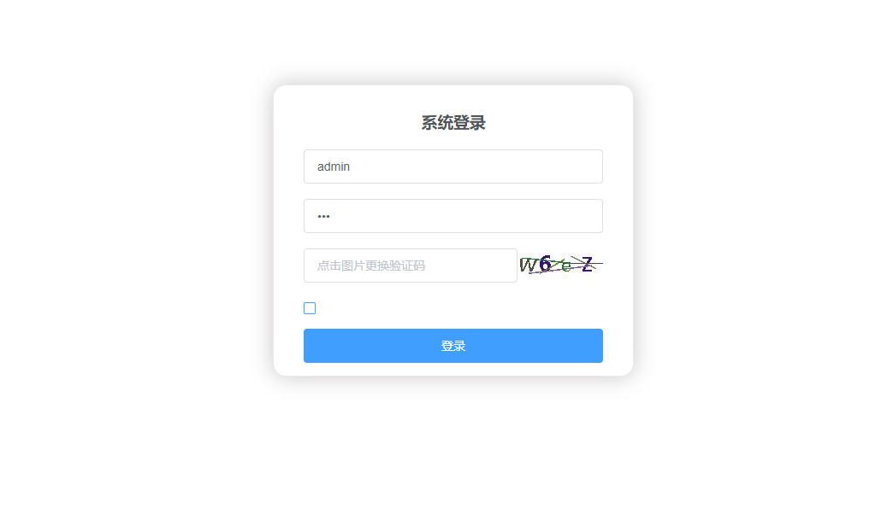

# 登录功能测试

## 主要针对登录功能进行测试用例设计

## 1.测试内容概述

该部分测试用例一共编写31条

### 登录页面

如果图片无法打开，请修改host文件

<ul style="font-size:16px">
<li>主要测试点：
    
1.页面设计是否合理，是否符合设计图

    
2.几个输入框测试

    
3.<kbd>Enter</kbd>、<kbd>TAB</kbd>等快捷键的使用

    
4.不同角色登录成功后的权限分配

    
5.登录成功后会话超时的相关设定

    
6.记住密码的使用

    
......

</li>
</ul>

## 后续详细内容请参考以下表格：

由于许多单元格内容过长，显示效果不太好，下面贴出excel表格

<a href="./登录测试用例.xlsx">链接：登录测试用例</a>

| 平台     | 所属模块 | 用例标题                             | 前置条件                                                     | 步骤                                                         | 预期                                                         | 关键词       | 优先级 | 用例类型 | 适用阶段     | 备注       | 类型可选值列表 | 阶段可选值列表 | 平台          |
| -------- | -------- | ------------------------------------ | ------------------------------------------------------------ | ------------------------------------------------------------ | ------------------------------------------------------------ | ------------ | ------ | -------- | ------------ | ---------- | -------------- | -------------- | ------------- |
| 所有平台 | /登录    | 访问登录页面                         | 1.处于联网状态                                               | 1.输入vhr域名                                                | 1.成功访问页面 2.页面设计符合设计图 3.响应时间不超过3秒      | 访问页面     | 低     |          |              |            |                |                |               |
| 所有平台 | /登录    | 输入正确的账号、密码和验证码         | 1.处于联网状态 2.访问vhr登录页面                             | 1. 输入正确的账号 2. 输入正确的密码 3. 输入正确的验证码  4.点击登录 | 1. 提示登录成功的消息 2. 跳转到vhr首页                       | 登录成功     | 中     | 功能测试 | 功能测试阶段 | 有效等价类 |                |                | 所有平台(#0)  |
| 所有平台 | /登录    | 输入正确的账号、验证码和错误的密码   | 1.处于联网状态 2.访问vhr登录页面                             | 1. 输入正确的账号 2. 输入错误的密码 3. 输入正确的验证码 4. 点击登录 | 1. 提示用户信息填写错误 2.清空密码输入框的内容  3.指针焦点停留在用户名处 4.验证码刷新 | 登录失败     | 中     | 功能测试 | 功能测试阶段 | 无效等价类 |                |                | 所有平台(#1)  |
| 所有平台 | /登录    | 输入正确的账号、密码和错误的验证码   | 1.处于联网状态 2.访问vhr登录页面                             | 1. 输入正确的账号 2. 输入正确的密码 3. 输入错误的验证码 4. 点击登录 | 1. 提示用户信息填写错误  2.指针焦点停留在验证码表单处 3.验证码刷新 | 登录失败     | 中     | 功能测试 | 功能测试阶段 | 无效等价类 |                |                | 所有平台(#2)  |
| 所有平台 | /登录    | 输入未注册的账号，任意密码和验证码   | 1.处于联网状态 2.访问vhr登录页面                             | 1. 输入未注册的账号 2. 输入任意的密码 3.输入任意的验证码 4.点击登录 | 1. 提示用户名不存在 2. 清空密码输入框的内容 3.指针焦点停留在用户名处 4.验证码刷新 | 登录失败     | 中     | 功能测试 | 功能测试阶段 | 无效等价类 |                |                | 所有平台(#3)  |
| 所有平台 | /登录    | 输入没有权限的账号，任意密码和验证码 | 1.处于联网状态 2.访问vhr登录页面                             | 1. 输入没有权限的账号 2. 输入任意的密码 3.输入任意的验证码 4.点击登录 | 1. 提示该用户名没有权限访问 2. 清空表单输入内容 3.指针焦点停留在用户名处 4.验证码刷新 | 登录失败     | 中     | 功能测试 | 功能测试阶段 | 无效等价类 |                |                | 所有平台(#4)  |
| 所有平台 | /登录    | 输入空的账号，密码和验证码           | 1.处于联网状态 2.访问vhr登录页面                             | 1. 点击登录                                                  | 1. 在用户名输入框处提示请输入用户名 2. 在密码输入框处提示请输入密码 3.在验证码输入框处提示请输入验证码 | 登录失败     | 中     | 功能测试 | 功能测试阶段 | 无效等价类 |                |                | 所有平台(#5)  |
| 所有平台 | /登录    | 超过范围长度上限的用户名登录         | 1.处于联网状态 2.访问vhr登录页面                             | 1.输入超过255个字符的用户名 2.输入边界长度内的密码 3.输入任意验证码 4.点击登录 | 1.提示用户名长度超限的失败信息 2.清除密码输入框的内容 3.验证码刷新 | 边界值       | 中     | 功能测试 | 功能测试阶段 | 无效等价类 |                |                | 所有平台(#12) |
| 所有平台 | /登录    | 边界长度内用户名登录                 | 1.处于联网状态 2.访问vhr登录页面                             | 1.输入254个字符的用户名 2.输入边界长度内的密码 3.输入任意验证码 4.点击登录 | 1. 提示登录成功的消息 2. 跳转到vhr首页                       | 边界值       | 中     | 功能测试 | 功能测试阶段 | 有效等价类 |                |                | 所有平台(#13) |
| 所有平台 | /登录    | 使用超过范围上限的密码登录           | 1.处于联网状态 2.访问vhr登录页面                             | 1.输入超过255个字符的密码 2.输入边界长度内的用户名 3.输入任意验证码 4.点击登录 | 1.提示密码长度超限的失败信息 2.清除密码输入框的内容 3.验证码刷新 | 边界值       | 中     | 功能测试 | 功能测试阶段 | 无效等价类 |                |                | 所有平台(#14) |
| 所有平台 | /登录    | 边界长度内用户名登录                 | 1.处于联网状态 2.访问vhr登录页面                             | 1.输入254个字符的密码 2.输入边界长度内的用户名 3.输入任意验证码 4.点击登录 | 1. 提示登录成功的消息 2. 跳转到vhr首页                       | 边界值       | 中     | 功能测试 | 功能测试阶段 | 有效等价类 |                |                | 所有平台(#15) |
| 所有平台 | /登录    | 用户名大小写敏感                     | 1.处于联网状态 2.访问vhr登录页面                             | 1.输入账号Admin； 2.输入密码123； 3.输入正确验证码 4.点击登录 | 1. 提示用户名或密码输入错误 2. 表单内账号保留，密码与验证码清空 3. 验证码刷新 | 大小写       | 中     | 功能测试 | 功能测试阶段 | 无效等价类 |                |                | 所有平台(#16) |
| 所有平台 | /登录    | 密码大小写敏感                       | 1.处于联网状态 2.访问vhr登录页面                             | 1.输入账号mzy； 2.输入密码MZY123456； 3.输入正确验证码 4.点击登录 | 1. 提示用户名或密码输入错误 2. 表单内账号保留，密码与验证码清空 3. 验证码刷新 | 大小写       | 中     | 功能测试 | 功能测试阶段 | 无效等价类 |                |                | 所有平台(#17) |
| 所有平台 | /登录    | 验证码大小写敏感                     | 1.处于联网状态 2.访问vhr登录页面  3.输入正确的账号密码       | 1.输入正确的验证码，将其中的小写字符替换为大写 2.点击登录    | 1. 提示登录成功的消息 2. 跳转到vhr首页                       | 大小写       | 中     | 功能测试 | 功能测试阶段 | 有效等价类 |                |                | 所有平台(#18) |
| 所有平台 | /登录    | 用户名输入框输入特殊字符             | 1.密码、验证码输入正确                                       | 1.用户名输入“@#￥@@” 2.点击登录                              | 1. 提示用户名或密码输入错误 2. 表单内账号保留，密码与验证码清空 3. 验证码刷新 |              | 中     | 功能测试 | 功能测试阶段 | 无效等价类 |                |                | 所有平台(#19) |
| 所有平台 | /登录    | 用户名输入框输入攻击性字符           | 1.密码、验证码输入正确                                       | 1.用户名输入“<input>” 2.点击登录                             | 1. 提示用户名或密码输入错误 2. 表单内账号保留，密码与验证码清空 3. 验证码刷新 |              | 中     | 功能测试 | 功能测试阶段 | 无效等价类 |                |                | 所有平台(#20) |
| 所有平台 | /登录    | 密码输入框输入特殊字符               | 1.用户名、验证码输入正确                                     | 1.密码输入“@#￥@@” 2.点击登录                                | 1. 提示用户名或密码输入错误 2. 表单内账号保留，密码与验证码清空 3. 验证码刷新 |              | 中     | 功能测试 | 功能测试阶段 | 无效等价类 |                |                | 所有平台(#21) |
| 所有平台 | /登录    | 密码输入框输入攻击性字符             | 1.密码、验证码输入正确                                       | 1.密码输入“'’or1=1” 2.点击登录                               | 1. 提示用户名或密码输入错误 2. 表单内账号保留，密码与验证码清空 3. 验证码刷新 |              | 中     | 功能测试 | 功能测试阶段 | 无效等价类 |                |                | 所有平台(#22) |
| 所有平台 | /登录    | 验证码输入框输入特殊字符             | 1.密码、用户名输入正确                                       | 1.验证码输入“@#￥@@” 2.点击登录                              | 1. 提示验证码输入错误 2. 表单内账号保留，密码与验证码清空 3. 验证码刷新 |              | 中     | 功能测试 | 功能测试阶段 | 无效等价类 |                |                | 所有平台(#23) |
| 所有平台 | /登录    | 验证码输入框输入攻击性字符           | 1.密码、用户名输入正确                                       | 1.验证码输入“<input>” 2.点击登录                             | 1. 提示验证码输入错误 2. 表单内账号保留，密码与验证码清空 3. 验证码刷新 |              | 中     | 功能测试 | 功能测试阶段 | 无效等价类 |                |                | 所有平台(#24) |
| 所有平台 | /登录    | 点击验证码刷新，刷新后可用           | 1.处于联网状态 2.访问vhr登录页面                             | 1. 鼠标点击验证码图片                                        | 1. 验证码图片刷新 2.输入正确的账号密码，以及刷新后的验证码登录成功 | 验证码       | 中     | 功能测试 | 功能测试阶段 |            |                |                | 所有平台(#7)  |
| 所有平台 | /登录    | 刷新页面验证码刷洗，刷洗后可用       | 1.处于联网状态 2.访问vhr登录页面                             | 1.使用F5或者鼠标右键选择刷新                                 | 1. 验证码图片刷新 2.输入正确的账号密码，以及刷新后的验证码登录成功 | 验证码       | 中     | 功能测试 | 功能测试阶段 |            |                |                |               |
| 所有平台 | /登录    | 账号密码的空格处理                   | 1.处于联网状态 2.访问vhr登录页面 3.输入正确的账号密码以及验证码 | 1. 在账号字符串前和账号字符串后加上3个空格 2. 在密码字符串前和密码字符串后加上4个空格 3.点击登录 | 1. 提示登录成功的消息 2. 跳转到vhr首页                       | 空格处理     | 中     | 功能测试 | 功能测试阶段 |            |                |                | 所有平台(#8)  |
| 所有平台 | /登录    | 密码密文处理                         | 1.处于联网状态 2.访问vhr登录页面                             | 1. 输入密码                                                  | 1. 密码不明文显示，而是由密文显示                            | 密码处理     | 中     | 功能测试 | 功能测试阶段 |            |                |                | 所有平台(#9)  |
| 所有平台 | /登录    | 开启大写输入密码                     | 1.处于联网状态 2.访问vhr登录页面                             | 1. 输入密码                                                  | 1.提示大写已开启                                             | 输入提示     | 低     | 功能测试 | 功能测试阶段 |            |                |                | 所有平台(#10) |
| 所有平台 | /登录    | 登录后页面跳转                       | 1.处于联网状态  2.输入正确的账号、密码和验证码               | 1.点击登录                                                   | 1.跳转到vhr系统首页                                          | 页面跳转     | 中     | 功能测试 | 功能测试阶段 |            |                |                | 所有平台(#11) |
| 所有平台 | /登录    | 勾选记住账号密码登录                 | 1.处于联网状态 2.访问vhr登录页面 3.输入正确的账号密码以及验证码 | 1.勾选记住账号密码 2.点击登录                                | 1. 提示登录成功的消息 2. 跳转到vhr首页 3.用户注销登录跳转到登录页面，或下一次访问登录页面，账号密码输入框自动填充上次成功登录的账号和密码 | 记住账号密码 | 中     | 功能测试 | 功能测试阶段 |            |                |                | 所有平台(#6)  |
| 所有平台 | /登录    | 登录后角色权限分配                   | 1.处于联网状态 2.访问vhr登录页面                             | 1.输入账号Admin； 2.输入密码123； 3.输入正确验证码 4.点击登录 | 1. 提示登录成功的消息 2.从vhr数据库的role表中读取admin的权限字段，以及该权限拥有的url 3. 跳转到vhr首页，读取的url能正常显示在导航栏中 | 权限         | 中     | 功能测试 | 功能测试阶段 |            |                |                | 所有平台(#18) |
| 所有平台 | /登录    | 登录成功后session时效性设置          | 1.登录成功                                                   | 1.系统一段时间不执行操作                                     | 1.session过期，跳转到登录页面                                | session      | 中     | 功能测试 | 功能测试阶段 |            |                |                | 所有平台(#19) |
| 所有平台 | /登录    | 登录页面前进后退按钮是否可用         | 1.登录超时，跳转到登录页面                                   | 1.登记后退按钮                                               | 1.页面不能退回系统内部 2.登录页面不发送请求                  |              | 中     | 功能测试 | 功能测试阶段 |            |                |                | 所有平台(#20) |