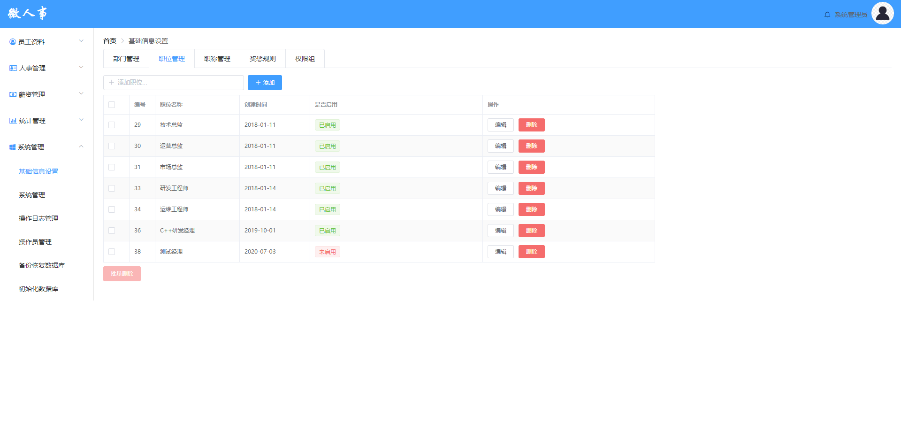

# 职位管理功能测试

## 主要针对职位管理进行测试用例设计

## 2.测试内容概述

该部分测试用例一共编写45条

职位管理页面:

如果图片无法打开，请修改host文件

## 后续详细内容请参考以下表格：

由于许多单元格内容过长，显示效果不太好，下面贴出excel表格

<a href="./职位管理测试用例设计.xlsx">链接：职位管理测试用例</a>

| 平台     | 所属模块                       | 用例标题                                             | 前置条件                                                | 步骤                                                     | 预期                                                         | 关键词 | 优先级 | 用例类型 | 适用阶段     | 备注       | 类型可选值列表 | 阶段可选值列表 | 平台           |
| -------- | ------------------------------ | ---------------------------------------------------- | ------------------------------------------------------- | -------------------------------------------------------- | ------------------------------------------------------------ | ------ | ------ | -------- | ------------ | ---------- | -------------- | -------------- | -------------- |
| 所有平台 | 系统管理/基础信息设置/职位管理 | 点击“职位管理”url访问页面                            |                                                         | 1.点击导航栏中的“职位管理”url                            | 1.页面跳转到“职位管理”页面                                   |        | 中     | 功能测试 | 功能测试阶段 |            |                |                | 所有平台(#513) |
| 所有平台 | 系统管理/基础信息设置/职位管理 | “职位管理”页面内容显示                               |                                                         | 1.点击导航栏中的“职位管理”url                            | 1.页面设计符合设计图 2.页面发送职位查询请求，从数据库position表中查询到公司所有职位 3.将职位信息填充进前台表格中 |        | 低     | 功能测试 | 功能测试阶段 |            |                |                | 所有平台(#514) |
| 所有平台 | 系统管理/基础信息设置/职位管理 | 添加职位输入框输入边界长度内的中文字符               |                                                         | 1.添加职位输入框输入“测试经理” 2.点击添加                | 1.页面发送添加请求，请求参数为name=“测试经理” 2.数据库position表中新增一条字段，position的name属性为“测试经理” 3.前端页面提示添加成功，职位表格刷新，新增“测试经理”职位 |        | 中     | 功能测试 | 功能测试阶段 | 有效等价类 |                |                | 所有平台(#515) |
| 所有平台 | 系统管理/基础信息设置/职位管理 | 添加职位输入框输入边界长度内的英文字符               |                                                         | 1.职位名输入框输入“TestManager” 2.点击确定               | 1.页面发送添加请求，请求参数为name=“TestManager” 2.数据库position表中新增一条字段，position的name属性为“TestManager” 3.前端页面提示添加成功，职位表格刷新，新增“TestManager”职位 |        | 中     | 功能测试 | 功能测试阶段 | 有效等价类 |                |                | 所有平台(#516) |
| 所有平台 | 系统管理/基础信息设置/职位管理 | 添加职位输入框输入边界长度内的数字                   |                                                         | 1.职位名输入框输入“123” 2.点击确定                       | 1.页面发送添加请求，请求参数为name=“123” 2.数据库position表中新增一条字段，position的name属性为“123” 3.前端页面提示添加成功，职位表格刷新，新增“123”职位 |        | 中     | 功能测试 | 功能测试阶段 | 有效等价类 |                |                | 所有平台(#517) |
| 所有平台 | 系统管理/基础信息设置/职位管理 | 添加职位输入框输入右边界长度上的中英文、数字混合     |                                                         | 1.职位名输入框输入“测试B12345” 2.点击确定                | 1.页面发送添加请求，请求参数为name=“测试B12345” 2.数据库position表中新增一条字段，position的name属性为“测试B12345” 3.前端页面提示添加成功，职位表格刷新，新增“测试B12345”职位 |        | 中     | 功能测试 | 功能测试阶段 | 有效等价类 |                |                | 所有平台(#518) |
| 所有平台 | 系统管理/基础信息设置/职位管理 | 添加职位输入框输入左边界长度上的中文                 |                                                         | 1.职位名输入框输入“测” 2.点击确定                        | 1.页面发送添加请求，请求参数为name=“测” 2.数据库position表中新增一条字段，position的name属性为“测” 3.前端页面提示添加成功，职位表格刷新，新增“测”职位 |        | 中     | 功能测试 | 功能测试阶段 | 有效等价类 |                |                | 所有平台(#519) |
| 所有平台 | 系统管理/基础信息设置/职位管理 | 添加职位输入框输入边界长度内的符号                   |                                                         | 1.职位名输入框输入“@#￥” 2.点击确定                      | 1.提示请输入正确的职位名 2.页面不发送查询请求                |        | 中     | 功能测试 | 功能测试阶段 | 无效等价类 |                |                | 所有平台(#520) |
| 所有平台 | 系统管理/基础信息设置/职位管理 | 添加职位输入框输入边界长度内的特殊符号               |                                                         | 1.职位名输入框输入“null” 2.点击确定                      | 1.提示请输入正确的职位名 2.页面不发送查询请求                |        | 中     | 功能测试 | 功能测试阶段 | 无效等价类 |                |                | 所有平台(#521) |
| 所有平台 | 系统管理/基础信息设置/职位管理 | 添加职位输入框输入边界长度内的攻击性符号             |                                                         | 1.职位名输入框输入“'or 1=1#” 2.点击确定                  | 1.提示请输入正确的职位名 2.页面不发送查询请求                |        | 中     | 功能测试 | 功能测试阶段 | 无效等价类 |                |                | 所有平台(#522) |
| 所有平台 | 系统管理/基础信息设置/职位管理 | 输入正确的职位名，前后有空格                         |                                                         | 1.职位名输入框输入“ 测试经理 ” 2.点击确定                | 1.提示请输入正确的职位名 2.页面不发送查询请求                |        | 中     | 功能测试 | 功能测试阶段 | 无效等价类 |                |                | 所有平台(#523) |
| 所有平台 | 系统管理/基础信息设置/职位管理 | 输入正确的职位名，中间有空格                         |                                                         | 1.职位名输入框输入“测试 经理” 2.点击确定                 | 1.提示请输入正确的职位名 2.页面不发送查询请求                |        | 中     | 功能测试 | 功能测试阶段 | 无效等价类 |                |                | 所有平台(#524) |
| 所有平台 | 系统管理/基础信息设置/职位管理 | 输入职位名超过右边界长度                             |                                                         | 1.职位名输入框输入“测试经理12312412413123123” 2.点击确定 | 1.提示请输入正确的职位名 2.页面不发送查询请求                |        | 中     | 功能测试 | 功能测试阶段 | 无效等价类 |                |                | 所有平台(#525) |
| 所有平台 | 系统管理/基础信息设置/职位管理 | 输入职位名小于左边界长度                             |                                                         | 1.职位名输入框输入“” 2.点击确定                          | 1.提示请输入职位名 2.页面不发送查询请求                      |        | 中     | 功能测试 | 功能测试阶段 | 无效等价类 |                |                | 所有平台(#526) |
| 所有平台 | 系统管理/基础信息设置/职位管理 | 输入重复的职位名                                     |                                                         | 1.职位名输入框输入“研发经理” 2.点击确定                  | 1.提示已存在该职位 2.页面不发送查询请求                      |        | 中     | 功能测试 | 功能测试阶段 | 无效等价类 |                |                | 所有平台(#527) |
| 所有平台 | 系统管理/基础信息设置/职位管理 | 点击“编辑”按钮打开修改页面                           |                                                         | 1.点击“技术总监”一行右侧“编辑”按钮                       | 1.编辑页面打开 2.页面设计符合设计图 3.职位名称输入框默认值为“技术总监”，是否启用选项默认为启用 |        | 中     | 功能测试 | 功能测试阶段 |            |                |                | 所有平台(#528) |
| 所有平台 | 系统管理/基础信息设置/职位管理 | 修改职位输入框输入边界长度内的中文字符               | 1.点击“技术总监”一行右侧“编辑”按钮 2.选择“启用”         | 1.修改职位输入框输入“测试经理” 2.点击添加                | 1.页面发送修改请求 2.数据库position表中该字段name属性由“技术总监”修改为“测试经理” 3.前端页面提示修改成功，职位表格刷新，“技术总监”改为“测试经理” |        | 中     | 功能测试 | 功能测试阶段 | 有效等价类 |                |                | 所有平台(#529) |
| 所有平台 | 系统管理/基础信息设置/职位管理 | 添加职位输入框输入边界长度内的英文字符               | 1.点击“技术总监”一行右侧“编辑”按钮 2.选择“启用”         | 1.职位名输入框输入“TestManager” 2.点击确定               | 1.页面发送修改请求 2.数据库position表中该字段name属性由“技术总监”修改为“TestManager” 3.前端页面提示修改成功，职位表格刷新，“技术总监”改为“TestManager” |        | 中     | 功能测试 | 功能测试阶段 | 有效等价类 |                |                | 所有平台(#530) |
| 所有平台 | 系统管理/基础信息设置/职位管理 | 添加职位输入框输入边界长度内的数字                   | 1.点击“技术总监”一行右侧“编辑”按钮 2.选择“启用”         | 1.职位名输入框输入“123” 2.点击确定                       | 1.页面发送修改请求 2.数据库position表中该字段name属性由“技术总监”修改为“123” 3.前端页面提示修改成功，职位表格刷新，“技术总监”改为“123” |        | 中     | 功能测试 | 功能测试阶段 | 有效等价类 |                |                | 所有平台(#531) |
| 所有平台 | 系统管理/基础信息设置/职位管理 | 添加职位输入框输入右边界长度上的中英文、数字混合     | 1.点击“技术总监”一行右侧“编辑”按钮 2.选择“启用”         | 1.职位名输入框输入“测试B12345” 2.点击确定                | 1.页面发送修改请求 2.数据库position表中该字段name属性由“技术总监”修改为“测试B12345” 3.前端页面提示修改成功，职位表格刷新，“技术总监”改为“测试B12345” |        | 中     | 功能测试 | 功能测试阶段 | 有效等价类 |                |                | 所有平台(#532) |
| 所有平台 | 系统管理/基础信息设置/职位管理 | 添加职位输入框输入左边界长度上的中文                 | 1.点击“技术总监”一行右侧“编辑”按钮 2.选择“启用”         | 1.职位名输入框输入“测” 2.点击确定                        | 1.页面发送修改请求 2.数据库position表中该字段name属性由“技术总监”修改为“测” 3.前端页面提示修改成功，职位表格刷新，“技术总监”改为“测” |        | 中     | 功能测试 | 功能测试阶段 | 有效等价类 |                |                | 所有平台(#533) |
| 所有平台 | 系统管理/基础信息设置/职位管理 | 添加职位输入框输入边界长度内的符号                   | 1.点击“技术总监”一行右侧“编辑”按钮 2.选择“启用”         | 1.职位名输入框输入“@#￥” 2.点击确定                      | 1.提示请输入正确的职位名 2.页面不发送查询请求                |        | 中     | 功能测试 | 功能测试阶段 | 无效等价类 |                |                | 所有平台(#534) |
| 所有平台 | 系统管理/基础信息设置/职位管理 | 添加职位输入框输入边界长度内的特殊符号               | 1.点击“技术总监”一行右侧“编辑”按钮 2.选择“启用”         | 1.职位名输入框输入“null” 2.点击确定                      | 1.提示请输入正确的职位名 2.页面不发送查询请求                |        | 中     | 功能测试 | 功能测试阶段 | 无效等价类 |                |                | 所有平台(#535) |
| 所有平台 | 系统管理/基础信息设置/职位管理 | 添加职位输入框输入边界长度内的攻击性符号             | 1.点击“技术总监”一行右侧“编辑”按钮 2.选择“启用”         | 1.职位名输入框输入“'or 1=1#” 2.点击确定                  | 1.提示请输入正确的职位名 2.页面不发送查询请求                |        | 中     | 功能测试 | 功能测试阶段 | 无效等价类 |                |                | 所有平台(#536) |
| 所有平台 | 系统管理/基础信息设置/职位管理 | 输入正确的职位名，前后有空格                         | 1.点击“技术总监”一行右侧“编辑”按钮 2.选择“启用”         | 1.职位名输入框输入“ 测试经理 ” 2.点击确定                | 1.提示请输入正确的职位名 2.页面不发送查询请求                |        | 中     | 功能测试 | 功能测试阶段 | 无效等价类 |                |                | 所有平台(#537) |
| 所有平台 | 系统管理/基础信息设置/职位管理 | 输入正确的职位名，中间有空格                         | 1.点击“技术总监”一行右侧“编辑”按钮 2.选择“启用”         | 1.职位名输入框输入“测试 经理” 2.点击确定                 | 1.提示请输入正确的职位名 2.页面不发送查询请求                |        | 中     | 功能测试 | 功能测试阶段 | 无效等价类 |                |                | 所有平台(#538) |
| 所有平台 | 系统管理/基础信息设置/职位管理 | 输入职位名超过右边界长度                             | 1.点击“技术总监”一行右侧“编辑”按钮 2.选择“启用”         | 1.职位名输入框输入“测试经理12312412413123123” 2.点击确定 | 1.提示请输入正确的职位名 2.页面不发送查询请求                |        | 中     | 功能测试 | 功能测试阶段 | 无效等价类 |                |                | 所有平台(#539) |
| 所有平台 | 系统管理/基础信息设置/职位管理 | 输入职位名小于左边界长度                             | 1.点击“技术总监”一行右侧“编辑”按钮 2.选择“启用”         | 1.职位名输入框输入“” 2.点击确定                          | 1.提示请输入职位名 2.页面不发送查询请求                      |        | 中     | 功能测试 | 功能测试阶段 | 无效等价类 |                |                | 所有平台(#540) |
| 所有平台 | 系统管理/基础信息设置/职位管理 | 不修改职位名提交                                     | 1.点击“技术总监”一行右侧“编辑”按钮 2.选择“启用”         | 1.点击确定                                               | 1.提示请修改职位名 2.页面不发送查询请求                      |        | 中     | 功能测试 | 功能测试阶段 | 无效等价类 |                |                | 所有平台(#541) |
| 所有平台 | 系统管理/基础信息设置/职位管理 | 职位名修改为该系统已有的且已启用的职位名             | 1.点击“技术总监”一行右侧“编辑”按钮 2.职位名已有且已启用 | 1.职位名输入框输入“Java研发经理” 2.点击确定              | 1.提示该职位已存在 2.页面不发送查询请求                      |        | 中     | 功能测试 | 功能测试阶段 | 无效等价类 |                |                | 所有平台(#542) |
| 所有平台 | 系统管理/基础信息设置/职位管理 | 职位名修改为该系统已有的且未启用的职位名             | 1.点击“技术总监”一行右侧“编辑”按钮 2.职位名已有且未启用 | 1.职位名输入框输入“测试经理” 2.点击确定                  | 1.提示该职位已存在 2.页面不发送查询请求                      |        | 中     | 功能测试 | 功能测试阶段 |            |                |                | 所有平台(#543) |
| 所有平台 | 系统管理/基础信息设置/职位管理 | 正确修改原职位名，是否启用选项选择否                 | 1.修改的职位名输入正确                                  | 1.是否启用选项选择否 2.点击确定                          | 1.页面发送修改请求 2.数据库position表中该字段enabled属性由“1”修改为“0” 3.前端页面提示修改成功，职位表格刷新，是否启用一列中为“未启用” |        | 中     | 功能测试 | 功能测试阶段 |            |                |                | 所有平台(#544) |
| 所有平台 | 系统管理/基础信息设置/职位管理 | 不修改原职位名，是否启动选项选择否                   |                                                         | 1.是否启用选项选择否 2.点击确定                          | 1.页面发送修改请求 2.数据库position表中该字段enabled属性由“1”修改为“0” 3.前端页面提示修改成功，职位表格刷新，是否启用一列中为“未启用” |        | 中     | 功能测试 | 功能测试阶段 |            |                |                | 所有平台(#545) |
| 所有平台 | 系统管理/基础信息设置/职位管理 | 点击删除按钮删除已启用的职位                         | 1.职位已启用                                            | 1.点击“测试经理”右侧的删除按钮                           | 1.弹出确认提示框，提示内容“该职位已启用，确定要永久删除该职位吗”，2.提示框提供确认与取消按钮 |        | 中     | 功能测试 | 功能测试阶段 |            |                |                | 所有平台(#546) |
| 所有平台 | 系统管理/基础信息设置/职位管理 | 选择确认按钮提交删除已启用的职位请求                 | 1.职位已启用                                            | 1.点击确定按钮                                           | 1.发送删除“测试经理”职位请求 2.数据库内“测试经理”一行数据被删除 3.页面刷新，职位表中“测试经理”职位消失 |        | 中     | 功能测试 | 功能测试阶段 |            |                |                | 所有平台(#547) |
| 所有平台 | 系统管理/基础信息设置/职位管理 | 点击删除按钮删除未启用的职位                         | 1.职位未启用                                            | 1.点击“测试经理”右侧的删除按钮                           | 1.弹出确认提示框，提示内容“确定要永久删除该职位吗” 2.提示框提供确认与取消按钮 |        | 中     | 功能测试 | 功能测试阶段 |            |                |                | 所有平台(#548) |
| 所有平台 | 系统管理/基础信息设置/职位管理 | 选择确认按钮提交删除未启用的职位请求                 | 1.职位未启用                                            | 1.点击确定按钮                                           | 1.发送删除“测试经理”职位请求 2.数据库内“测试经理”一行数据被删除 3.页面刷新，职位表中“测试经理”职位消失 |        | 中     | 功能测试 | 功能测试阶段 |            |                |                | 所有平台(#549) |
| 所有平台 | 系统管理/基础信息设置/职位管理 | 选择取消按钮取消删除请求                             |                                                         | 1.点击取消按钮                                           | 1.确认提示框消失 2.不执行删除操作                            |        | 中     | 功能测试 | 功能测试阶段 |            |                |                | 所有平台(#550) |
| 所有平台 | 系统管理/基础信息设置/职位管理 | 没有勾选批量删除多选选框，批量删除按钮不可获取       | 1.不勾选批量删除多选框                                  |                                                          | 1.批量删除按钮显示不可点击 2.点击批量删除按钮不生效          |        | 中     | 功能测试 | 功能测试阶段 |            |                |                | 所有平台(#551) |
| 所有平台 | 系统管理/基础信息设置/职位管理 | 批量删除多选框全没被勾选时使用全选框勾选             | 1.批量删除多选框全没被勾选                              | 1.勾选“编号”旁的全选框                                   | 1.批量删除多选框全被勾选                                     |        | 低     | 功能测试 | 功能测试阶段 |            |                |                | 所有平台(#552) |
| 所有平台 | 系统管理/基础信息设置/职位管理 | 批量删除多选框多个被勾选时使用全选框勾选             | 1.多个批量删除多选框被勾选                              | 1.勾选“编号”旁的全选框                                   | 1.批量删除多选框全被勾选                                     |        | 低     | 功能测试 | 功能测试阶段 |            |                |                | 所有平台(#553) |
| 所有平台 | 系统管理/基础信息设置/职位管理 | 批量删除多选框全被勾选时使用全选框勾选               | 1.批量删除多选框全被勾选                                | 1.勾选“编号”旁的全选框                                   | 1.批量删除多选框全部取消勾选                                 |        | 低     | 功能测试 | 功能测试阶段 |            |                |                | 所有平台(#554) |
| 所有平台 | 系统管理/基础信息设置/职位管理 | 勾选多个批量删除多选框后使用批量删除按钮执行删除操作 | 1.勾选3个批量删除多选框                                 | 1.点击批量删除按钮                                       | 1.弹出删除确认提示框，提示框信息“确认删除这【3】条职位信息吗” 2.提供确认与取消按钮 |        | 中     | 功能测试 | 功能测试阶段 |            |                |                | 所有平台(#555) |
| 所有平台 | 系统管理/基础信息设置/职位管理 | 点击确认执行批量删除                                 | 1.勾选3个批量删除多选框 2.点击批量删除按钮              | 1.点击确定按钮                                           | 1.发送批量删除请求 2.数据库内对应3条职位字段被删除 3.页面刷新，职位表中对应三个职位被删除 |        | 中     | 功能测试 | 功能测试阶段 |            |                |                | 所有平台(#556) |
| 所有平台 | 系统管理/基础信息设置/职位管理 | 点击取消不执行批量删除                               | 1.勾选3个批量删除多选框 2.点击批量删除按钮              | 1.点击取消按钮                                           | 1.确认框关闭 2.页面不发送请求 3.批量删除多选框勾选状态保留   |        | 中     | 功能测试 | 功能测试阶段 |            |                |                | 所有平台(#557) |