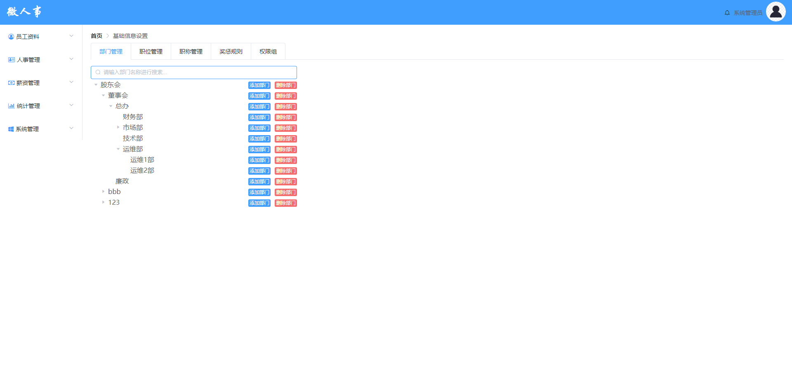

# 部门管理功能测试

## 主要针对部门管理功能进行测试用例设计

## 1.测试内容概述

该部分测试用例一共编写47条

部门管理设置页面

如果图片无法打开，请修改host文件

<ul style="font-size:16px">
<li>主要测试点：
    
1.页面设计是否合理，是否符合设计图

    
2.部门树形结构显示

    
3.添加部门

    
4.删除部门

    
5.搜索

    
......

</li>
</ul>

## 后续详细内容请参考以下表格：

由于许多单元格内容过长，显示效果不太好，下面贴出excel表格

<a href="./部门管理测试用例设计.xlsx">链接：部门管理测试用例</a>

| 平台     | 所属模块                       | 用例标题                                       | 前置条件                                       | 步骤                                                   | 预期                                                         | 关键词     | 优先级 | 用例类型 | 适用阶段     | 备注       | 类型可选值列表 | 阶段可选值列表 | 平台           |
| -------- | ------------------------------ | ---------------------------------------------- | ---------------------------------------------- | ------------------------------------------------------ | ------------------------------------------------------------ | ---------- | ------ | -------- | ------------ | ---------- | -------------- | -------------- | -------------- |
| 所有平台 | 系统管理/基础信息设置/部门管理 | “部门管理”页面内容显示                         |                                                | 1.点击导航栏中的“部门管理”进入部门管理页面             | 1.页面设计符合设计图 2.页面提供部门搜索文本框 3.页面发送部门查询请求，从数据库department表中查询到公司所有部门及其子部门，以树形结构处理各个部门的关系 3.默认显示每个部门树形结构的根节点部门 4.部门后提供“添加部门”、“删除部门”两个按钮 |            | 中     | 功能测试 | 功能测试阶段 |            |                |                | 所有平台(#466) |
| 所有平台 | 系统管理/基础信息设置/部门管理 | 点击“》”按钮展开节点                           | 1.该节点有子节点                               | 1.点击“股东会”左侧的“》”按钮                           | 1.股东会展开，显示其子节点                                   |            | 中     | 功能测试 | 功能测试阶段 |            |                |                | 所有平台(#467) |
| 所有平台 | 系统管理/基础信息设置/部门管理 | 没有子节点的父节点不提供展开功能               | 1.所选父节点没有子节点                         | 1.点击“bbb”左侧“》”按钮展开子部门“111”                 | 1.“111”部门没有“》”按钮提供展开功能                          |            | 中     | 功能测试 | 功能测试阶段 |            |                |                | 所有平台(#468) |
| 所有平台 | 系统管理/基础信息设置/部门管理 | 为没有子节点的父节点添加子节点后，显示展开按钮 | 1.所选父节点没有子节点                         | 1.在数据库中为“111”部门添加一个子部门 2.刷新页面       | 1.“111”部门左侧出现“》”按钮 2.“》”按钮展开功能正常使用       |            | 中     | 功能测试 | 功能测试阶段 |            |                |                | 所有平台(#469) |
| 所有平台 | 系统管理/基础信息设置/部门管理 | 为有子节点的父节点删除其子节点后，展开按钮小时 | 1.所选父节点有子节点                           | 1.在数据库中为“123”部门删除其子部门“456” 2.刷新页面    | 1.“123”部门左侧展开按钮消失                                  |            | 中     | 功能测试 | 功能测试阶段 |            |                |                | 所有平台(#470) |
| 所有平台 | 系统管理/基础信息设置/部门管理 | “部门管理”页面部门树形结构显示                 | 1.进入部门管理页面 2.department表中有部门值    | 1.点击“股东会”左侧的“》”按钮                           | 1.“股东会”处于展开状态，显示该部门下的子节点 2.每个子节点默认隐藏自己的子节点 3.父节点与子节点用明显的缩进来区分父子关系，父节点展开后子节点向前缩进1个字符 4.每个子节点后都有“添加部门”、“删除部门”两个按钮 |            | 中     | 功能测试 | 功能测试阶段 |            |                |                | 所有平台(#471) |
| 所有平台 | 系统管理/基础信息设置/部门管理 | 点击“添加部门”按钮显示添加部门页面             |                                                | 1.点击“股东会”右侧的“添加部门”按钮                     | 1.弹出添加部门页面 2.添加部门页面设计符合设计图 3.添加部门页面中上级部门的值为“股东会” 4.提供部门名称输入框,输入框默认获得焦点 5.提供提交表单与退出页面的按钮 |            | 中     | 功能测试 | 功能测试阶段 |            |                |                | 所有平台(#472) |
| 所有平台 | 系统管理/基础信息设置/部门管理 | 点击“取消”按钮退出添加部门页面                 | 1.添加部门页面已弹出                           | 1.点击“取消”按钮                                       | 1.添加部门页面关闭 2.页面不执行添加操作                      |            | 中     | 功能测试 | 功能测试阶段 |            |                |                | 所有平台(#473) |
| 所有平台 | 系统管理/基础信息设置/部门管理 | 点击“确定”按钮提交添加部门请求                 | 1.添加部门页面已弹出 2.部门名称输入正确        | 1.点击“确定”按钮                                       | 1.提示添加成功 2.添加部门页面关闭 3.页面执行添加操作，发送添加请求 4.数据库department表落一条字段，字段属性与表单内容一致 5.页面更新，父节点部门下新增一个子部门， 子部门与其他子部门处于同列，较父节点缩进一个字符 |            | 中     | 功能测试 | 功能测试阶段 |            |                |                | 所有平台(#474) |
| 所有平台 | 系统管理/基础信息设置/部门管理 | 部门名输入边界长度内的中文字符                 | 1.选择“总办”作为父节点                         | 1.部门名输入框输入“后勤部” 2.点击确定                  | 1.提示添加成功 2.添加部门页面关闭 3.页面执行添加操作，发送添加请求 4.数据库department表落一条字段，字段属性与表单内容一致 5.页面更新，“总办”父节点部门下新增“后勤部”子部门， 子部门与其他子部门处于同列，较父节点缩进一个字符 | 有效等价类 | 中     | 功能测试 | 功能测试阶段 |            |                |                | 所有平台(#475) |
| 所有平台 | 系统管理/基础信息设置/部门管理 | 部门名输入边界长度内的英文字符                 | 1.选择“总办”作为父节点                         | 1.部门名输入框输入“BackOffice” 2.点击确定              | 1.提示添加成功 2.添加部门页面关闭 3.页面执行添加操作，发送添加请求 4.数据库department表落一条字段，字段属性与表单内容一致 5.页面更新，“总办”父节点部门下新增“BackOffice”子部门， 子部门与其他子部门处于同列，较父节点缩进一个字符 | 有效等价类 | 中     | 功能测试 | 功能测试阶段 |            |                |                | 所有平台(#476) |
| 所有平台 | 系统管理/基础信息设置/部门管理 | 部门名输入边界长度内的数字                     | 1.选择“总办”作为父节点                         | 1.部门名输入框输入“123” 2.点击确定                     | 1.提示添加成功 2.添加部门页面关闭 3.页面执行添加操作，发送添加请求 4.数据库department表落一条字段，字段属性与表单内容一致 5.页面更新，“总办”父节点部门下新增“123”子部门， 子部门与其他子部门处于同列，较父节点缩进一个字符 | 有效等价类 | 中     | 功能测试 | 功能测试阶段 |            |                |                | 所有平台(#477) |
| 所有平台 | 系统管理/基础信息设置/部门管理 | 部门名输入右边界长度上的中英文、数字混合       | 1.选择“总办”作为父节点                         | 1.部门名输入框输入“后勤部B12345” 2.点击确定            | 1.提示添加成功 2.添加部门页面关闭 3.页面执行添加操作，发送添加请求 4.数据库department表落一条字段，字段属性与表单内容一致 5.页面更新，“总办”父节点部门下新增“后勤部B12345”子部门， 子部门与其他子部门处于同列，较父节点缩进一个字符 | 有效等价类 | 中     | 功能测试 | 功能测试阶段 |            |                |                | 所有平台(#478) |
| 所有平台 | 系统管理/基础信息设置/部门管理 | 部门名输入左边界长度上的中文                   | 1.选择“总办”作为父节点                         | 1.部门名输入框输入“后” 2.点击确定                      | 1.提示添加成功 2.添加部门页面关闭 3.页面执行添加操作，发送添加请求 4.数据库department表落一条字段，字段属性与表单内容一致 5.页面更新，“总办”父节点部门下新增“后”子部门， 子部门与其他子部门处于同列，较父节点缩进一个字符 | 有效等价类 | 中     | 功能测试 | 功能测试阶段 |            |                |                | 所有平台(#479) |
| 所有平台 | 系统管理/基础信息设置/部门管理 | 部门名输入边界长度内的符号                     | 1.选择“总办”作为父节点                         | 1.部门名输入框输入“@#￥” 2.点击确定                    | 1.提示添加失败 2.添加部门页面保留，表单内容保留，部门输入框提示“请输入正确的部门名” 3.不执行添加操作 4.“总办”下不增加子部门 | 无效等价类 | 中     | 功能测试 | 功能测试阶段 |            |                |                | 所有平台(#480) |
| 所有平台 | 系统管理/基础信息设置/部门管理 | 部门名输入边界长度内的特殊符号                 | 1.选择“总办”作为父节点                         | 1.部门名输入框输入“null” 2.点击确定                    | 1.提示添加失败 2.添加部门页面保留，表单内容保留，部门输入框提示“请输入正确的部门名” 3.不执行添加操作 4.“总办”下不增加子部门 | 无效等价类 | 中     | 功能测试 | 功能测试阶段 |            |                |                | 所有平台(#481) |
| 所有平台 | 系统管理/基础信息设置/部门管理 | 部门名输入边界长度内的特殊符号                 | 1.选择“总办”作为父节点                         | 1.部门名输入框输入“null” 2.点击确定                    | 1.提示添加失败 2.添加部门页面保留，表单内容保留，部门输入框提示“请输入正确的部门名” 3.不执行添加操作 4.“总办”下不增加子部门 | 无效等价类 | 中     | 功能测试 | 功能测试阶段 |            |                |                | 所有平台(#482) |
| 所有平台 | 系统管理/基础信息设置/部门管理 | 部门名输入边界长度内的攻击性符号               | 1.选择“总办”作为父节点                         | 1.部门名输入框输入“'or 1=1#” 2.点击确定                | 1.提示添加失败 2.添加部门页面保留，表单内容保留，部门输入框提示“请输入正确的部门名” 3.不执行添加操作 4.“总办”下不增加子部门 | 无效等价类 | 中     | 功能测试 | 功能测试阶段 |            |                |                | 所有平台(#483) |
| 所有平台 | 系统管理/基础信息设置/部门管理 | 输入正确的部门名，前后有空格                   | 1.选择“总办”作为父节点                         | 1.部门名输入框输入“ 后勤部 ” 2.点击确定                | 1.提示添加失败 2.添加部门页面保留，表单内容保留，部门输入框提示“请输入正确的部门名” 3.不执行添加操作 4.“总办”下不增加子部门 | 无效等价类 | 中     | 功能测试 | 功能测试阶段 |            |                |                | 所有平台(#484) |
| 所有平台 | 系统管理/基础信息设置/部门管理 | 输入正确的部门名，中间有空格                   | 1.选择“总办”作为父节点                         | 1.部门名输入框输入“后勤 部” 2.点击确定                 | 1.提示添加失败 2.添加部门页面保留，表单内容保留，部门输入框提示“请输入正确的部门名” 3.不执行添加操作 4.“总办”下不增加子部门 | 无效等价类 | 中     | 功能测试 | 功能测试阶段 |            |                |                | 所有平台(#485) |
| 所有平台 | 系统管理/基础信息设置/部门管理 | 输入部门名超过右边界长度                       | 1.选择“总办”作为父节点                         | 1.部门名输入框输入“后勤部12312412413123123” 2.点击确定 | 1.提示添加失败 2.添加部门页面保留，表单内容保留，部门输入框提示“请输入正确的部门名” 3.不执行添加操作 4.“总办”下不增加子部门 | 无效等价类 | 中     | 功能测试 | 功能测试阶段 |            |                |                | 所有平台(#486) |
| 所有平台 | 系统管理/基础信息设置/部门管理 | 输入部门名小于左边界长度                       | 1.选择“总办”作为父节点                         | 1.部门名输入框输入“” 2.点击确定                        | 1.提示添加失败 2.添加部门页面保留，表单内容保留，部门输入框提示“请输入部门名” 3.不执行添加操作 4.“总办”下不增加子部门 | 无效等价类 | 中     | 功能测试 | 功能测试阶段 |            |                |                | 所有平台(#487) |
| 所有平台 | 系统管理/基础信息设置/部门管理 | 点击删除按钮删除无子部门的部门节点后弹出提示框 |                                                | 1.点击“456”部门左侧的删除按钮                          | 1.弹出提示框“是否删除该部门” 2.提供确定按钮提交删除请求，提供取消按钮取消删除 |            | 中     | 功能测试 | 功能测试阶段 |            |                |                | 所有平台(#488) |
| 所有平台 | 系统管理/基础信息设置/部门管理 | 点击删除按钮删除有子部门的部门节点后弹出提示框 |                                                | 1.点击“123”部门左侧的删除按钮                          | 1.弹出提示框“删除该部门会同时删除其子部门，是否要删除” 2.提供确定按钮提交删除请求，提供取消按钮取消删除 |            | 中     | 功能测试 | 功能测试阶段 |            |                |                | 所有平台(#489) |
| 所有平台 | 系统管理/基础信息设置/部门管理 | 点击取消按钮取消删除                           | 1.点击“456”部门左侧的删除按钮 2.弹出删除提示框 | 1.点击取消按钮                                         | 1.提示框关闭 2.不执行删除操作                                |            | 中     | 功能测试 | 功能测试阶段 |            |                |                | 所有平台(#490) |
| 所有平台 | 系统管理/基础信息设置/部门管理 | 点击确定按钮确定删除无子部门的部门节点         | 1.点击“456”部门左侧的删除按钮 2.弹出删除提示框 | 1.点击确定按钮                                         | 1.页面提交删除请求，请求参数为部门的主键id 2.数据库对应部门字段删除 3.提示删除成功，部门页面刷新，该部门消失，部门树重新加载 |            | 中     | 功能测试 | 功能测试阶段 |            |                |                | 所有平台(#491) |
| 所有平台 | 系统管理/基础信息设置/部门管理 | 点击确定按钮确定删除有子部门的部门节点         | 1.点击“456”部门左侧的删除按钮 2.弹出删除提示框 | 1.点击确定按钮                                         | 1.页面提交删除请求，请求参数为部门的主键id 2.数据库对应部门以及其子部门删除，该部门及其子部门中的员工的部门字段为空； 3.提示删除成功，部门页面刷新，该部门及其子部门消失，部门树重新加载； |            | 中     | 功能测试 | 功能测试阶段 |            |                |                | 所有平台(#492) |
| 所有平台 | 系统管理/基础信息设置/部门管理 | 搜索框输入边界长度内的中文字符                 |                                                | 1.搜索框输入框输入“后勤部”                             | 1.页面发送查询请求，参数name=“后勤部”，模糊查询出所有name中包含“后勤部”的部门 2.从数据库department表中查询出对应部门及其父部门 3.前端页面部门树中被查询出的部门的直系上级部门展开，被查询出的部门的父部门下只显示被查询出的部门 |            | 中     | 功能测试 | 功能测试阶段 | 有效等价类 |                |                | 所有平台(#493) |
| 所有平台 | 系统管理/基础信息设置/部门管理 | 搜索框输入边界长度内的英文字符                 |                                                | 1.搜索框输入框输入“BackOffice”                         | 1.页面发送查询请求，参数name=“BackOffice”，模糊查询出所有name中包含“BackOffice”的部门 2.从数据库department表中查询出对应部门及其父部门 3.前端页面部门树中被查询出的部门的直系上级部门展开，被查询出的部门的父部门下只显示被查询出的部门 |            | 中     | 功能测试 | 功能测试阶段 | 有效等价类 |                |                | 所有平台(#494) |
| 所有平台 | 系统管理/基础信息设置/部门管理 | 搜索框输入边界长度内的数字                     |                                                | 1.搜索框输入框输入“123”                                | 1.页面发送查询请求，参数name=“123”，模糊查询出所有name中包含“123”的部门 2.从数据库department表中查询出对应部门及其父部门 3.前端页面部门树中被查询出的部门的直系上级部门展开，被查询出的部门的父部门下只显示被查询出的部门 |            | 中     | 功能测试 | 功能测试阶段 | 有效等价类 |                |                | 所有平台(#495) |
| 所有平台 | 系统管理/基础信息设置/部门管理 | 搜索框输入右边界长度上的中英文、数字混合       |                                                | 1.搜索框输入框输入“后勤部B12345”                       | 1.页面发送查询请求，参数name=“后勤部B12345”，模糊查询出所有name中包含“后勤部B12345”的部门 2.从数据库department表中查询出对应部门及其父部门 3.前端页面部门树中被查询出的部门的直系上级部门展开，被查询出的部门的父部门下只显示被查询出的部门 |            | 中     | 功能测试 | 功能测试阶段 | 有效等价类 |                |                | 所有平台(#496) |
| 所有平台 | 系统管理/基础信息设置/部门管理 | 搜索框输入左边界长度上的中文                   |                                                | 1.搜索框输入框输入“后”                                 | 1.页面发送查询请求，参数name=“后”，模糊查询出所有name中包含“后”的部门 2.从数据库department表中查询出对应部门及其父部门 3.前端页面部门树中被查询出的部门的直系上级部门展开，被查询出的部门的父部门下只显示被查询出的部门 |            | 中     | 功能测试 | 功能测试阶段 | 有效等价类 |                |                | 所有平台(#497) |
| 所有平台 | 系统管理/基础信息设置/部门管理 | 搜索框输入未录入数据库的部门名                 |                                                | 1.搜索框输入框输入“没有这个部门”                       | 1.页面发送查询请求，参数name=“没有这个部门”，模糊查询出所有name中包含“没有这个部门”的部门 2.从数据库department表中查询对应部门及其父部门，返回结果 3.页面显示暂无这个部门 |            | 中     | 功能测试 | 功能测试阶段 | 无效等价类 |                |                | 所有平台(#498) |
| 所有平台 | 系统管理/基础信息设置/部门管理 | 搜索框输入边界长度内的符号                     |                                                | 1.搜索框输入框输入“@#￥”                               | 1.提示请输入正确的部门名 2.页面不发送查询请求，部门树不刷新  |            | 中     | 功能测试 | 功能测试阶段 | 无效等价类 |                |                | 所有平台(#499) |
| 所有平台 | 系统管理/基础信息设置/部门管理 | 搜索框输入边界长度内的特殊符号                 |                                                | 1.搜索框输入框输入“null”                               | 1.提示请输入正确的部门名 2.页面不发送查询请求，部门树不刷新  |            | 中     | 功能测试 | 功能测试阶段 | 无效等价类 |                |                | 所有平台(#500) |
| 所有平台 | 系统管理/基础信息设置/部门管理 | 搜索框输入边界长度内的特殊符号                 |                                                | 1.搜索框输入框输入“null”                               | 1.提示请输入正确的部门名 2.页面不发送查询请求，部门树不刷新  |            | 中     | 功能测试 | 功能测试阶段 | 无效等价类 |                |                | 所有平台(#501) |
| 所有平台 | 系统管理/基础信息设置/部门管理 | 搜索框输入边界长度内的攻击性符号               |                                                | 1.搜索框输入框输入“'or 1=1#”                           | 1.提示请输入正确的部门名 2.页面不发送查询请求，部门树不刷新  |            | 中     | 功能测试 | 功能测试阶段 | 无效等价类 |                |                | 所有平台(#502) |
| 所有平台 | 系统管理/基础信息设置/部门管理 | 搜索框输入正确的部门名，前后有空格             |                                                | 1.搜索框输入框输入“ 后勤部 ”                           | 1.提示请输入正确的部门名 2.页面不发送查询请求，部门树不刷新  |            | 中     | 功能测试 | 功能测试阶段 | 无效等价类 |                |                | 所有平台(#503) |
| 所有平台 | 系统管理/基础信息设置/部门管理 | 搜索框输入正确的部门名，中间有空格             |                                                | 1.搜索框输入框输入“后勤 部”                            | 1.提示请输入正确的部门名 2.页面不发送查询请求，部门树不刷新  |            | 中     | 功能测试 | 功能测试阶段 | 无效等价类 |                |                | 所有平台(#504) |
| 所有平台 | 系统管理/基础信息设置/部门管理 | 搜索框输入部门名超过右边界长度                 |                                                | 1.搜索框输入框输入“后勤部123124124131231”              | 1.提示请输入正确的部门名 2.页面不发送查询请求，部门树不刷新  |            | 中     | 功能测试 | 功能测试阶段 | 无效等价类 |                |                | 所有平台(#505) |
| 所有平台 | 系统管理/基础信息设置/部门管理 | 搜索框输入部门名小于左边界长度                 |                                                | 1.搜索框输入框输入“”                                   | 1.提示请输入部门名 2.页面不发送查询请求，部门树不刷新        |            | 中     | 功能测试 | 功能测试阶段 |            |                |                | 所有平台(#506) |
| 所有平台 | 系统管理/基础信息设置/部门管理 | 搜索成功后，删除搜索框内的字段                 | 1.搜索“后勤部”                                 | 1.删除搜索框内字段                                     | 1.部门树变为默认显示                                         |            | 中     | 功能测试 | 功能测试阶段 |            |                |                | 所有平台(#507) |
| 所有平台 | 系统管理/基础信息设置/部门管理 | 搜索成功后，刷新页面                           | 1.搜索“后勤部”                                 | 1.刷新页面                                             | 1.部门树变为默认显示                                         |            | 中     | 功能测试 | 功能测试阶段 |            |                |                | 所有平台(#508) |
| 所有平台 | 系统管理/基础信息设置/部门管理 | 搜索后显示暂无数据，删除搜索框内的字段         | 1.搜索完成，显示无数据                         | 1.删除搜索框内字段                                     | 1.部门树变为默认显示                                         |            | 中     | 功能测试 | 功能测试阶段 |            |                |                | 所有平台(#509) |
| 所有平台 | 系统管理/基础信息设置/部门管理 | 搜索后显示暂无数据，刷新页面                   | 1.搜索完成，显示无数据                         | 1.刷新页面                                             | 1.部门树变为默认显示                                         |            | 中     | 功能测试 | 功能测试阶段 |            |                |                | 所有平台(#510) |
| 所有平台 | 系统管理/基础信息设置/部门管理 | 搜索成功后，修改搜索框内部分的字段             | 1.搜索“后勤部”                                 | 1.搜索输入框字段修改为“后部”                           | 1.页面显示暂无数据                                           |            | 中     | 功能测试 | 功能测试阶段 |            |                |                | 所有平台(#511) |
| 所有平台 | 系统管理/基础信息设置/部门管理 | 搜索后显示暂无数据，修改搜索框内部分的字段     | 1.搜索“后部”                                   | 1.搜索输入框字段修改为“后勤部”                         | 1.前端页面部门树中被查询出的部门的直系上级部门展开，被查询出的部门的父部门下只显示被查询出的部门 |            | 中     | 功能测试 | 功能测试阶段 |            |                |                | 所有平台(#512) |
|          |                                |                                                |                                                |                                                        |                                                              |            |        |          |              |            |                |                |                |