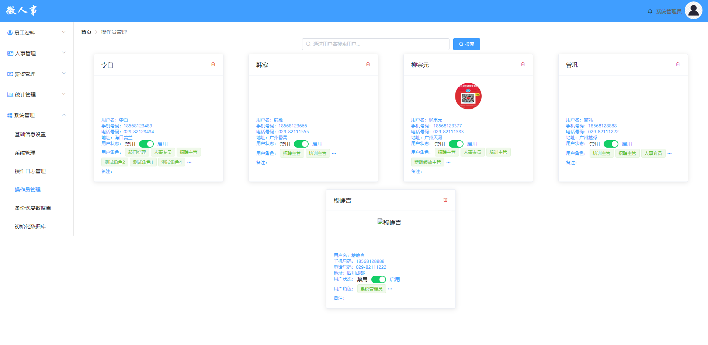

# 操作员管理功能测试

## 主要针对操作员管理进行测试用例设计

## 1.测试内容概述

该部分测试用例一共编写20条

操作员管理页面:

如果图片无法打开，请修改host文件

<ul style="font-size:16px">
<li>主要测试点：
    
1.页面设计是否合理，是否符合设计图

    
2.模糊查询

    
3.修改功能

    
4.删除功能

</li>
</ul>

## 后续详细内容请参考以下表格：

由于许多单元格内容过长，显示效果不太好，下面贴出excel表格

<a href="./操作员管理测试用例设计.xlsx">链接：操作员管理测试用例</a>

| 平台     | 所属模块                         | 用例标题                                           | 前置条件                              | 步骤                                                         | 预期                                                         | 关键词 | 优先级 | 用例类型 | 适用阶段     | 备注 | 类型可选值列表 | 阶段可选值列表 | 平台           |
| -------- | -------------------------------- | -------------------------------------------------- | ------------------------------------- | ------------------------------------------------------------ | ------------------------------------------------------------ | ------ | ------ | -------- | ------------ | ---- | -------------- | -------------- | -------------- |
| 所有平台 | 系统管理/基础信息设置/操作员管理 | 点击“操作员管理”url进入页面                        | 1.系统管理员登录                      | 1.点击左侧导航栏中“基础信息设置”下的“操作员管理”url          | 1.跳转到操作员管理页面 2.操作员管理页面设计符合设计图 3.从数据库hr表和hr_role表中读取数据 3.前台页面显示系统管理员信息，以及每个系统管理员拥有的权限 |        | 低     | 功能测试 | 功能测试阶段 |      |                |                | 所有平台(#588) |
| 所有平台 | 系统管理/基础信息设置/操作员管理 | 搜索框正确的系统管理员名                           |                                       | 1.输入长度为5个字符的“李白” 2.点击搜索按钮                   | 1.页面发送查询请求 2.对数据库表hr进行查询 3.系统管理员列表刷新，显示名称中带有“李白”的系统管理员的详细信息 |        | 中     | 功能测试 | 功能测试阶段 |      |                |                | 所有平台(#589) |
| 所有平台 | 系统管理/基础信息设置/操作员管理 | 搜索框输入未录入的系统管理员名                     |                                       | 1.输入长度为5个字符的“一二三四五” 2.点击搜索按钮             | 1.页面发送查询请求 2.对数据库表hr进行查询 3.系统管理员列表刷新，显示暂无信息 |        | 中     | 功能测试 | 功能测试阶段 |      |                |                | 所有平台(#590) |
| 所有平台 | 系统管理/基础信息设置/操作员管理 | 搜索框输入工号                                     |                                       | 1.输入00000057 2.点击搜索按钮                                | 1.页面发送查询请求 2.对数据库表hr进行查询 3.系统管理员列表刷新，显示暂无信息 |        | 中     | 功能测试 | 功能测试阶段 |      |                |                | 所有平台(#591) |
| 所有平台 | 系统管理/基础信息设置/操作员管理 | 搜索框输入符号                                     |                                       | 1.输入“@#￥%……&” 2.点击搜索按钮                              | 1.提示输入信息错误的提示信息 2.搜索框内容清除 3.搜索框获得焦点 |        | 中     | 功能测试 | 功能测试阶段 |      |                |                | 所有平台(#592) |
| 所有平台 | 系统管理/基础信息设置/操作员管理 | 搜索框输入特殊字符串                               |                                       | 1.输入“null” 2.点击搜索按钮                                  | 1.提示输入信息错误的提示信息 2.搜索框内容清除 3.搜索框获得焦点 |        | 中     | 功能测试 | 功能测试阶段 |      |                |                | 所有平台(#593) |
| 所有平台 | 系统管理/基础信息设置/操作员管理 | 搜索框输入攻击性字符串                             |                                       | 1.输入“‘or 1=1#” 2.点击搜索按钮                              | 1.提示输入信息错误的提示信息 2.搜索框内容清除 3.搜索框获得焦点 |        | 中     | 功能测试 | 功能测试阶段 |      |                |                | 所有平台(#594) |
| 所有平台 | 系统管理/基础信息设置/操作员管理 | 搜索输入框输入大于范围长度的系统管理员名           |                                       | 1.输入长度为11个字符的“一二三四五六七八九十零” 2.点击搜索按钮 | 1.提示输入员工名超限的提示信息 2.搜索框内容清除 3.搜索框获得焦点 |        | 中     | 功能测试 | 功能测试阶段 |      |                |                | 所有平台(#595) |
| 所有平台 | 系统管理/基础信息设置/操作员管理 | 搜索输入框输入小于范围长度的系统管理员名（不输入） |                                       | 1.输入框内不输入任何信息 2.点击搜索按钮                      | 1.提示请输入员工名的提示信息 2.搜索框内容清除 3.搜索框获得焦点 |        | 中     | 功能测试 | 功能测试阶段 |      |                |                | 所有平台(#596) |
| 所有平台 | 系统管理/基础信息设置/操作员管理 | 使用Enter键完成搜索                                | 1.选中搜索框 2.输入正确的员工名“李白” | 按下Enter键                                                  | 1.页面发送查询请求 2.对数据库表hr进行查询 3.系统管理员列表刷新，显示名称中带有“李白”的系统管理员的详细信息 |        | 中     | 功能测试 | 功能测试阶段 |      |                |                | 所有平台(#597) |
| 所有平台 | 系统管理/基础信息设置/操作员管理 | 搜索输入框输入前后带空格的正确系统管理员名         |                                       | 1.输入“ 李白 ” 2.点击搜索按钮                                | 1.提示输入信息错误的提示信息 2.搜索框内容清除 3.搜索框获得焦点 |        | 中     | 功能测试 | 功能测试阶段 |      |                |                | 所有平台(#598) |
| 所有平台 | 系统管理/基础信息设置/操作员管理 | 搜索输入框输入中间夹着空格的正确系统管理员名       |                                       | 1.输入“李 白” 2.点击搜索按钮                                 | 1.提示输入信息错误的提示信息 2.搜索框内容清除 3.搜索框获得焦点 |        | 中     | 功能测试 | 功能测试阶段 |      |                |                | 所有平台(#599) |
| 所有平台 | 系统管理/基础信息设置/操作员管理 | 对已启用的系统管理员点击启用                       | 1.系统管理员已启用                    | 1.点击系统管理员“李白”的启用按钮                             | 1.系统管理员状态不改变，保持启用                             |        | 中     | 功能测试 | 功能测试阶段 |      |                |                | 所有平台(#600) |
| 所有平台 | 系统管理/基础信息设置/操作员管理 | 对已禁用的系统管理员点击禁用                       | 1.系统管理员已禁用                    | 1.点击系统管理员“李白”的禁用按钮                             | 1.系统管理员状态不改变，保持禁用                             |        | 中     | 功能测试 | 功能测试阶段 |      |                |                | 所有平台(#601) |
| 所有平台 | 系统管理/基础信息设置/操作员管理 | 对已启用的系统管理员点击禁用                       | 1.系统管理员已启用                    | 1.点击系统管理员“李白”的禁用按钮                             | 1.系统管理员状态变为禁用 2.使用禁用的系统管理员账号无法登陆系统 |        | 中     | 功能测试 | 功能测试阶段 |      |                |                | 所有平台(#602) |
| 所有平台 | 系统管理/基础信息设置/操作员管理 | 对已禁用的系统管理员点击启用                       | 1.系统管理员已禁用                    | 1.点击系统管理员“李白”的启用按钮                             | 1.系统管理员状态变为启用 2.启用后该系统管理员账号能登陆系统，且权限正常 |        | 中     | 功能测试 | 功能测试阶段 |      |                |                | 所有平台(#603) |
| 所有平台 | 系统管理/基础信息设置/操作员管理 | 点击...查看系统管理员拥有的角色权限                |                                       | 1.系统管理员“李白”的“...”                                    | 1.显示“李白”拥有的角色列表文本框                             |        | 低     | 功能测试 | 功能测试阶段 |      |                |                | 所有平台(#604) |
| 所有平台 | 系统管理/基础信息设置/操作员管理 | 点击删除（红色垃圾桶）图标                         |                                       | 1.点击系统管理员“李白”删除图标                               | 1.弹出删除确认提示框，提示信息为“您确定要删除【李白】这一角色吗” 2.提示框提供确定和取消按钮 |        | 中     | 功能测试 | 功能测试阶段 |      |                |                | 所有平台(#605) |
| 所有平台 | 系统管理/基础信息设置/操作员管理 | 点击确定执行删除操作                               | 1.显示删除确认提示框                  | 1.点击确定                                                   | 1.点击“确定” 2.页面发送删除请求 3.数据库hr表中name=“李白”的字段被删除 4.前端页面角色列表该角色消失 |        | 中     | 功能测试 | 功能测试阶段 |      |                |                | 所有平台(#606) |
| 所有平台 | 系统管理/基础信息设置/操作员管理 | 点击取消按钮取消删除操作                           | 1.显示删除确认提示框                  | 1.点击取消按钮                                               | 1.提示框关闭 2.不执行删除操作                                |        | 中     | 功能测试 | 功能测试阶段 |      |                |                | 所有平台(#607) |