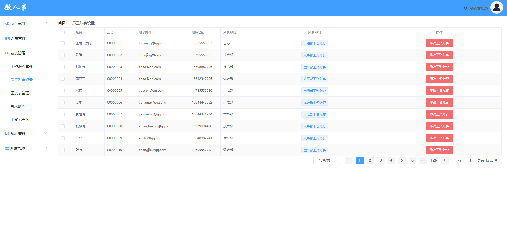

# 员工账套设置功能测试

## 主要针对员工账套设置功能进行测试用例设计

## 1.测试内容概述

该部分测试用例一共编写39条

员工账套设置页面

如果图片无法打开，请修改host文件

<ul style="font-size:16px">
<li>主要测试点：
    
1.页面设计是否合理，是否符合设计图

    
2.分页

    
3.修改功能

    
......

</li>
</ul>

## 后续详细内容请参考以下表格：

由于许多单元格内容过长，显示效果不太好，下面贴出excel表格

<a href="./员工账套设置测试用例设计.xlsx">链接：员工账套设置测试用例</a>

| 平台     | 所属模块              | 用例标题                                                   | 前置条件                                                     | 步骤                                                         | 预期                                                         | 关键词   | 优先级 | 用例类型 | 适用阶段     | 备注       | 类型可选值列表 | 阶段可选值列表 | 平台           |
| -------- | --------------------- | ---------------------------------------------------------- | ------------------------------------------------------------ | ------------------------------------------------------------ | ------------------------------------------------------------ | -------- | ------ | -------- | ------------ | ---------- | -------------- | -------------- | -------------- |
| 所有平台 | 薪资管理/员工账套设置 | 点击“员工账套设置”url进入页面                              | 1.联网 2.admin登录                                           | 1.点击左侧导航栏中“薪资管理”展开子菜单 2.点击“员工账套设置”  | 1.跳转到“员工账套设置”页面                                   |          | 中     | 功能测试 | 功能测试阶段 |            |                |                | 所有平台(#426) |
| 所有平台 | 薪资管理/员工账套设置 | “员工账套设置”页面显示                                     | 1.联网 2.admin登录                                           | 1.点击左侧导航栏中“薪资管理”展开子菜单 2.点击“员工账套设置”  | 1.页面标题为“首页>员工账套设置” 2.页面设计符合设计图 3.从数据库emploee表和salary表中查询出所需的数据正确填充进前端表格中分页显示 4.分页信息显示正确 5.表格内员工信息按id升序排序 |          | 低     | 功能测试 | 功能测试阶段 |            |                |                | 所有平台(#427) |
| 所有平台 | 薪资管理/员工账套设置 | 鼠标悬浮于所属部门列中各个工资账套之上时显示该账套详细信息 | 1.联网 2.admin登录 3.表格内有数据                            | 1.鼠标悬浮于员工“江南一点雨”“所属部门”列中“市场部工资账套”上 | 1.“市场部工资账套”右侧出现一个悬浮窗 2.悬浮窗内容为“市场部工资账套”的各个属性以及各属性对应的值 |          | 中     | 功能测试 | 功能测试阶段 |            |                |                | 所有平台(#428) |
| 所有平台 | 薪资管理/员工账套设置 | 悬浮窗出现后，鼠标移动到悬浮窗上                           | 1.悬浮窗出现                                                 | 1.鼠标从“市场部工资账套”移动到悬浮窗上                       | 1.悬浮窗不消失                                               |          | 低     | 功能测试 | 功能测试阶段 |            |                |                | 所有平台(#429) |
| 所有平台 | 薪资管理/员工账套设置 | 悬浮窗出现后，鼠标移动到页面空白处                         | 1.悬浮窗出现                                                 | 1.鼠标从“市场部工资账套”移动页面空白处                       | 1.悬浮窗消失                                                 |          | 低     | 功能测试 | 功能测试阶段 |            |                |                | 所有平台(#430) |
| 所有平台 | 薪资管理/员工账套设置 | 鼠标悬浮于工资账套为“暂未设置”之上时不显示悬浮窗           | 1.该员工工资账套值为“暂未设置”                               | 1.鼠标悬浮于号工“00000046”的工资账套“暂未设置”上             | 1.不出现悬浮窗                                               |          | 中     | 功能测试 | 功能测试阶段 |            |                |                | 所有平台(#431) |
| 所有平台 | 薪资管理/员工账套设置 | 点击“修改工资账套”按钮                                     |                                                              | 1.点击工号为“00000001”该行右侧的“修改工资账套”按钮           | 1.弹出修改工资账套页面                                       |          | 中     | 功能测试 | 功能测试阶段 |            |                |                | 所有平台(#432) |
| 所有平台 | 薪资管理/员工账套设置 | 点击页面空白处关闭“修改工资账套”                           | 1.点击工号为“00000001”该行右侧的“修改工资账套”按钮 2.修改工资账套页面打开 | 1.鼠标左键点击页面空白处                                     | 1.“修改工资账套”页面消失                                     |          | 低     | 功能测试 | 功能测试阶段 |            |                |                | 所有平台(#433) |
| 所有平台 | 薪资管理/员工账套设置 | 拥有工资账套的员工的修改工资账套选择下拉框默认值           | 1.该员工拥有工资账套                                         | 1.点击工号为“00000001”该行右侧的“修改工资账套”按钮 2.修改工资账套页面打开 | 1.账套选择下拉框默认值为“市场部工资账套”                     |          | 中     | 功能测试 | 功能测试阶段 |            |                |                | 所有平台(#434) |
| 所有平台 | 薪资管理/员工账套设置 | 工资账套值为“暂未设置”的员工的修改工资账套下拉框默认值     | 1.该员工工资账套为“暂未设置”                                 | 1.点击工号为“00000046”该行右侧的“修改工资账套”按钮 2.修改工资账套页面打开 | 1.账套选择下拉框默认值为“”                                   |          | 低     | 功能测试 | 功能测试阶段 |            |                |                | 所有平台(#435) |
| 所有平台 | 薪资管理/员工账套设置 | 选择不同的工资账套提交修改                                 | 1.点击工号为“00000001”该行右侧的“修改工资账套”按钮 2.修改工资账套页面打开 | 1.鼠标点击账套选择下拉框 2.选择“人事部工资账套” 3.点击确定   | 1.提示修改完成，修改工资账套页面关闭 2.工号“00000001”的工资账套更改为“人事部工资账套” 3.页面发送修改请求 4.数据库内empsalary表中数据修改 4.鼠标悬浮于“人事部工资账套上”，其详细属性符合salary表中数据 |          | 低     | 功能测试 | 功能测试阶段 |            |                |                | 所有平台(#436) |
| 所有平台 | 薪资管理/员工账套设置 | 选择相同的工资账套提交修改                                 | 1.点击工号为“00000002”该行右侧的“修改工资账套”按钮 2.修改工资账套页面打开 | 1.鼠标点击账套选择下拉框 2.点击确定                          | 1.修改工资账套页面关闭 2.页面不发送请求                      |          | 中     | 功能测试 | 功能测试阶段 |            |                |                | 所有平台(#437) |
| 所有平台 | 薪资管理/员工账套设置 | 分页信息显示                                               |                                                              | 1.点击左侧导航栏中“薪资管理”展开子菜单 2.点击“员工账套设置”  | 1.显示默认每页员工数据条数10条 2.根据每页员工数据条数与数据库员工总条数正确计算页数，并显示到页面上来 3.页数无法完全显示，中间页面由...代替 4.在直接输入页面跳转处，输入框内默认值为1，员工总条数正确显示 5.当前页默认处于第一页，页面按钮1处于选中状态 | 分页显示 | 中     | 功能测试 | 功能测试阶段 |            |                |                | 所有平台(#438) |
| 所有平台 | 薪资管理/员工账套设置 | 员工信息条数选择                                           |                                                              | 1.点击员工信息条数选择下拉框 2.选择每页显示20条员工信息条数  | 1.下拉列表显示预设的条数 2.下拉列表焦点在默认值10条处 3.选择每页显示20条员工信息后，员工信息展示条数变为20条，分页总页数正确减少 | 条数限制 | 中     | 功能测试 | 功能测试阶段 |            |                |                | 所有平台(#439) |
| 所有平台 | 薪资管理/员工账套设置 | 在非第一页点击向前翻页按钮                                 |                                                              | 1.跳转到第2页 2.点击向前翻页按钮                             | 1.页面跳转到前一页 2.员工数据显示为前一页数据 3.页面数-1     | 边界值   | 中     | 功能测试 | 功能测试阶段 | 有效等价类 |                |                | 所有平台(#440) |
| 所有平台 | 薪资管理/员工账套设置 | 在非最后一页点击向后翻页按钮                               |                                                              | 1.跳转到第1页 2.点击向前翻页按钮                             | 1.页面跳转到后一页 2.员工数据显示为后一页数据 3.页面数+1     | 边界值   | 中     | 功能测试 | 功能测试阶段 | 有效等价类 |                |                | 所有平台(#441) |
| 所有平台 | 薪资管理/员工账套设置 | 在第一页点击向前翻页按钮                                   |                                                              | 1.跳转到第1页 2.点击向前翻页按钮                             | 1.向前翻页按钮显示为不可选取 2.页面不发送跳转请求，仍然处于第一页 | 边界值   | 中     | 功能测试 | 功能测试阶段 | 无效等价类 |                |                | 所有平台(#442) |
| 所有平台 | 薪资管理/员工账套设置 | 在最后一页点击向后翻页按钮                                 |                                                              | 1.跳转到最后一页 2.点击向后翻页按钮                          | 1.向后按钮显示为不可选取 2.页面不发送跳转请求，仍然处于最后一页 | 边界值   | 中     | 功能测试 | 功能测试阶段 | 无效等价类 |                |                | 所有平台(#443) |
| 所有平台 | 薪资管理/员工账套设置 | 点击当前页的页面按钮进行页面跳转                           |                                                              | 1.跳转到第1页 2.点击第1页的页面按钮                          | 1.当前页第1页的页面按钮不可选取 2.页面不发送跳转请求，仍然处于当前页 |          | 低     | 功能测试 | 功能测试阶段 |            |                |                | 所有平台(#444) |
| 所有平台 | 薪资管理/员工账套设置 | 点击非当前页的页面按钮进行页面跳转                         |                                                              | 1.点击第10页的页面按钮                                       | 1.页面跳转到第10页，员工数据刷新 2.页面按钮10处于被选中状态，页面按钮刷新并显示正确 |          | 中     | 功能测试 | 功能测试阶段 |            |                |                | 所有平台(#445) |
| 所有平台 | 薪资管理/员工账套设置 | 点击靠左...按钮进行页面跳转                                | 1.跳转到第10页                                               | 1.靠左的...正常显示在第1页按钮的右边 2.点击靠左的...按钮     | 1.页面跳转到第5页，员工数据刷新 2.页面按钮5处于被选中状态，页面按钮刷新并显示正确 |          | 低     | 功能测试 | 功能测试阶段 |            |                |                | 所有平台(#446) |
| 所有平台 | 薪资管理/员工账套设置 | 点击靠右...按钮进行页面跳转                                | 1.跳转到第10页                                               | 1.靠右的...正常显示在最后一页按钮的左边 2.点击靠右的...按钮  | 1.页面跳转到第15页，员工数据刷新 2.页面按钮15处于选中状态，页面按钮刷新并显示正确 |          | 低     | 功能测试 | 功能测试阶段 |            |                |                | 所有平台(#447) |
| 所有平台 | 薪资管理/员工账套设置 | 页面跳转输入框输入最小边界上的整数                         | 1.跳转到第10页                                               | 1.选中页面跳转输入框，并输入1 2.按下回车键                   | 1.页面跳转到第1页，员工数据刷新 2.页面按钮1处于选中状态，页面按钮刷新并显示正确 | 边界值   | 中     | 功能测试 | 功能测试阶段 | 有效等价类 |                |                | 所有平台(#448) |
| 所有平台 | 薪资管理/员工账套设置 | 页面跳转输入框输入最大边界上的整数                         | 1.每页显示员工信息条数为10条/页                              | 1.选中页面跳转输入框，并输入62 2.按下回车键                  | 1.页面跳转到第62页，员工数据刷新 2.页面按钮62处于选中状态，页面按钮刷新并显示正确 | 边界值   | 中     | 功能测试 | 功能测试阶段 | 有效等价类 |                |                | 所有平台(#449) |
| 所有平台 | 薪资管理/员工账套设置 | 页面跳转输入框输入最小边界外的整数                         |                                                              | 1.选中页面跳转输入框，并输入0 2.按下回车键                   | 1.跳转到第1页，员工数据刷新 2.输入框内数值清除并填入1 3.页面按钮1处于被选中状态，页面按钮刷新并显示正确 | 边界值   | 中     | 功能测试 | 功能测试阶段 | 无效等价类 |                |                | 所有平台(#450) |
| 所有平台 | 薪资管理/员工账套设置 | 页面跳转输入框输入最大边界外的整数                         | 1.每页显示员工信息条数为10条/页                              | 1.选中页面跳转输入框，并输入100 2.按下回车键                 | 1.跳转到第62页，员工数据刷新 2.输入框内数值清除并填入62 3.页面按钮62处于被选中状态，页面按钮刷新并显示正确 | 边界值   | 中     | 功能测试 | 功能测试阶段 | 无效等价类 |                |                | 所有平台(#451) |
| 所有平台 | 薪资管理/员工账套设置 | 页面跳转输入框输入符号                                     |                                                              | 1.选中页面跳转输入框，并输入-1 2.按下回车键                  | 1.跳转到第1页，员工数据刷新 2.输入框内数值清除并填入1 3.页面按钮1处于被选中状态，页面按钮刷新并显示正确 |          | 中     | 功能测试 | 功能测试阶段 | 无效等价类 |                |                | 所有平台(#452) |
| 所有平台 | 薪资管理/员工账套设置 | 页面跳转输入框输入中文字符                                 |                                                              | 1.选中页面跳转输入框，并输入“五” 2.按下回车键                | 1.输入框内数值清除并填入当前页码 2.按下回车后跳不执行跳转，仍处于当前页 3.页面不重新发送请求 |          | 中     | 功能测试 | 功能测试阶段 | 无效等价类 |                |                | 所有平台(#453) |
| 所有平台 | 薪资管理/员工账套设置 | 页面跳转输入框输入英文字符                                 |                                                              | 1.选中页面跳转输入框，并输入“five” 2.按下回车键              | 1.输入框内数值清除并填入当前页码 2.按下回车后跳不执行跳转，仍处于当前页 3.页面不重新发送请求 |          | 中     | 功能测试 | 功能测试阶段 | 无效等价类 |                |                | 所有平台(#454) |
| 所有平台 | 薪资管理/员工账套设置 | 页面跳转输入框输入符输入特殊字符串                         |                                                              | 1.选中页面跳转输入框，并输入“  ” 2.按下回车键                | 1.输入框内数值清除并填入当前页码 2.按下回车后跳不执行跳转，仍处于当前页 3.页面不重新发送请求 |          | 中     | 功能测试 | 功能测试阶段 | 无效等价类 |                |                | 所有平台(#455) |
| 所有平台 | 薪资管理/员工账套设置 | 页面跳转输入框输入符输入攻击性字符串                       |                                                              | 1.选中页面跳转输入框，并输入“' or1=1#'” 2.按下回车键         | 1.输入框内数值清除并填入当前页码 2.按下回车后跳不执行跳转，仍处于当前页 3.页面不重新发送请求 |          | 中     | 功能测试 | 功能测试阶段 | 无效等价类 |                |                | 所有平台(#456) |
| 所有平台 | 薪资管理/员工账套设置 | 页面跳转输入框输入小数                                     |                                                              | 1.选中页面跳转输入框，并输入1.5 2.按下回车键                 | 1.输入框内数值清除并填入当前页码 2.按下回车后跳不执行跳转，仍处于当前页 3.页面不重新发送请求 |          | 中     | 功能测试 | 功能测试阶段 | 无效等价类 |                |                | 所有平台(#457) |
| 所有平台 | 薪资管理/员工账套设置 | 页面跳转输入框输入字符e                                    |                                                              | 1.选中页面跳转输入框，并输入“eee” 2.按下回车键               | 1.输入框内数值清除并填入当前页码 2.按下回车后跳不执行跳转，仍处于当前页 3.页面不重新发送请求 |          | 中     | 功能测试 | 功能测试阶段 | 无效等价类 |                |                | 所有平台(#458) |
| 所有平台 | 薪资管理/员工账套设置 | 页面跳转框输入数字，点击页面按钮                           |                                                              | 1.选中页面跳转输入框，并输入“15” 2.点击页面按钮16            | 1.页面跳转到第16页，显示第16页的员工信息 2.页面跳转输入框内容替换为16 |          | 低     | 功能测试 | 功能测试阶段 |            |                |                | 所有平台(#459) |
| 所有平台 | 薪资管理/员工账套设置 | 页面跳转输入框输入当前页面                                 | 1.当前页面为第10页                                           | 1.选中页面跳转输入框，并输入10 2.按下回车键                  | 1.按下回车后跳不执行跳转，仍处于当前页 2.页面不重新发送请求  |          | 低     | 功能测试 | 功能测试阶段 |            |                |                | 所有平台(#460) |
| 所有平台 | 薪资管理/员工账套设置 | 在其他地方输入数字后在页面跳转输入框粘贴                   | 1.打开记事本 2.输入数字“123” 3.复制字符串                    | 1.选中页面跳转输入框，使用粘贴快捷键 2.选中页面跳转输入框，鼠标右键，选择粘贴 | 1.输入框内显示被粘贴的数字                                   |          | 低     | 功能测试 | 功能测试阶段 |            |                |                | 所有平台(#461) |
| 所有平台 | 薪资管理/员工账套设置 | 在其他地方输入字符串后在页面跳转输入框粘贴                 | 1.打开记事本 2.输入字符串“adssdf” 3.复制字符串               | 1.选中页面跳转输入框，使用粘贴快捷键 2.选中页面跳转输入框，鼠标右键，选择粘贴 | 1.输入框内粘贴的字符串被清除                                 |          | 低     | 功能测试 | 功能测试阶段 |            |                |                | 所有平台(#462) |