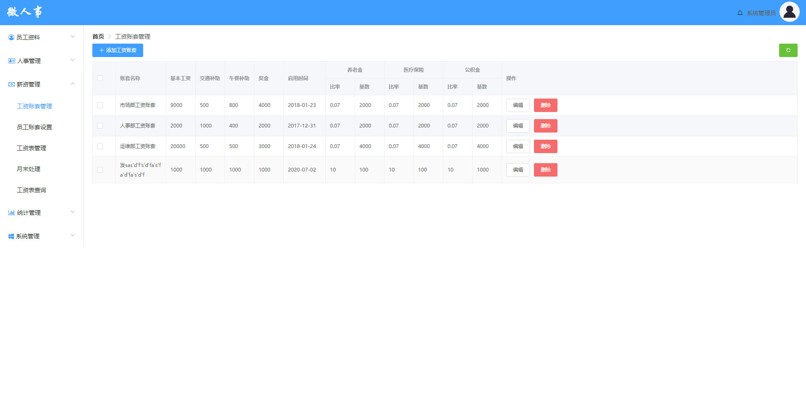
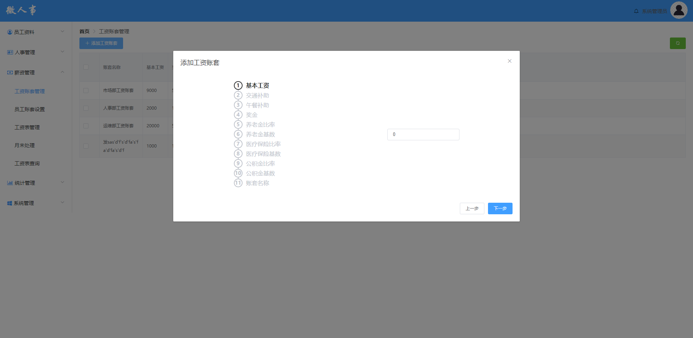

# 工资账套管理功能测试

## 主要针对工资账套管理功能进行测试用例设计

## 1.测试内容概述

该部分测试用例一共编写135条

### 工资账套管理页面

### 添加账套页面

如果图片无法打开，请修改host文件

<ul style="font-size:16px">
<li>主要测试点：
    
1.页面设计是否合理，是否符合设计图

    
2.数字输入框与普通输入框测试

    
3.删除功能

    
4.修改功能

    
......

</li>
</ul>

## 后续详细内容请参考以下表格：

由于许多单元格内容过长，显示效果不太好，下面贴出excel表格

<a href="./工资账套管理测试用例设计.xlsx">链接：工资账套管理测试用例</a>

| 平台     | 所属模块              | 用例标题                                                     | 前置条件                                    | 步骤                                                         | 预期                                                         | 关键词     | 优先级 | 用例类型 | 适用阶段     | 备注                                                         | 类型可选值列表 | 阶段可选值列表 | 平台           |
| -------- | --------------------- | ------------------------------------------------------------ | ------------------------------------------- | ------------------------------------------------------------ | ------------------------------------------------------------ | ---------- | ------ | -------- | ------------ | ------------------------------------------------------------ | -------------- | -------------- | -------------- |
| 所有平台 | 薪资管理/工资账套管理 | 点击工资账套管理URL进入页面                                  | 1.管理员权限登录 2.联网                     | 1.点击页面左边的导航栏“薪资管理”,展开子菜单 2.点击“工资账套管理” | 1.跳转到工资账套管理页面 2.页面设计符合设计图 3.从vhr数据库salary表中读取工资账套并将数据填充进前台页面的表格中 4.工资账套以id升序排序 5.左上角标题为“首页>工资账套管理” |            | 中     | 功能测试 | 功能测试阶段 |                                                              |                |                | 所有平台(#291) |
| 所有平台 | 薪资管理/工资账套管理 | 工资账套管理页面刷新按钮使用                                 |                                             | 1.在数据库中修改“市场工资账套”的“基本工资”值，修改为“8000” 2.点击页面右上方的刷新按钮 | 1.页面刷新，发送查询工资账套请求 2.页面内工资账套信息重新填充，“市场工资账套”的“基本工资”值变为“8000” |            | 低     | 功能测试 | 功能测试阶段 |                                                              |                |                | 所有平台(#292) |
| 所有平台 | 薪资管理/工资账套管理 | 点击“添加工资账套”按钮                                       |                                             | 1.点击页面左上方“添加工资账套”按钮                           | 1.弹出添加工资账套页面 2.添加工资账套页面设计符合设计图 3.工资账套的各项属性以队列的方式呈现在前端页面，属性之间遵守严格线性约束，页面提供“上一步”“下一步”按钮对属性进行选择 4.选中的属性字体为黑色，其输入框获得焦点，未选中的属性字体为灰色，其输入框不显示 |            | 中     | 功能测试 | 功能测试阶段 |                                                              |                |                | 所有平台(#293) |
| 所有平台 | 薪资管理/工资账套管理 | “添加工资账套”页面默认值设置                                 |                                             | 1.点击页面左上方“添加工资账套”按钮                           | 1.页面焦点默认为“基本工资”输入框 2.各个输入框的默认值为0     |            | 低     | 功能测试 | 功能测试阶段 |                                                              |                |                | 所有平台(#294) |
| 所有平台 | 薪资管理/工资账套管理 | “上一步”“下一步”按钮的使用                                   | 1.进入“添加工资套账”页面                    | 1.在“①基础工资”处点击“上一步” 2.在“①基础工资”处点击“下一步” 3.点击多次“下一步”，直至处于“⑪账套名称”处 4.在“⑪账套名称”处点击下一步 | 1.在“①基础工资”处点击“上一步”，不执行“上一步”操作，“上一步”按钮不可选取，指针图标悬浮之上显示为禁止图标 2.在“①基础工资”处点击“下一步”，属性切换到“②交通补助”，输入框获得焦点 3.点击多次“下一步”，属性按顺序切换 4.在“⑪账套名称”处点击“下一步”，不执行“下一步”操作，“下一步”按钮不可选取，指针图标悬浮之上显示为禁止图标 |            | 中     | 功能测试 | 功能测试阶段 |                                                              |                |                | 所有平台(#295) |
| 所有平台 | 薪资管理/工资账套管理 | “基本工资”输入框输入数的大小、有效数字个数边界内的整数       | 1.进入“添加工资套账”页面                    | 1.在“基本工资”输入框输入5000 2.点击“下一步”                  | 1.“下一步”操作成功，切换到“交通补助”输入框                   | 有效等价类 | 中     | 功能测试 | 功能测试阶段 |                                                              |                |                | 所有平台(#296) |
| 所有平台 | 薪资管理/工资账套管理 | “基本工资”输入框输入数的大小、有效数字边界内的小数           | 1.进入“添加工资套账”页面                    | 1.在“基本工资”输入框输入5000.1 2.点击“下一步”                | 1.“下一步”操作成功，切换到“交通补助”输入框                   | 有效等价类 | 中     | 功能测试 | 功能测试阶段 |                                                              |                |                | 所有平台(#297) |
| 所有平台 | 薪资管理/工资账套管理 | “基本工资”输入框输入数的大小右边界上、有效数字个数边界内的整数 | 1.进入“添加工资套账”页面                    | 1.在“基本工资”输入框输入10000000001 2.点击“下一步”           | 1.“下一步”操作成功，切换到“交通补助”输入框                   | 有效等价类 | 中     | 功能测试 | 功能测试阶段 |                                                              |                |                | 所有平台(#298) |
| 所有平台 | 薪资管理/工资账套管理 | “基本工资”输入框输入数的大小右边界内、有效数字个数右边界上的小数 | 1.进入“添加工资套账”页面                    | 1.在“基本工资”输入框输入1000000000.00001 2.点击“下一步”      | 1.“下一步”操作成功，切换到“交通补助”输入框                   | 有效等价类 | 中     | 功能测试 | 功能测试阶段 |                                                              |                |                | 所有平台(#299) |
| 所有平台 | 薪资管理/工资账套管理 | “基本工资”输入框输入数的大小、有效数字个数左边界上的整数     | 1.进入“添加工资套账”页面                    | 1.在“基本工资”输入框输入0 2.点击“下一步”                     | 1.“下一步”操作成功，切换到“交通补助”输入框                   | 有效等价类 | 中     | 功能测试 | 功能测试阶段 |                                                              |                |                | 所有平台(#300) |
| 所有平台 | 薪资管理/工资账套管理 | “基本工资”输入框输入负数                                     | 1.进入“添加工资套账”页面                    | 1.在“基本工资”输入框输入“-1” 2.点击“下一步”                  | 1.“下一步”操作失败，“基本工资”输入框提示数据格式有误         | 无效等价类 | 中     | 功能测试 | 功能测试阶段 |                                                              |                |                | 所有平台(#301) |
| 所有平台 | 薪资管理/工资账套管理 | “基本工资”输入框输入以0开头的整数                            | 1.进入“添加工资套账”页面                    | 1.在“基本工资”输入框输入“010” 2.点击“下一步”                 | 1.“下一步”操作失败，“基本工资”输入框提示数据格式有误         | 无效等价类 | 中     | 功能测试 | 功能测试阶段 |                                                              |                |                | 所有平台(#302) |
| 所有平台 | 薪资管理/工资账套管理 | “基本工资”输入框输入以0开头的小数                            | 1.进入“添加工资套账”页面                    | 1.在“基本工资”输入框输入“010.1” 2.点击“下一步”               | 1.“下一步”操作失败，“基本工资”输入框提示数据格式有误         | 无效等价类 | 中     | 功能测试 | 功能测试阶段 |                                                              |                |                | 所有平台(#303) |
| 所有平台 | 薪资管理/工资账套管理 | “基本工资”输入框输入小数包含两个小数点                       | 1.进入“添加工资套账”页面                    | 1.在“基本工资”输入框输入“1.0.1” 2.点击“下一步”               | 1.“下一步”操作失败，“基本工资”输入框提示数据格式有误         | 无效等价类 | 中     | 功能测试 | 功能测试阶段 |                                                              |                |                | 所有平台(#304) |
| 所有平台 | 薪资管理/工资账套管理 | “基本工资”输入框输入一个“.”                                  | 1.进入“添加工资套账”页面                    | 1.在“基本工资”输入框输入“.” 2.点击“下一步”                   | 1.“下一步”操作失败，“基本工资”输入框提示数据格式有误         | 无效等价类 | 中     | 功能测试 | 功能测试阶段 |                                                              |                |                | 所有平台(#305) |
| 所有平台 | 薪资管理/工资账套管理 | “基本工资”输入框输入前面带“+”的整数                          | 1.进入“添加工资套账”页面                    | 1.在“基本工资”输入框输入“+1000” 2.点击“下一步”               | 1.“下一步”操作失败，“基本工资”输入框提示数据格式有误         | 无效等价类 | 中     | 功能测试 | 功能测试阶段 |                                                              |                |                | 所有平台(#306) |
| 所有平台 | 薪资管理/工资账套管理 | “基本工资”输入框输入前面带“+”的小数                          | 1.进入“添加工资套账”页面                    | 1.在“基本工资”输入框输入“+1000.1” 2.点击“下一步”             | 1.“下一步”操作失败，“基本工资”输入框提示数据格式有误         | 无效等价类 | 中     | 功能测试 | 功能测试阶段 |                                                              |                |                | 所有平台(#307) |
| 所有平台 | 薪资管理/工资账套管理 | “基本工资”输入框输入边界内的整数，前后带有空格               | 1.进入“添加工资套账”页面                    | 1.在“基本工资”输入框输入“ 1000 ” 2.点击“下一步”              | 1.“下一步”操作失败，“基本工资”输入框提示数据格式有误         | 无效等价类 | 中     | 功能测试 | 功能测试阶段 |                                                              |                |                | 所有平台(#308) |
| 所有平台 | 薪资管理/工资账套管理 | “基本工资”输入框输入边界内的小数，前后带有空格               | 1.进入“添加工资套账”页面                    | 1.在“基本工资”输入框输入“ 1000.1 ” 2.点击“下一步”            | 1.“下一步”操作失败，“基本工资”输入框提示数据格式有误         | 无效等价类 | 中     | 功能测试 | 功能测试阶段 |                                                              |                |                | 所有平台(#309) |
| 所有平台 | 薪资管理/工资账套管理 | “基本工资”输入框输入边界内的小数，中间带有空格               | 1.进入“添加工资套账”页面                    | 1.在“基本工资”输入框输入“10 00.1” 2.点击“下一步”             | 1.“下一步”操作失败，“基本工资”输入框提示数据格式有误         | 无效等价类 | 中     | 功能测试 | 功能测试阶段 |                                                              |                |                | 所有平台(#310) |
| 所有平台 | 薪资管理/工资账套管理 | “基本工资”输入框输入边界内的整数，中间带有空格               | 1.进入“添加工资套账”页面                    | 1.在“基本工资”输入框输入“10 00” 2.点击“下一步”               | 1.“下一步”操作失败，“基本工资”输入框提示数据格式有误         | 无效等价类 | 中     | 功能测试 | 功能测试阶段 |                                                              |                |                | 所有平台(#311) |
| 所有平台 | 薪资管理/工资账套管理 | “基本工资”输入框输入符号                                     | 1.进入“添加工资套账”页面                    | 1.在“基本工资”输入框输入“@#￥” 2.点击“下一步”                | 1.“下一步”操作失败，“基本工资”输入框提示数据格式有误         | 无效等价类 | 中     | 功能测试 | 功能测试阶段 |                                                              |                |                | 所有平台(#312) |
| 所有平台 | 薪资管理/工资账套管理 | “基本工资”输入框输入中文                                     | 1.进入“添加工资套账”页面                    | 1.在“基本工资”输入框输入“一二三” 2.点击“下一步”              | 1.“下一步”操作失败，“基本工资”输入框提示数据格式有误         | 无效等价类 | 中     | 功能测试 | 功能测试阶段 |                                                              |                |                | 所有平台(#313) |
| 所有平台 | 薪资管理/工资账套管理 | “基本工资”输入框输入英文                                     | 1.进入“添加工资套账”页面                    | 1.在“基本工资”输入框输入“oneoneone” 2.点击“下一步”           | 1.“下一步”操作失败，“基本工资”输入框提示数据格式有误         | 无效等价类 | 中     | 功能测试 | 功能测试阶段 |                                                              |                |                | 所有平台(#314) |
| 所有平台 | 薪资管理/工资账套管理 | “基本工资”输入框输入以非0数字开头，数字结尾，中间夹杂中文    | 1.进入“添加工资套账”页面                    | 1.在“基本工资”输入框输入“12一0” 2.点击“下一步”               | 1.“下一步”操作失败，“基本工资”输入框提示数据格式有误         | 无效等价类 | 中     | 功能测试 | 功能测试阶段 |                                                              |                |                | 所有平台(#315) |
| 所有平台 | 薪资管理/工资账套管理 | “基本工资”输入框输入以非0数字开头，数字结尾，中间夹杂英文    | 1.进入“添加工资套账”页面                    | 1.在“基本工资”输入框输入“12s0” 2.点击“下一步”                | 1.“下一步”操作失败，“基本工资”输入框提示数据格式有误         | 无效等价类 | 中     | 功能测试 | 功能测试阶段 |                                                              |                |                | 所有平台(#316) |
| 所有平台 | 薪资管理/工资账套管理 | “基本工资”输入框输入以非0数字开头，数字结尾，中间夹杂符号    | 1.进入“添加工资套账”页面                    | 1.在“基本工资”输入框输入“12@0” 2.点击“下一步”                | 1.“下一步”操作失败，“基本工资”输入框提示数据格式有误         | 无效等价类 | 中     | 功能测试 | 功能测试阶段 |                                                              |                |                | 所有平台(#317) |
| 所有平台 | 薪资管理/工资账套管理 | “基本工资”输入框输入特殊字符串                               | 1.进入“添加工资套账”页面                    | 1.在“基本工资”输入框输入“  ” 2.点击“下一步”                  | 1.“下一步”操作失败，“基本工资”输入框提示数据格式有误         | 无效等价类 | 中     | 功能测试 | 功能测试阶段 |                                                              |                |                | 所有平台(#318) |
| 所有平台 | 薪资管理/工资账套管理 | “基本工资”输入框输入攻击性字符                               | 1.进入“添加工资套账”页面                    | 1.在“基本工资”输入框输入“'or 1=1#” 2.点击“下一步”            | 1.“下一步”操作失败，“基本工资”输入框提示数据格式有误         | 无效等价类 | 中     | 功能测试 | 功能测试阶段 |                                                              |                |                | 所有平台(#319) |
| 所有平台 | 薪资管理/工资账套管理 | “基本工资”输入框输入数字大小超过右边界                       | 1.进入“添加工资套账”页面                    | 1.在“基本工资”输入框输入“10000000002” 2.点击“下一步”         | 1.“下一步”操作失败，“基本工资”输入框提示数据超过最大范围     | 无效等价类 | 中     | 功能测试 | 功能测试阶段 |                                                              |                |                | 所有平台(#320) |
| 所有平台 | 薪资管理/工资账套管理 | “基本工资”输入框输入数字大小超过左边界                       | 1.进入“添加工资套账”页面                    | 1.在“基本工资”输入框输入“-1” 2.点击“下一步”                  | 1.“下一步”操作失败，“基本工资”输入框提示数据格式有误         | 无效等价类 | 中     | 功能测试 | 功能测试阶段 | 前面已经有-1的情况                                           |                |                | 所有平台(#321) |
| 所有平台 | 薪资管理/工资账套管理 | “基本工资”输入框输入有效位数超过右边界                       | 1.进入“添加工资套账”页面                    | 1.在“基本工资”输入框输入“1000000.000000000001” 2.点击“下一步” | 1.“下一步”操作失败，“基本工资”输入框提示数据有效位数超过最大范围 | 无效等价类 | 中     | 功能测试 | 功能测试阶段 |                                                              |                |                | 所有平台(#322) |
| 所有平台 | 薪资管理/工资账套管理 | “交通补助”输入框输入数的大小、有效数字个数边界内的整数       | 1.进入“添加工资套账”页面                    | 1.在“交通补助”输入框输入500 2.点击“下一步”                   | 1.“下一步”操作成功，切换到“午餐补助”输入框                   | 有效等价类 | 中     | 功能测试 | 功能测试阶段 |                                                              |                |                | 所有平台(#323) |
| 所有平台 | 薪资管理/工资账套管理 | “交通补助”输入框输入数的大小、有效数字边界内的小数           | 1.进入“添加工资套账”页面                    | 1.在“交通补助”输入框输入500.1 2.点击“下一步”                 | 1.“下一步”操作成功，切换到“午餐补助”输入框                   | 有效等价类 | 中     | 功能测试 | 功能测试阶段 |                                                              |                |                | 所有平台(#324) |
| 所有平台 | 薪资管理/工资账套管理 | “交通补助”输入框输入数的大小右边界上、有效数字个数边界内的整数 | 1.进入“添加工资套账”页面                    | 1.在“交通补助”输入框输入10000000001 2.点击“下一步”           | 1.“下一步”操作成功，切换到“午餐补助”输入框                   | 有效等价类 | 中     | 功能测试 | 功能测试阶段 |                                                              |                |                | 所有平台(#325) |
| 所有平台 | 薪资管理/工资账套管理 | “交通补助”输入框输入数的大小右边界内、有效数字个数右边界上的小数 | 1.进入“添加工资套账”页面                    | 1.在“交通补助”输入框输入1000000000.00001 2.点击“下一步”      | 1.“下一步”操作成功，切换到“午餐补助”输入框                   | 有效等价类 | 中     | 功能测试 | 功能测试阶段 |                                                              |                |                | 所有平台(#326) |
| 所有平台 | 薪资管理/工资账套管理 | “交通补助”输入框输入数的大小、有效数字个数左边界上的整数     | 1.进入“添加工资套账”页面                    | 1.在“交通补助”输入框输入0 2.点击“下一步”                     | 1.“下一步”操作成功，切换到“午餐补助”输入框                   | 有效等价类 | 中     | 功能测试 | 功能测试阶段 |                                                              |                |                | 所有平台(#327) |
| 所有平台 | 薪资管理/工资账套管理 | “交通补助”输入框输入负数                                     | 1.进入“添加工资套账”页面                    | 1.在“交通补助”输入框输入“-1” 2.点击“下一步”                  | 1.“下一步”操作失败，“交通补助”输入框提示数据格式有误         | 无效等价类 | 中     | 功能测试 | 功能测试阶段 |                                                              |                |                | 所有平台(#328) |
| 所有平台 | 薪资管理/工资账套管理 | “交通补助”输入框输入以0开头的整数                            | 1.进入“添加工资套账”页面                    | 1.在“交通补助”输入框输入“010” 2.点击“下一步”                 | 1.“下一步”操作失败，“交通补助”输入框提示数据格式有误         | 无效等价类 | 中     | 功能测试 | 功能测试阶段 |                                                              |                |                | 所有平台(#329) |
| 所有平台 | 薪资管理/工资账套管理 | “交通补助”输入框输入以0开头的小数                            | 1.进入“添加工资套账”页面                    | 1.在“交通补助”输入框输入“010.1” 2.点击“下一步”               | 1.“下一步”操作失败，“交通补助”输入框提示数据格式有误         | 无效等价类 | 中     | 功能测试 | 功能测试阶段 |                                                              |                |                | 所有平台(#330) |
| 所有平台 | 薪资管理/工资账套管理 | “交通补助”输入框输入小数包含两个小数点                       | 1.进入“添加工资套账”页面                    | 1.在“交通补助”输入框输入“1.0.1” 2.点击“下一步”               | 1.“下一步”操作失败，“交通补助”输入框提示数据格式有误         | 无效等价类 | 中     | 功能测试 | 功能测试阶段 |                                                              |                |                | 所有平台(#331) |
| 所有平台 | 薪资管理/工资账套管理 | “交通补助”输入框输入一个“.”                                  | 1.进入“添加工资套账”页面                    | 1.在“交通补助”输入框输入“.” 2.点击“下一步”                   | 1.“下一步”操作失败，“交通补助”输入框提示数据格式有误         | 无效等价类 | 中     | 功能测试 | 功能测试阶段 |                                                              |                |                | 所有平台(#332) |
| 所有平台 | 薪资管理/工资账套管理 | “交通补助”输入框输入前面带“+”的整数                          | 1.进入“添加工资套账”页面                    | 1.在“交通补助”输入框输入“+1000” 2.点击“下一步”               | 1.“下一步”操作失败，“交通补助”输入框提示数据格式有误         | 无效等价类 | 中     | 功能测试 | 功能测试阶段 |                                                              |                |                | 所有平台(#333) |
| 所有平台 | 薪资管理/工资账套管理 | “交通补助”输入框输入前面带“+”的小数                          | 1.进入“添加工资套账”页面                    | 1.在“交通补助”输入框输入“+1000.1” 2.点击“下一步”             | 1.“下一步”操作失败，“交通补助”输入框提示数据格式有误         | 无效等价类 | 中     | 功能测试 | 功能测试阶段 |                                                              |                |                | 所有平台(#334) |
| 所有平台 | 薪资管理/工资账套管理 | “交通补助”输入框输入边界内的整数，前后带有空格               | 1.进入“添加工资套账”页面                    | 1.在“交通补助”输入框输入“ 1000 ” 2.点击“下一步”              | 1.“下一步”操作失败，“交通补助”输入框提示数据格式有误         | 无效等价类 | 中     | 功能测试 | 功能测试阶段 |                                                              |                |                | 所有平台(#335) |
| 所有平台 | 薪资管理/工资账套管理 | “交通补助”输入框输入边界内的小数，前后带有空格               | 1.进入“添加工资套账”页面                    | 1.在“交通补助”输入框输入“ 1000.1 ” 2.点击“下一步”            | 1.“下一步”操作失败，“交通补助”输入框提示数据格式有误         | 无效等价类 | 中     | 功能测试 | 功能测试阶段 |                                                              |                |                | 所有平台(#336) |
| 所有平台 | 薪资管理/工资账套管理 | “交通补助”输入框输入边界内的小数，中间带有空格               | 1.进入“添加工资套账”页面                    | 1.在“交通补助”输入框输入“10 00.1” 2.点击“下一步”             | 1.“下一步”操作失败，“交通补助”输入框提示数据格式有误         | 无效等价类 | 中     | 功能测试 | 功能测试阶段 |                                                              |                |                | 所有平台(#337) |
| 所有平台 | 薪资管理/工资账套管理 | “交通补助”输入框输入边界内的整数，中间带有空格               | 1.进入“添加工资套账”页面                    | 1.在“交通补助”输入框输入“10 00” 2.点击“下一步”               | 1.“下一步”操作失败，“交通补助”输入框提示数据格式有误         | 无效等价类 | 中     | 功能测试 | 功能测试阶段 |                                                              |                |                | 所有平台(#338) |
| 所有平台 | 薪资管理/工资账套管理 | “交通补助”输入框输入符号                                     | 1.进入“添加工资套账”页面                    | 1.在“交通补助”输入框输入“@#￥” 2.点击“下一步”                | 1.“下一步”操作失败，“交通补助”输入框提示数据格式有误         | 无效等价类 | 中     | 功能测试 | 功能测试阶段 |                                                              |                |                | 所有平台(#339) |
| 所有平台 | 薪资管理/工资账套管理 | “交通补助”输入框输入中文                                     | 1.进入“添加工资套账”页面                    | 1.在“交通补助”输入框输入“一二三” 2.点击“下一步”              | 1.“下一步”操作失败，“交通补助”输入框提示数据格式有误         | 无效等价类 | 中     | 功能测试 | 功能测试阶段 |                                                              |                |                | 所有平台(#340) |
| 所有平台 | 薪资管理/工资账套管理 | “交通补助”输入框输入英文                                     | 1.进入“添加工资套账”页面                    | 1.在“交通补助”输入框输入“oneoneone” 2.点击“下一步”           | 1.“下一步”操作失败，“交通补助”输入框提示数据格式有误         | 无效等价类 | 中     | 功能测试 | 功能测试阶段 |                                                              |                |                | 所有平台(#341) |
| 所有平台 | 薪资管理/工资账套管理 | “交通补助”输入框输入以非0数字开头，数字结尾，中间夹杂中文    | 1.进入“添加工资套账”页面                    | 1.在“交通补助”输入框输入“12一0” 2.点击“下一步”               | 1.“下一步”操作失败，“交通补助”输入框提示数据格式有误         | 无效等价类 | 中     | 功能测试 | 功能测试阶段 |                                                              |                |                | 所有平台(#342) |
| 所有平台 | 薪资管理/工资账套管理 | “交通补助”输入框输入以非0数字开头，数字结尾，中间夹杂英文    | 1.进入“添加工资套账”页面                    | 1.在“交通补助”输入框输入“12s0” 2.点击“下一步”                | 1.“下一步”操作失败，“交通补助”输入框提示数据格式有误         | 无效等价类 | 中     | 功能测试 | 功能测试阶段 |                                                              |                |                | 所有平台(#343) |
| 所有平台 | 薪资管理/工资账套管理 | “交通补助”输入框输入以非0数字开头，数字结尾，中间夹杂符号    | 1.进入“添加工资套账”页面                    | 1.在“交通补助”输入框输入“12@0” 2.点击“下一步”                | 1.“下一步”操作失败，“交通补助”输入框提示数据格式有误         | 无效等价类 | 中     | 功能测试 | 功能测试阶段 |                                                              |                |                | 所有平台(#344) |
| 所有平台 | 薪资管理/工资账套管理 | “交通补助”输入框输入特殊字符串                               | 1.进入“添加工资套账”页面                    | 1.在“交通补助”输入框输入“  ” 2.点击“下一步”                  | 1.“下一步”操作失败，“交通补助”输入框提示数据格式有误         | 无效等价类 | 中     | 功能测试 | 功能测试阶段 |                                                              |                |                | 所有平台(#345) |
| 所有平台 | 薪资管理/工资账套管理 | “交通补助”输入框输入攻击性字符                               | 1.进入“添加工资套账”页面                    | 1.在“交通补助”输入框输入“'or 1=1#” 2.点击“下一步”            | 1.“下一步”操作失败，“交通补助”输入框提示数据格式有误         | 无效等价类 | 中     | 功能测试 | 功能测试阶段 |                                                              |                |                | 所有平台(#346) |
| 所有平台 | 薪资管理/工资账套管理 | “交通补助”输入框输入数字大小超过右边界                       | 1.进入“添加工资套账”页面                    | 1.在“交通补助”输入框输入“10000000002” 2.点击“下一步”         | 1.“下一步”操作失败，“交通补助”输入框提示数据超过最大范围     | 无效等价类 | 中     | 功能测试 | 功能测试阶段 |                                                              |                |                | 所有平台(#347) |
| 所有平台 | 薪资管理/工资账套管理 | “交通补助”输入框输入数字大小超过左边界                       | 1.进入“添加工资套账”页面                    | 1.在“交通补助”输入框输入“-1” 2.点击“下一步”                  | 1.“下一步”操作失败，“交通补助”输入框提示数据格式有误         | 无效等价类 | 中     | 功能测试 | 功能测试阶段 | 前面已经有-1的情况                                           |                |                | 所有平台(#348) |
| 所有平台 | 薪资管理/工资账套管理 | “交通补助”输入框输入有效位数超过右边界                       | 1.进入“添加工资套账”页面                    | 1.在“交通补助”输入框输入“1000000.000000000001” 2.点击“下一步” | 1.“下一步”操作失败，“交通补助”输入框提示数据有效位数超过最大范围 | 无效等价类 | 中     | 功能测试 | 功能测试阶段 |                                                              |                |                | 所有平台(#349) |
| 所有平台 | 薪资管理/工资账套管理 | “午餐补助”输入框输入数的大小、有效数字个数边界内的整数       | 1.进入“添加工资套账”页面                    | 1.在“午餐补助”输入框输入500 2.点击“下一步”                   | 1.“下一步”操作成功，切换到“奖金”输入框                       | 有效等价类 | 中     | 功能测试 | 功能测试阶段 |                                                              |                |                | 所有平台(#350) |
| 所有平台 | 薪资管理/工资账套管理 | “午餐补助”输入框输入数的大小、有效数字边界内的小数           | 1.进入“添加工资套账”页面                    | 1.在“午餐补助”输入框输入500.1 2.点击“下一步”                 | 1.“下一步”操作成功，切换到“奖金”输入框                       | 有效等价类 | 中     | 功能测试 | 功能测试阶段 |                                                              |                |                | 所有平台(#351) |
| 所有平台 | 薪资管理/工资账套管理 | “午餐补助”输入框输入数的大小右边界上、有效数字个数边界内的整数 | 1.进入“添加工资套账”页面                    | 1.在“午餐补助”输入框输入10000000001 2.点击“下一步”           | 1.“下一步”操作成功，切换到“奖金”输入框                       | 有效等价类 | 中     | 功能测试 | 功能测试阶段 |                                                              |                |                | 所有平台(#352) |
| 所有平台 | 薪资管理/工资账套管理 | “午餐补助”输入框输入数的大小右边界内、有效数字个数右边界上的小数 | 1.进入“添加工资套账”页面                    | 1.在“午餐补助”输入框输入1000000000.00001 2.点击“下一步”      | 1.“下一步”操作成功，切换到“奖金”输入框                       | 有效等价类 | 中     | 功能测试 | 功能测试阶段 |                                                              |                |                | 所有平台(#353) |
| 所有平台 | 薪资管理/工资账套管理 | “午餐补助”输入框输入数的大小、有效数字个数左边界上的整数     | 1.进入“添加工资套账”页面                    | 1.在“午餐补助”输入框输入0 2.点击“下一步”                     | 1.“下一步”操作成功，切换到“奖金”输入框                       | 有效等价类 | 中     | 功能测试 | 功能测试阶段 |                                                              |                |                | 所有平台(#354) |
| 所有平台 | 薪资管理/工资账套管理 | “午餐补助”输入框输入负数                                     | 1.进入“添加工资套账”页面                    | 1.在“午餐补助”输入框输入“-1” 2.点击“下一步”                  | 1.“下一步”操作失败，“午餐补助”输入框提示数据格式有误         | 无效等价类 | 中     | 功能测试 | 功能测试阶段 |                                                              |                |                | 所有平台(#355) |
| 所有平台 | 薪资管理/工资账套管理 | “午餐补助”输入框输入以0开头的整数                            | 1.进入“添加工资套账”页面                    | 1.在“午餐补助”输入框输入“010” 2.点击“下一步”                 | 1.“下一步”操作失败，“午餐补助”输入框提示数据格式有误         | 无效等价类 | 中     | 功能测试 | 功能测试阶段 |                                                              |                |                | 所有平台(#356) |
| 所有平台 | 薪资管理/工资账套管理 | “午餐补助”输入框输入以0开头的小数                            | 1.进入“添加工资套账”页面                    | 1.在“午餐补助”输入框输入“010.1” 2.点击“下一步”               | 1.“下一步”操作失败，“午餐补助”输入框提示数据格式有误         | 无效等价类 | 中     | 功能测试 | 功能测试阶段 |                                                              |                |                | 所有平台(#357) |
| 所有平台 | 薪资管理/工资账套管理 | “午餐补助”输入框输入小数包含两个小数点                       | 1.进入“添加工资套账”页面                    | 1.在“午餐补助”输入框输入“1.0.1” 2.点击“下一步”               | 1.“下一步”操作失败，“午餐补助”输入框提示数据格式有误         | 无效等价类 | 中     | 功能测试 | 功能测试阶段 |                                                              |                |                | 所有平台(#358) |
| 所有平台 | 薪资管理/工资账套管理 | “午餐补助”输入框输入一个“.”                                  | 1.进入“添加工资套账”页面                    | 1.在“午餐补助”输入框输入“.” 2.点击“下一步”                   | 1.“下一步”操作失败，“午餐补助”输入框提示数据格式有误         | 无效等价类 | 中     | 功能测试 | 功能测试阶段 |                                                              |                |                | 所有平台(#359) |
| 所有平台 | 薪资管理/工资账套管理 | “午餐补助”输入框输入前面带“+”的整数                          | 1.进入“添加工资套账”页面                    | 1.在“午餐补助”输入框输入“+1000” 2.点击“下一步”               | 1.“下一步”操作失败，“午餐补助”输入框提示数据格式有误         | 无效等价类 | 中     | 功能测试 | 功能测试阶段 |                                                              |                |                | 所有平台(#360) |
| 所有平台 | 薪资管理/工资账套管理 | “午餐补助”输入框输入前面带“+”的小数                          | 1.进入“添加工资套账”页面                    | 1.在“午餐补助”输入框输入“+1000.1” 2.点击“下一步”             | 1.“下一步”操作失败，“午餐补助”输入框提示数据格式有误         | 无效等价类 | 中     | 功能测试 | 功能测试阶段 |                                                              |                |                | 所有平台(#361) |
| 所有平台 | 薪资管理/工资账套管理 | “午餐补助”输入框输入边界内的整数，前后带有空格               | 1.进入“添加工资套账”页面                    | 1.在“午餐补助”输入框输入“ 1000 ” 2.点击“下一步”              | 1.“下一步”操作失败，“午餐补助”输入框提示数据格式有误         | 无效等价类 | 中     | 功能测试 | 功能测试阶段 |                                                              |                |                | 所有平台(#362) |
| 所有平台 | 薪资管理/工资账套管理 | “午餐补助”输入框输入边界内的小数，前后带有空格               | 1.进入“添加工资套账”页面                    | 1.在“午餐补助”输入框输入“ 1000.1 ” 2.点击“下一步”            | 1.“下一步”操作失败，“午餐补助”输入框提示数据格式有误         | 无效等价类 | 中     | 功能测试 | 功能测试阶段 |                                                              |                |                | 所有平台(#363) |
| 所有平台 | 薪资管理/工资账套管理 | “午餐补助”输入框输入边界内的小数，中间带有空格               | 1.进入“添加工资套账”页面                    | 1.在“午餐补助”输入框输入“10 00.1” 2.点击“下一步”             | 1.“下一步”操作失败，“午餐补助”输入框提示数据格式有误         | 无效等价类 | 中     | 功能测试 | 功能测试阶段 |                                                              |                |                | 所有平台(#364) |
| 所有平台 | 薪资管理/工资账套管理 | “午餐补助”输入框输入边界内的整数，中间带有空格               | 1.进入“添加工资套账”页面                    | 1.在“午餐补助”输入框输入“10 00” 2.点击“下一步”               | 1.“下一步”操作失败，“午餐补助”输入框提示数据格式有误         | 无效等价类 | 中     | 功能测试 | 功能测试阶段 |                                                              |                |                | 所有平台(#365) |
| 所有平台 | 薪资管理/工资账套管理 | “午餐补助”输入框输入符号                                     | 1.进入“添加工资套账”页面                    | 1.在“午餐补助”输入框输入“@#￥” 2.点击“下一步”                | 1.“下一步”操作失败，“午餐补助”输入框提示数据格式有误         | 无效等价类 | 中     | 功能测试 | 功能测试阶段 |                                                              |                |                | 所有平台(#366) |
| 所有平台 | 薪资管理/工资账套管理 | “午餐补助”输入框输入中文                                     | 1.进入“添加工资套账”页面                    | 1.在“午餐补助”输入框输入“一二三” 2.点击“下一步”              | 1.“下一步”操作失败，“午餐补助”输入框提示数据格式有误         | 无效等价类 | 中     | 功能测试 | 功能测试阶段 |                                                              |                |                | 所有平台(#367) |
| 所有平台 | 薪资管理/工资账套管理 | “午餐补助”输入框输入英文                                     | 1.进入“添加工资套账”页面                    | 1.在“午餐补助”输入框输入“oneoneone” 2.点击“下一步”           | 1.“下一步”操作失败，“午餐补助”输入框提示数据格式有误         | 无效等价类 | 中     | 功能测试 | 功能测试阶段 |                                                              |                |                | 所有平台(#368) |
| 所有平台 | 薪资管理/工资账套管理 | “午餐补助”输入框输入以非0数字开头，数字结尾，中间夹杂中文    | 1.进入“添加工资套账”页面                    | 1.在“午餐补助”输入框输入“12一0” 2.点击“下一步”               | 1.“下一步”操作失败，“午餐补助”输入框提示数据格式有误         | 无效等价类 | 中     | 功能测试 | 功能测试阶段 |                                                              |                |                | 所有平台(#369) |
| 所有平台 | 薪资管理/工资账套管理 | “午餐补助”输入框输入以非0数字开头，数字结尾，中间夹杂英文    | 1.进入“添加工资套账”页面                    | 1.在“午餐补助”输入框输入“12s0” 2.点击“下一步”                | 1.“下一步”操作失败，“午餐补助”输入框提示数据格式有误         | 无效等价类 | 中     | 功能测试 | 功能测试阶段 |                                                              |                |                | 所有平台(#370) |
| 所有平台 | 薪资管理/工资账套管理 | “午餐补助”输入框输入以非0数字开头，数字结尾，中间夹杂符号    | 1.进入“添加工资套账”页面                    | 1.在“午餐补助”输入框输入“12@0” 2.点击“下一步”                | 1.“下一步”操作失败，“午餐补助”输入框提示数据格式有误         | 无效等价类 | 中     | 功能测试 | 功能测试阶段 |                                                              |                |                | 所有平台(#371) |
| 所有平台 | 薪资管理/工资账套管理 | “午餐补助”输入框输入特殊字符串                               | 1.进入“添加工资套账”页面                    | 1.在“午餐补助”输入框输入“  ” 2.点击“下一步”                  | 1.“下一步”操作失败，“午餐补助”输入框提示数据格式有误         | 无效等价类 | 中     | 功能测试 | 功能测试阶段 |                                                              |                |                | 所有平台(#372) |
| 所有平台 | 薪资管理/工资账套管理 | “午餐补助”输入框输入攻击性字符                               | 1.进入“添加工资套账”页面                    | 1.在“午餐补助”输入框输入“'or 1=1#” 2.点击“下一步”            | 1.“下一步”操作失败，“午餐补助”输入框提示数据格式有误         | 无效等价类 | 中     | 功能测试 | 功能测试阶段 |                                                              |                |                | 所有平台(#373) |
| 所有平台 | 薪资管理/工资账套管理 | “午餐补助”输入框输入数字大小超过右边界                       | 1.进入“添加工资套账”页面                    | 1.在“午餐补助”输入框输入“10000000002” 2.点击“下一步”         | 1.“下一步”操作失败，“午餐补助”输入框提示数据超过最大范围     | 无效等价类 | 中     | 功能测试 | 功能测试阶段 |                                                              |                |                | 所有平台(#374) |
| 所有平台 | 薪资管理/工资账套管理 | “午餐补助”输入框输入数字大小超过左边界                       | 1.进入“添加工资套账”页面                    | 1.在“午餐补助”输入框输入“-1” 2.点击“下一步”                  | 1.“下一步”操作失败，“午餐补助”输入框提示数据格式有误         | 无效等价类 | 中     | 功能测试 | 功能测试阶段 | 前面已经有-1的情况                                           |                |                | 所有平台(#375) |
| 所有平台 | 薪资管理/工资账套管理 | “午餐补助”输入框输入有效位数超过右边界                       | 1.进入“添加工资套账”页面                    | 1.在“午餐补助”输入框输入“1000000.000000000001” 2.点击“下一步” | 1.“下一步”操作失败，“午餐补助”输入框提示数据有效位数超过最大范围 | 无效等价类 | 中     | 功能测试 | 功能测试阶段 |                                                              |                |                | 所有平台(#376) |
| 所有平台 | 薪资管理/工资账套管理 | “奖金”输入框输入数的大小、有效数字个数边界内的整数           | 1.进入“添加工资套账”页面                    | 1.在“奖金”输入框输入500 2.点击“下一步”                       | 1.“下一步”操作成功，切换到“养老金比率”输入框                 | 有效等价类 | 中     | 功能测试 | 功能测试阶段 |                                                              |                |                | 所有平台(#377) |
| 所有平台 | 薪资管理/工资账套管理 | “奖金”输入框输入数的大小、有效数字边界内的小数               | 1.进入“添加工资套账”页面                    | 1.在“奖金”输入框输入500.1 2.点击“下一步”                     | 1.“下一步”操作成功，切换到“养老金比率”输入框                 | 有效等价类 | 中     | 功能测试 | 功能测试阶段 |                                                              |                |                | 所有平台(#378) |
| 所有平台 | 薪资管理/工资账套管理 | “奖金”输入框输入数的大小右边界上、有效数字个数边界内的整数   | 1.进入“添加工资套账”页面                    | 1.在“奖金”输入框输入10000000001 2.点击“下一步”               | 1.“下一步”操作成功，切换到“养老金比率”输入框                 | 有效等价类 | 中     | 功能测试 | 功能测试阶段 |                                                              |                |                | 所有平台(#379) |
| 所有平台 | 薪资管理/工资账套管理 | “奖金”输入框输入数的大小右边界内、有效数字个数右边界上的小数 | 1.进入“添加工资套账”页面                    | 1.在“奖金”输入框输入1000000000.00001 2.点击“下一步”          | 1.“下一步”操作成功，切换到“养老金比率”输入框                 | 有效等价类 | 中     | 功能测试 | 功能测试阶段 |                                                              |                |                | 所有平台(#380) |
| 所有平台 | 薪资管理/工资账套管理 | “奖金”输入框输入数的大小、有效数字个数左边界上的整数         | 1.进入“添加工资套账”页面                    | 1.在“奖金”输入框输入0 2.点击“下一步”                         | 1.“下一步”操作成功，切换到“养老金比率”输入框                 | 有效等价类 | 中     | 功能测试 | 功能测试阶段 |                                                              |                |                | 所有平台(#381) |
| 所有平台 | 薪资管理/工资账套管理 | “奖金”输入框输入负数                                         | 1.进入“添加工资套账”页面                    | 1.在“奖金”输入框输入“-1” 2.点击“下一步”                      | 1.“下一步”操作失败，“奖金”输入框提示数据格式有误             | 无效等价类 | 中     | 功能测试 | 功能测试阶段 |                                                              |                |                | 所有平台(#382) |
| 所有平台 | 薪资管理/工资账套管理 | “奖金”输入框输入以0开头的整数                                | 1.进入“添加工资套账”页面                    | 1.在“奖金”输入框输入“010” 2.点击“下一步”                     | 1.“下一步”操作失败，“奖金”输入框提示数据格式有误             | 无效等价类 | 中     | 功能测试 | 功能测试阶段 |                                                              |                |                | 所有平台(#383) |
| 所有平台 | 薪资管理/工资账套管理 | “奖金”输入框输入以0开头的小数                                | 1.进入“添加工资套账”页面                    | 1.在“奖金”输入框输入“010.1” 2.点击“下一步”                   | 1.“下一步”操作失败，“奖金”输入框提示数据格式有误             | 无效等价类 | 中     | 功能测试 | 功能测试阶段 |                                                              |                |                | 所有平台(#384) |
| 所有平台 | 薪资管理/工资账套管理 | “奖金”输入框输入小数包含两个小数点                           | 1.进入“添加工资套账”页面                    | 1.在“奖金”输入框输入“1.0.1” 2.点击“下一步”                   | 1.“下一步”操作失败，“奖金”输入框提示数据格式有误             | 无效等价类 | 中     | 功能测试 | 功能测试阶段 |                                                              |                |                | 所有平台(#385) |
| 所有平台 | 薪资管理/工资账套管理 | “奖金”输入框输入一个“.”                                      | 1.进入“添加工资套账”页面                    | 1.在“奖金”输入框输入“.” 2.点击“下一步”                       | 1.“下一步”操作失败，“奖金”输入框提示数据格式有误             | 无效等价类 | 中     | 功能测试 | 功能测试阶段 |                                                              |                |                | 所有平台(#386) |
| 所有平台 | 薪资管理/工资账套管理 | “奖金”输入框输入前面带“+”的整数                              | 1.进入“添加工资套账”页面                    | 1.在“奖金”输入框输入“+1000” 2.点击“下一步”                   | 1.“下一步”操作失败，“奖金”输入框提示数据格式有误             | 无效等价类 | 中     | 功能测试 | 功能测试阶段 |                                                              |                |                | 所有平台(#387) |
| 所有平台 | 薪资管理/工资账套管理 | “奖金”输入框输入前面带“+”的小数                              | 1.进入“添加工资套账”页面                    | 1.在“奖金”输入框输入“+1000.1” 2.点击“下一步”                 | 1.“下一步”操作失败，“奖金”输入框提示数据格式有误             | 无效等价类 | 中     | 功能测试 | 功能测试阶段 |                                                              |                |                | 所有平台(#388) |
| 所有平台 | 薪资管理/工资账套管理 | “奖金”输入框输入边界内的整数，前后带有空格                   | 1.进入“添加工资套账”页面                    | 1.在“奖金”输入框输入“ 1000 ” 2.点击“下一步”                  | 1.“下一步”操作失败，“奖金”输入框提示数据格式有误             | 无效等价类 | 中     | 功能测试 | 功能测试阶段 |                                                              |                |                | 所有平台(#389) |
| 所有平台 | 薪资管理/工资账套管理 | “奖金”输入框输入边界内的小数，前后带有空格                   | 1.进入“添加工资套账”页面                    | 1.在“奖金”输入框输入“ 1000.1 ” 2.点击“下一步”                | 1.“下一步”操作失败，“奖金”输入框提示数据格式有误             | 无效等价类 | 中     | 功能测试 | 功能测试阶段 |                                                              |                |                | 所有平台(#390) |
| 所有平台 | 薪资管理/工资账套管理 | “奖金”输入框输入边界内的小数，中间带有空格                   | 1.进入“添加工资套账”页面                    | 1.在“奖金”输入框输入“10 00.1” 2.点击“下一步”                 | 1.“下一步”操作失败，“奖金”输入框提示数据格式有误             | 无效等价类 | 中     | 功能测试 | 功能测试阶段 |                                                              |                |                | 所有平台(#391) |
| 所有平台 | 薪资管理/工资账套管理 | “奖金”输入框输入边界内的整数，中间带有空格                   | 1.进入“添加工资套账”页面                    | 1.在“奖金”输入框输入“10 00” 2.点击“下一步”                   | 1.“下一步”操作失败，“奖金”输入框提示数据格式有误             | 无效等价类 | 中     | 功能测试 | 功能测试阶段 |                                                              |                |                | 所有平台(#392) |
| 所有平台 | 薪资管理/工资账套管理 | “奖金”输入框输入符号                                         | 1.进入“添加工资套账”页面                    | 1.在“奖金”输入框输入“@#￥” 2.点击“下一步”                    | 1.“下一步”操作失败，“奖金”输入框提示数据格式有误             | 无效等价类 | 中     | 功能测试 | 功能测试阶段 |                                                              |                |                | 所有平台(#393) |
| 所有平台 | 薪资管理/工资账套管理 | “奖金”输入框输入中文                                         | 1.进入“添加工资套账”页面                    | 1.在“奖金”输入框输入“一二三” 2.点击“下一步”                  | 1.“下一步”操作失败，“奖金”输入框提示数据格式有误             | 无效等价类 | 中     | 功能测试 | 功能测试阶段 |                                                              |                |                | 所有平台(#394) |
| 所有平台 | 薪资管理/工资账套管理 | “奖金”输入框输入英文                                         | 1.进入“添加工资套账”页面                    | 1.在“奖金”输入框输入“oneoneone” 2.点击“下一步”               | 1.“下一步”操作失败，“奖金”输入框提示数据格式有误             | 无效等价类 | 中     | 功能测试 | 功能测试阶段 |                                                              |                |                | 所有平台(#395) |
| 所有平台 | 薪资管理/工资账套管理 | “奖金”输入框输入以非0数字开头，数字结尾，中间夹杂中文        | 1.进入“添加工资套账”页面                    | 1.在“奖金”输入框输入“12一0” 2.点击“下一步”                   | 1.“下一步”操作失败，“奖金”输入框提示数据格式有误             | 无效等价类 | 中     | 功能测试 | 功能测试阶段 |                                                              |                |                | 所有平台(#396) |
| 所有平台 | 薪资管理/工资账套管理 | “奖金”输入框输入以非0数字开头，数字结尾，中间夹杂英文        | 1.进入“添加工资套账”页面                    | 1.在“奖金”输入框输入“12s0” 2.点击“下一步”                    | 1.“下一步”操作失败，“奖金”输入框提示数据格式有误             | 无效等价类 | 中     | 功能测试 | 功能测试阶段 |                                                              |                |                | 所有平台(#397) |
| 所有平台 | 薪资管理/工资账套管理 | “奖金”输入框输入以非0数字开头，数字结尾，中间夹杂符号        | 1.进入“添加工资套账”页面                    | 1.在“奖金”输入框输入“12@0” 2.点击“下一步”                    | 1.“下一步”操作失败，“奖金”输入框提示数据格式有误             | 无效等价类 | 中     | 功能测试 | 功能测试阶段 |                                                              |                |                | 所有平台(#398) |
| 所有平台 | 薪资管理/工资账套管理 | “奖金”输入框输入特殊字符串                                   | 1.进入“添加工资套账”页面                    | 1.在“奖金”输入框输入“  ” 2.点击“下一步”                      | 1.“下一步”操作失败，“奖金”输入框提示数据格式有误             | 无效等价类 | 中     | 功能测试 | 功能测试阶段 |                                                              |                |                | 所有平台(#399) |
| 所有平台 | 薪资管理/工资账套管理 | “奖金”输入框输入攻击性字符                                   | 1.进入“添加工资套账”页面                    | 1.在“奖金”输入框输入“'or 1=1#” 2.点击“下一步”                | 1.“下一步”操作失败，“奖金”输入框提示数据格式有误             | 无效等价类 | 中     | 功能测试 | 功能测试阶段 |                                                              |                |                | 所有平台(#400) |
| 所有平台 | 薪资管理/工资账套管理 | “奖金”输入框输入数字大小超过右边界                           | 1.进入“添加工资套账”页面                    | 1.在“奖金”输入框输入“10000000002” 2.点击“下一步”             | 1.“下一步”操作失败，“奖金”输入框提示数据超过最大范围         | 无效等价类 | 中     | 功能测试 | 功能测试阶段 |                                                              |                |                | 所有平台(#401) |
| 所有平台 | 薪资管理/工资账套管理 | “奖金”输入框输入数字大小超过左边界                           | 1.进入“添加工资套账”页面                    | 1.在“奖金”输入框输入“-1” 2.点击“下一步”                      | 1.“下一步”操作失败，“奖金”输入框提示数据格式有误             | 无效等价类 | 中     | 功能测试 | 功能测试阶段 | 前面已经有-1的情况                                           |                |                | 所有平台(#402) |
| 所有平台 | 薪资管理/工资账套管理 | “奖金”输入框输入有效位数超过右边界                           | 1.进入“添加工资套账”页面                    | 1.在“奖金”输入框输入“1000000.000000000001” 2.点击“下一步”    | 1.“下一步”操作失败，“奖金”输入框提示数据有效位数超过最大范围 | 无效等价类 | 中     | 功能测试 | 功能测试阶段 |                                                              |                |                | 所有平台(#403) |
| 所有平台 | 薪资管理/工资账套管理 | “养老金比率”输入框单位提示                                   | 1.进入“添加工资套账”页面                    | 1.进入“养老金比率”输入环节                                   | 1.输入框后显示%的单位                                        |            | 中     | 功能测试 | 功能测试阶段 | 养老金比率 养老金基数 医疗保险比率 医疗保险基数  公积金比率 公积金基数 -------------------- 逻辑与数字输入框逻辑处理类似，可以参考前面的用例，如有特殊情况补充即可 |                |                | 所有平台(#404) |
| 所有平台 | 薪资管理/工资账套管理 | “账套名称”输入框确认添加提示框使用                           | 1.进入“添加工资套账”页面 2.所有属性填写正确 | 1.点击“下一步”                                               | 1.弹出提示框提示是否创建该工资账套 2.点击取消，提示框消失，回到“账套名称”输入框页面 3.点击确定，成功创建工资账套 |            | 中     | 功能测试 | 功能测试阶段 |                                                              |                |                | 所有平台(#405) |
| 所有平台 | 薪资管理/工资账套管理 | “账套名称”输入框输入边界长度内的中文                         | 1.进入“添加工资套账”页面 2.其他属性填写正确 | 1.进入“养老金比率”输入环节 2.输入“技术部工资账套” 3.点击“下一步” | 1.弹出提示框提示是否创建该工资账套 2.点击确定 3.数据库vhr数据库salary落一条字段，其中数据写入正确 4.页面工资账套展示表格刷新，新增一条字段 | 有效等价类 | 中     | 功能测试 | 功能测试阶段 |                                                              |                |                | 所有平台(#406) |
| 所有平台 | 薪资管理/工资账套管理 | “账套名称”输入框输入边界长度内的英文                         | 1.进入“添加工资套账”页面 2.其他属性填写正确 | 1.进入“养老金比率”输入环节 2.输入“Technical Department wage account set” 3.点击“下一步” | 1.弹出提示框提示是否创建该工资账套 2.点击确定 3.数据库vhr数据库salary落一条字段，其中数据写入正确 4.页面工资账套展示表格刷新，新增一条字段 | 有效等价类 | 中     | 功能测试 | 功能测试阶段 |                                                              |                |                | 所有平台(#407) |
| 所有平台 | 薪资管理/工资账套管理 | “账套名称”输入框输入边界长度内的数字                         | 1.进入“添加工资套账”页面 2.其他属性填写正确 | 1.进入“养老金比率”输入环节 2.输入“123” 3.点击“下一步”        | 1.弹出提示框提示是否创建该工资账套 2.点击确定 3.数据库vhr数据库salary落一条字段，其中数据写入正确 4.页面工资账套展示表格刷新，新增一条字段 | 有效等价类 | 中     | 功能测试 | 功能测试阶段 |                                                              |                |                | 所有平台(#408) |
| 所有平台 | 薪资管理/工资账套管理 | “账套名称”输入框输入边界长度内的中英文数字混合               | 1.进入“添加工资套账”页面 2.其他属性填写正确 | 1.进入“养老金比率”输入环节 2.输入“技术TGSG123” 3.点击“下一步” | 1.弹出提示框提示是否创建该工资账套 2.点击确定 3.数据库vhr数据库salary落一条字段，其中数据写入正确 4.页面工资账套展示表格刷新，新增一条字段 | 有效等价类 | 中     | 功能测试 | 功能测试阶段 |                                                              |                |                | 所有平台(#409) |
| 所有平台 | 薪资管理/工资账套管理 | “账套名称”输入框输入内容为符号                               | 1.进入“添加工资套账”页面 2.其他属性填写正确 | 1.进入“养老金比率”输入环节 2.输入“@#￥” 3.点击“下一步”       | 1.提示添加失败，名称输入有误 2.数据库内不写入数据 3.账套名称输入框获得焦点 | 无效等价类 | 中     | 功能测试 | 功能测试阶段 |                                                              |                |                | 所有平台(#410) |
| 所有平台 | 薪资管理/工资账套管理 | “账套名称”输入框输入内容中间存在符号                         | 1.进入“添加工资套账”页面 2.其他属性填写正确 | 1.进入“养老金比率”输入环节 2.输入“技术@#￥部” 3.点击“下一步” | 1.提示添加失败，名称输入有误 2.数据库内不写入数据 3.账套名称输入框获得焦点 | 无效等价类 | 中     | 功能测试 | 功能测试阶段 |                                                              |                |                | 所有平台(#411) |
| 所有平台 | 薪资管理/工资账套管理 | “账套名称”输入框输入内容前后存在空格                         | 1.进入“添加工资套账”页面 2.其他属性填写正确 | 1.进入“养老金比率”输入环节 2.输入“ 技术部工资账套 ” 3.点击“下一步” | 1.提示添加失败，名称输入有误 2.数据库内不写入数据 3.账套名称输入框获得焦点 | 无效等价类 | 中     | 功能测试 | 功能测试阶段 |                                                              |                |                | 所有平台(#412) |
| 所有平台 | 薪资管理/工资账套管理 | “账套名称”输入框输入内容中间存在空格                         | 1.进入“添加工资套账”页面 2.其他属性填写正确 | 1.进入“养老金比率”输入环节 2.输入“技术部工 资账套” 3.点击“下一步” | 1.提示添加失败，名称输入有误 2.数据库内不写入数据 3.账套名称输入框获得焦点 | 无效等价类 | 中     | 功能测试 | 功能测试阶段 |                                                              |                |                | 所有平台(#413) |
| 所有平台 | 薪资管理/工资账套管理 | “账套名称”输入框输入内容为特殊字符串                         | 1.进入“添加工资套账”页面 2.其他属性填写正确 | 1.进入“养老金比率”输入环节 2.输入“null” 3.点击“下一步”       | 1.提示添加失败，名称输入有误 2.数据库内不写入数据 3.账套名称输入框获得焦点 | 无效等价类 | 中     | 功能测试 | 功能测试阶段 |                                                              |                |                | 所有平台(#414) |
| 所有平台 | 薪资管理/工资账套管理 | “账套名称”输入框输入内容为攻击性字符串                       | 1.进入“添加工资套账”页面 2.其他属性填写正确 | 1.进入“养老金比率”输入环节 2.输入“'or 1=1#” 3.点击“下一步”   | 1.提示添加失败，名称输入有误 2.数据库内不写入数据 3.账套名称输入框获得焦点 | 无效等价类 | 中     | 功能测试 | 功能测试阶段 |                                                              |                |                | 所有平台(#415) |
| 所有平台 | 薪资管理/工资账套管理 | “账套名称”输入框输入右边界长度上的中英文数字混合             | 1.进入“添加工资套账”页面 2.其他属性填写正确 | 1.进入“养老金比率”输入环节 2.输入“技术部工资账套技术部工资账套...”（32位） 3.点击“下一步” | 1.弹出提示框提示是否创建该工资账套 2.点击确定 3.数据库vhr数据库salary落一条字段，其中数据写入正确 4.页面工资账套展示表格刷新，新增一条字段 | 有效等价类 | 中     | 功能测试 | 功能测试阶段 |                                                              |                |                | 所有平台(#416) |
| 所有平台 | 薪资管理/工资账套管理 | “账套名称”输入框输入左边界长度上的中英文数字混合             | 1.进入“添加工资套账”页面 2.其他属性填写正确 | 1.进入“养老金比率”输入环节 2.输入“技” 3.点击“下一步”         | 1.弹出提示框提示是否创建该工资账套 2.点击确定 3.数据库vhr数据库salary落一条字段，其中数据写入正确 4.页面工资账套展示表格刷新，新增一条字段 | 有效等价类 | 中     | 功能测试 | 功能测试阶段 |                                                              |                |                | 所有平台(#417) |
| 所有平台 | 薪资管理/工资账套管理 | “账套名称”输入框输入右边界长度外的中英文数字混合             | 1.进入“添加工资套账”页面 2.其他属性填写正确 | 1.进入“养老金比率”输入环节 2.输入“技术部工资账套技术部工资账套...”（33位） 3.点击“下一步” | 1.提示添加失败，名称输入有误 2.数据库内不写入数据 3.账套名称输入框获得焦点 | 无效等价类 | 中     | 功能测试 | 功能测试阶段 |                                                              |                |                | 所有平台(#418) |
| 所有平台 | 薪资管理/工资账套管理 | “账套名称”输入框输入左边界长度外的中英文数字混合             | 1.进入“添加工资套账”页面 2.其他属性填写正确 | 1.进入“养老金比率”输入环节 2.输入“”（空） 3.点击“下一步”     | 1.提示添加失败，名称输入有误 2.数据库内不写入数据 3.账套名称输入框获得焦点 | 无效等价类 | 中     | 功能测试 | 功能测试阶段 |                                                              |                |                | 所有平台(#419) |
| 所有平台 | 薪资管理/工资账套管理 | 点击编辑工资账套按钮                                         | 1.工资账套表格内有数据                      | 1.点击“编辑”                                                 | 1.弹出编辑工资账套页面 2.页面设计符合设计图                  |            | 中     | 功能测试 | 功能测试阶段 |                                                              |                |                | 所有平台(#420) |
| 所有平台 | 薪资管理/工资账套管理 | 工资账套各属性输入框默认值                                   |                                             | 1.点击“编辑”                                                 | 1.从数据库salary表中读取该工资账套的基本工资、交通补助、午餐补助、奖金、养老金比率、养老金基数、医疗保险比率、医疗保险基数、公积金比率、公积金基数、账套名称的值，填充进对应的输入框中 |            | 低     | 功能测试 | 功能测试阶段 | 其余测试点与添加工资账套测试点类似，可以参考前面的用例，如有特殊情况补充即可 |                |                | 所有平台(#421) |
| 所有平台 | 薪资管理/工资账套管理 | 点击删除按钮                                                 | 1.工资账套表格内有数据                      | 1.点击“删除”                                                 | 1.弹出删除确认提示框 2.提示内容为“确认要删除【对应的工资账套名称】吗” 3.提供取消与确认按钮 |            | 中     | 功能测试 | 功能测试阶段 |                                                              |                |                | 所有平台(#422) |
| 所有平台 | 薪资管理/工资账套管理 | 点击取消关闭删除确认提示框                                   | 1.弹出删除确认提示框                        | 1.点击取消按钮                                               | 1.提示框消失 2.不执行删除操作                                |            | 低     | 功能测试 | 功能测试阶段 |                                                              |                |                | 所有平台(#423) |
| 所有平台 | 薪资管理/工资账套管理 | 点击“X”关闭删除提示框                                        | 1.弹出删除确认提示框                        | 1.点击右上角的“X”按钮                                        | 1.提示框消失 2.不执行删除操作                                |            | 低     | 功能测试 | 功能测试阶段 |                                                              |                |                | 所有平台(#424) |
| 所有平台 | 薪资管理/工资账套管理 | 点击确定执行删除                                             | 1.弹出删除确认提示框                        | 1.点击确定按钮                                               | 1.提示删除成功，执行删除操作 2.页面刷新，对应字段消失 3.数据库内salary表中对应id字段的工资套账被删除 |            | 中     | 功能测试 | 功能测试阶段 |                                                              |                |                | 所有平台(#425) |